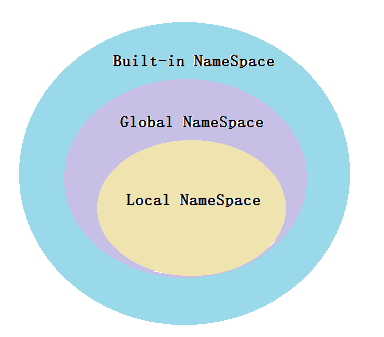
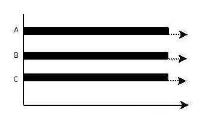
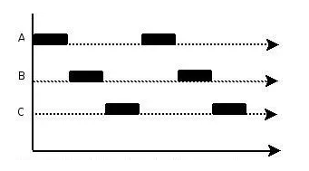

---
阅读进度
Python编程：从入门到实践（第2版）		继续第12章，后面都是东拼西凑先不用看了

python基础教程（第三版）				继续第12章，后面都是东拼西凑先不用看了

python语言及其应用						继续第11章，后面都是东拼西凑先不用看了

流畅的Python							继续第16章（暂未看10-13）

Python Cookbook（第3版）

看漫画学Python							基本完毕

http://www.ityouknow.com/python.html    基本完毕

Python网络数据采集                      继续第4章

Python编程快速上手                      基本完毕

Python Linux系统管理与自动化运维        继续第3.2章

---
# 基础知识

> Python 是一门面向对象语言，在 Python 的世界一切皆对象。所以一切变量的本质都是对象的一个指针而已。
> Python 最底层的基本数据类型：布尔型、整型、浮点型以及字符串型。

## 数据类型
- 在Python中所有的数据类型都是类，每个数据值都是类的“实例”。
- 在Python中有6种主要的内置数据类型：数字、字符串、列表、元组、集合和字典。
- 列表、元组、集合和字典可以容纳多项数据，统称为容器类型的数据。
- Python中的数字类型有4种：整数类型、浮点类型、复数类型和布尔类型。需要注意的是，布尔类型也是数字类型，它事实上是整数类型的一种。

如果把最底层的基本数据类型看作组成 Python 的原子，数据结构就像分子一样。在编程中，最常见的工作就是将数据进行拆分或合并，将其加工为特定的形式，而数据结构就是用以切分数据的钢锯以及合并数据的粘合枪。
## 变量
- 为了理解 Python 中的赋值语句，应该始终先读右边。对象在右边创建或获取，在此之后左边的变量才会绑定到对象上，这就像为对象贴上标注。因为变量只不过是标注，所以无法阻止为对象贴上多个标注。贴的多个标注，就是别名。
- 每个变量都有标识、类型和值。对象一旦创建，它的标识绝不会变；你可以把标识理解为对象在内存中的地址。is 运算符比较两个对象的标识；id() 函数返回对象标识的整数表示。
- 对 Python 来说，变量就不再是一段固定的地址，而只是 Python 中各个对象所附着的标签（可以理解为使用id打印同一变量多次赋值每次后的地址，会发现都不一样）。理解这一点对于理解 Python 的很多特性十分重要。(可以认为普通变量都是引用，其余为测试，详见 http://www.ityouknow.com/python/2019/09/12/python-reference-012.html)

```
a=100
print(id(a))
a=200
print(id(a))

[huawei@n161 ccc]$ python3 1.py
139721664918528
139721664921728
```

## 数值
- 整型（整数，例如 42、100000000）
- 浮点型（小数，例如 3.14159，或用科学计数法表示的数字，例如 1.0e8，它表示1乘以10的8次方，也可写作100000000.0）
- 无论是哪种运算，只要有操作数是浮点数，Python默认得到的总是浮点数，即便结果原本为整数也是如此。
- 书写很大的数时，可使用下划线将其中的数字分组，如 universe_age = 14_000_000_000
- 可以同时赋值多个变量 x, y, z = 0, 0, 0
## bool
表示真假的类型，仅包含 True 和 False 两种取值
- bool()
- True
- False
```
print(bool('I think, therefore I am'))
print(bool(42))
print(bool(''))
print(True)
print(False)

[huawei@n148 pythontest]$ /usr/bin/python3 "/home/huawei/playground/pythontest/pyth.py"
True
True
False
True
False
```

## 乘方
print(3 ** 2)
## 常量
Python没有内置的常量类型，通常使用全大写将某个变量视为常量，如MAX_CONNECTIONS = 5000
## 注释
用一个“#”
## min、max、sum、len

这几个函数可以直接内建容器，如元祖、列表等

```
even_numbers = list(range(2, 11, 2))	# 可以指定步长
print(min(even_numbers))
print(max(even_numbers))
print(sum(even_numbers))
print(len(even_numbers))

```
## input、int、float
- int()可以取值
- int(False)也可以转换bool得到1和0
- float()可以将其他数字类型转换为浮点型
```
#!/usr/bin/python3
height = input("How tall are you, in inches? ")
height = int(height)
if height >= 48:
 print("\nYou're tall enough to ride!")
else:
 print("\nYou'll be able to ride when you're a little older.")

```
## 打印、漂亮打印。。。
```
print('Age:', 42) 
name = 'Gumby' 
salutation = 'Mr.' 
greeting = 'Hello,' 
print(greeting, salutation, name) 	# 多个变量间默认是空格，也可以设置间隔符，见下面
print(greeting, ',', salutation, name) 
print(greeting + ',', salutation, name)  # 将第一个变量与逗号连接的结果作为第一个参数
print("I", "wish", "to", "register", "a", "complaint", sep="_")  # 设置间隔符号 
print('Hello,', end='\n\n\n') # 设置打印的结束符号
print('world!')


[huawei@n148 pythontest]$ /usr/bin/python3 "/home/huawei/playground/pythontest/pyth.py"
Age: 42
Hello, Mr. Gumby
Hello, , Mr. Gumby
Hello,, Mr. Gumby
I_wish_to_register_a_complaint
Hello,


world!
```
如果要打印的数据结构太大，一行容纳不下，可使用模块pprint中的函数pprint（而不是普通print语句）。pprint是个卓越的打印函数，能够更妥善地打印输出。

```
#!/usr/bin/python3
import sys, pprint 
pprint.pprint(sys.path) 

[huawei@n148 pytest]$ python3 pyth.py 
['/home/huawei/hwwork/doc/md/aaa/pytest',
 '/usr/local/lib/python3.6/site-packages/setuptools-19.6-py3.6.egg',
 '/usr/lib64/python36.zip',
 '/usr/lib64/python3.6',
 '/usr/lib64/python3.6/lib-dynload',
 '/usr/local/lib64/python3.6/site-packages',
 '/usr/local/lib/python3.6/site-packages',
 '/usr/lib64/python3.6/site-packages',
 '/usr/lib/python3.6/site-packages']
```

## 伪随机数
- random()函数可以随机生成一个[0,1)的浮点数。
- randint(a,b)函数可以在指定范围内随机生成一个整数，其中参数a是下限，参数 b 是上限，生成的随机数n：a <= n <= b。
- uniform(a,b)函数可以在指定范围内随机生成一个浮点数，两个参数其中一个是上限，一个是下限。如果a > b，则生成的随机数n: b <= n <= a。如果 a <b， 则 a <= n <= b。
- sample(sequence, k)函数可以获取从总体序列或集合中选择的唯一元素的k长度列表。sample()函数不会修改原有序列，它主要用在无重复的随机抽样场景，实现从大量样本中快速进行抽样
- randrange()函数主要用于返回一个随机数，它有三个参数，其中第三个参数step是可选参数。具体区别如下：
    - randrange([start], stop)可以在指定范围内随机生成一个整数，生成的随机数n：a <= n <= b。其中，参数start和参数stop是有要求的，必须小数在前大数在后，否则会报错。
    - randrange([start], stop[, step])函数可以先从1到10中产生一个间隔是2的等差数列[1,3,5,7,9]，再从中随机获取一个随机数。
- choice(sequence)函数可以从非空序列 sequence 中随机返回一个数，参数 sequence 表示一个有序类型，可以包含 list、tuple 等
- shuffle(x[, random])函数可以将一个有序列表中的元素打乱，再重新排序

```
import random
print(random.random())
print(random.randint(5,50)) 
print(random.uniform(2,5))
print(random.uniform(5,2))
lst = [1,2,3,4,5]  
print(random.sample(lst,4))  
print(lst) 
print(random.randrange(1,10,2))
strlist = ['C++','C#','Java','Python']  
strtemp = ('Do you love python')  
print(random.choice(strlist))
print(random.choice(strtemp))  
lst = ['A' , 'B', 'C', 'D', 'E' ]
random.shuffle(lst)  
print (lst)  

[huawei@n161 ccc]$ python3 1.py
0.9216266647181643
41
3.428690309360838
4.214136072878796
[1, 3, 2, 4]
[1, 2, 3, 4, 5]
7
Python
y
['E', 'A', 'B', 'D', 'C']
```

## 数字四舍五入 round

```
import time
now = time.time()
print(now)
print(round(now, 2))
print(round(now, 4))
print(round(now))


[huawei@n161 ccc]$ python 1.py
1666249651.4505882
1666249651.45
1666249651.4506
1666249651
```
## pass

防止在if里什么都不写无法运行，可暂时用pass占位
```
#!/usr/bin/python3
name = "Enid"
if name == 'Ralph Auldus Melish': 
	print('Welcome!') 
elif name == 'Enid': 
	# 还未完成……
	pass 
elif name == 'Bill Gates': 
	print('Access Denied')

```
在异常处理中如果没找到文件也就什么都不做了
```
def count_words(filename):
	try:
		with open(filename, encoding='utf-8') as f:
			contents = f.read()
	except FileNotFoundError:
		pass
	else:
		words = contents.split()
		num_words = len(words)
		print(f"The file {filename} has about {num_words} words.")


filenames = ['alice.txt', 'siddhartha.txt', 'moby_dick.txt', 'little_women.txt']
for filename in filenames:
	count_words(filename)

[huawei@n148 pytest]$ python3 pyth.py 
The file alice.txt has about 29465 words.
```
## del
不仅会删除到对象的引用，还会删除名称本身
## exec、eval
## 命名空间



- 命名空间定义了在某个作用域内变量名和绑定值之间的对应关系，命名空间是键值对的集合，变量名与值是一一对应关系。作用域定义了命名空间中的变量能够在多大范围内起作用。
- 命名空间在 Python 解释器中是以字典的形式存在的，是以一种可以看得见摸得着的实体存在的。作用域是 Python 解释器定义的一种规则，该规则确定了运行时变量查找的顺序，是一种形而上的虚的规定。
- 命名空间的种类分为 3 类，命名空间的种类也体现了命名空间的生命周期。三个种类及生命周期描述如下：
   
    - 内置名称（built-in names） Python 语言内置的名称，比如函数名 abs、char 和异常名称 BaseException、Exception 等等。生命周期：对于 Python built-in names 组成的命名空间，它在 Python 解释器启动的时候被创建，在解释器退出的时候才被删除；

    - 全局名称（global names）模块中定义的名称，记录了模块的变量，包括函数、类、其它导入的模块、模块级的变量和常量。生命周期：对于一个 Python 模块的 global namespace，它在这个 module 被 import 的时候创建，在解释器退出的时候退出；

    - 局部名称（local names）函数中定义的名称，记录了函数的变量，包括函数的参数和局部定义的变量。（类中定义的也是）生命周期：对于一个函数的 local namespace，它在函数每次被调用的时候创建，函数返回的时候被删除。

    - 命名空间的生命周期取决于对象的作用域，如果对象执行完成，则该命名空间的生命周期就结束。 因此，我们无法从外部命名空间访问内部命名空间的对象。

- 查找变量顺序为：局部的命名空间 -> 全局命名空间 -> 内置命名空间
- 各命名空间创建顺序：Python 解释器启动 ->创建内建命名空间 -> 加载模块 -> 创建全局命名空间 ->函数被调用 ->创建局部命名空间
- 各命名空间销毁顺序：函数调用结束 -> 销毁函数对应的局部命名空间 -> Python 虚拟机（解释器）退出 ->销毁全局命名空间 ->销毁内建命名空间

- 总结: 一个模块的引入，函数的调用，类的定义都会引入命名空间，函数中的再定义函数，类中的成员函数定义会在局部 namespace 中再次引入局部 namespace。


Python 提供了两个获取命名空间内容的函数：
- locals() 返回一个局部命名空间内容的字典；
- globals() 返回一个全局命名空间内容的字典。

```
animal = 'fruitbat'
def change_local():
	animal = 'wombat'
	print('locals:',locals())


print(animal)
change_local()
print('globals:', globals())
print(animal)

[huawei@n148 doc]$ python -u "/home/huawei/hwwork/doc/md/aaa/pltest/pyth.py"
fruitbat
('locals:', {'animal': 'wombat'})
('globals:', {'__builtins__': <module '__builtin__' (built-in)>, '__file__': '/home/huawei/hwwork/doc/md/aaa/pltest/pyth.py', '__package__': None, 'change_local': <function change_local at 0x7f9b8b392758>, 'animal': 'fruitbat', '__name__': '__main__', '__doc__': None})
fruitbat
```

## 作用域

- 作用域就是一个 Python 程序可以直接访问命名空间的正文区域。
- 直接访问一个变量，会从内到外依次访问所有的作用域直到找到，否则会报未定义的错误。
- 程序的变量并不是在哪个位置都可以访问的，访问权限决定于这个变量是在哪里赋值的。
- 变量的作用域决定了在哪一部分程序可以访问哪个特定的变量名称


作用域分为4类，分别如下：
- L（Local）：最内层，包含局部变量，比如一个函数/方法内部。
- E（Enclosing）：包含了非局部(non-local)也非全局(non-global)的变量。比如两个嵌套函数，一个函数（或类） A 里面又包含了一个函数 B ，那么对于 B 中的名称来说 A 中的作用域就为 nonlocal。
- G（Global）：当前脚本的最外层，比如当前模块的全局变量。
- B（Built-in）： 包含了内建的变量/关键字等，最后被搜索。


作用域规则顺序为：L->E->G->B。如果变量在局部内找不到，便会去局部外的局部找（例如闭包），再找不到就会去全局找，再找不到就去内置中找，如下图所示：  


### 全局作用域和局部作用域
局部作用域（Local）是脚本中的最内层，包含局部变量，比如一个函数或方法内部。 闭包函数外函数（Enclosing）包含了非局部 (non-local) 也非全局 (non-global) 的变量。 全局作用域（Global）是当前脚本的最外层，如当前模块的全局变量，实例如下：

```
global_scope = 0  # 全局作用域
# 定义闭包函数中的局部作用域
def outer():
    o_count = 1  # 闭包函数外的函数中，相对于函数 inner() 来说 作用域非局部
    def inner():
       local_scope = 2  # 局部作用域
```
以上实例展示的是全局作用域和闭包函数中的函数，以及函数中的局部作用域，对于函数 inner() 来说，outer() 中的作用域为 non-local

### 内建作用域

Python 中的内建作用域（Built-in）： 包含了内建的变量/关键字等，最后被搜索。内建作用域是通过一个名为 builtin 的标准模块来实现的，但是这个变量名自身并没有放入内置作用域内，所以必须导入这个文件才能够使用它。在 Python3.0 中，可以使用以下的代码来查看到底预定义了哪些变量:
```
import builtins
dir(builtins)
['ArithmeticError', 'AssertionError', 'AttributeError', 'BaseException', 'BlockingIOError', 'BrokenPipeError', 'BufferError', 'BytesWarning', 'ChildProcessError', 'ConnectionAbortedError', 'ConnectionError', 'ConnectionRefusedError'...]
```
Python 中只有模块（module），类（class）以及函数（def、lambda）才会引入新的作用域，其它的代码块（如 if/elif/else/、try/except、for/while 等）是不会引入新的作用域的，也就是说这些语句内定义的变量，外部也可以访问

### 全局变量和局部变量
- 全局变量：定义在函数外部拥有全局作用域的变量
- 局部变量：定义在函数内部拥有局部作用域的变量

局部变量只能在其被声明的函数内部访问，而全局变量可以在整个程序范围内访问。调用函数时，所有在函数内声明的变量名称都将被加入到作用域中。如下实例：
```
# 全局变量和局部变量
total = 0  # 这是一个全局变量
# 函数说明
def sum(arg1, arg2):
    # 返回2个参数的和."
    total = arg1 + arg2  # total在这里是局部变量.
    print("函数内是局部变量 : ", total)
    return total

# 调用sum函数，传入参数的计算结果显示局部变量
sum(10, 20)
print("函数外是全局变量 : ", total)

# 输出结果为：
函数内是局部变量 :  30
函数外是全局变量 :  0
```

### global 和 nonlocal 关键字

当内部作用域想修改外部作用域的变量时，就要用到 global 和 nonlocal 关键字了。变量访问顺序：  
当前作用域局部变量 -> 外层作用域变量 -> 再外层作用域变量 -> …… -> 当前模块全局变量 -> pyhton 内置变量
- global: 全局变量,当局部作用域改变全局变量用 global，同时 global 还可以定义新的全局变量
- nonlocal: 外层嵌套函数的变量, nonlocal 不能定义新的外层函数变量，只能改变已有的外层函数变量,同时 nonlocal 不能改变全局变量

Python不要求声明变量，但是假定在函数定义体中赋值的变量是局部变量，下个案例会err
```
b = 6
def f3(a):
	# global b		没有这行会认为b是下面的b，是未定义的局部变量
	print(a)
	print(b)
	b = 9

f3(3)
```
- 可使用函数globals来访问全局变量，返回一个包含全局变量的字典
```
def combine(parameter): # 与全局变量同名的参数
	print(parameter + globals()['parameter']) 

parameter = 'berry' 	# 全局变量
combine('Shrub') 

[huawei@n148 pythontest]$ /usr/bin/python3 "/home/huawei/playground/pythontest/pyth.py"
Shrubberry
```

函数内部使用global声明一下即可
```
animal = 'fruitbat'
def change_and_print_global():
	global animal
	animal = 'wombat'
	print('inside change_and_print_global:', animal)

print(animal)
change_and_print_global()
print(animal)

[huawei@n148 doc]$ python -u "/home/huawei/hwwork/doc/md/aaa/pltest/pyth.py"
fruitbat
('inside change_and_print_global:', 'wombat')
wombat
```


- 在函数内部给变量赋值时，该变量默认为局部变量，除非明确说明它是全局变量。
```
x = 1 
def change_global(): 
	global x 
	x = x + 1 

change_global() 
print(x)

[huawei@n148 pythontest]$ /usr/bin/python3 "/home/huawei/playground/pythontest/pyth.py"
2
```
global 和 nonlocal 的区别: 
- 两者的功能不同。global 关键字修饰变量后标识该变量是全局变量，对该变量进行修改就是修改全局变量，而 nonlocal 关键字修饰变量后标识该变量是上一级函数中的局部变量，如果上一级函数中不存在该局部变量，nonlocal 位置会发生错误（最上层的函数使用 nonlocal 修饰变量必定会报错）。
- 两者使用的范围不同。global 关键字可以用在任何地方，包括最上层函数中和嵌套函数中，即使之前未定义该变量，global 修饰后也可以直接使用，而 nonlocal 关键字只能用于嵌套函数中，并且外层函数中定义了相应的局部变量，否则会发生错误

## 引用计数 getrefcount
http://www.ityouknow.com/python/2020/01/06/python-gc-111.html

sys.getrefcount(object)，返回值是传入对象的引用计数。由于作为参数传入getrefcount()的时候产生了一次临时引用，因此返回的计数值一般要比预期多1。

## range自然数序列
- range() 函数的用法类似于使用切片
- range(start，stop，step)
- start 的默认值为 0。唯一要求的参数值是 stop，产生的最后一个数的值是 stop 的前一个
- step 的默认值是1。当然，也可以反向创建自然数序列，这时 step 的值为 -1。
```
如：
list( range(0, 11, 2) )
for x in range(2, -1, -1):
for x in range(0,3):
list( range(0, 3) )
```

## exit 退出程序

```
import sys
while True:
    print('Type exit to exit.')
    response = input()
    if response == 'exit':
        sys.exit()
    print('You typed ' + response + '.')

```

# 命令行

## 参数sys.argv
是个列表
```
import sys

print ('参数个数为:', len(sys.argv), '个参数。')
print ('参数列表:', str(sys.argv))
print ('脚本名:', str(sys.argv[0]))

[huawei@n161 pl]$ python3 61-buildpdf2bbb.py arg1 arg2 arg3
参数个数为: 4 个参数。
参数列表: ['61-buildpdf2bbb.py', 'arg1', 'arg2', 'arg3']
脚本名: 61-buildpdf2bbb.py
```

将所有参数练成join起来

```
import webbrowser, sys
if len(sys.argv) > 1:
    address = ' '.join(sys.argv[1:])
    print(address)
```

# 序列的分类

## 扁平序列
是一段连续的内存空间。存放如字符、字节和数值这种基础类型，存储的是值而不是引用。体积更小、速度更快而且用起来更简单，但是它只能保存一些原子性的数据，比如数字、字符和字节。扁平序列因为只能包含原子数据类型，比如整数、浮点数或字符，所以不能嵌套使用。

- str
- bytes
- bytearray
- memoryview
- array.array

## 容器序列
可以存放任意类型的对象的引用。容器序列则比较灵活，但是当容器序列遇到可变对象时，用户就需要格外小心了，因为这种组合时常会搞出一些“意外”，特别是带嵌套的数据结构出现时，用户要多费一些心思来保证代码的正确。


- list
- tuple
- collections.deque

## 非容器序列
- 映射关系的容器dict
- 只有key的容器set
## 可变序列

list、bytearray、array.array、collections.deque 和 memoryview。

## 不可变序列

tuple、str 和 bytes。


# 推导和生成器表达式
列表推导和生成器表达式则提供了灵活构建和初始化序列的方式，这两个工具都异常强大。
## 列表推导
## 字典推导
将元祖的列表推导为字典
```
DIAL_CODES = [
	(86, 'China'),
	(91, 'India'),
	(1, 'United States'),
	(62, 'Indonesia'),
	(55, 'Brazil'),
	(92, 'Pakistan'),
	(880, 'Bangladesh'),
	(234, 'Nigeria'),
	(7, 'Russia'),
	(81, 'Japan'),
]

# 迭代列表，将item拆包为code与country，并使用此2构建字典
country_code = {country: code for code, country in DIAL_CODES}
print(country_code)
country_code = {code: country.upper() for country, code in country_code.items() if code < 66}
print(country_code)

[huawei@n148 doc]$ /usr/bin/python3 "/home/huawei/hwwork/doc/md/bbb/src/pyth.py"
{'China': 86, 'India': 91, 'United States': 1, 'Indonesia': 62, 'Brazil': 55, 'Pakistan': 92, 'Bangladesh': 880, 'Nigeria': 234, 'Russia': 7, 'Japan': 81}
{1: 'UNITED STATES', 62: 'INDONESIA', 55: 'BRAZIL', 7: 'RUSSIA'}
```

## 集合推导
```
一个Latin-1 字符集合，该集合里的每个字符的 Unicode 名字里都有“SIGN”这个单词
# 从 unicodedata 模块里导入 name 函数，用以获取字符的名字。
from unicodedata import name
# 把编码在 32~255 之间的字符的名字里有“SIGN”单词的挑出来，放到一个集合里
s = {chr(i) for i in range(32, 256) if 'SIGN' in name(chr(i),'')}
print(s)

[huawei@n148 doc]$ /usr/bin/python3 "/home/huawei/hwwork/doc/md/bbb/src/pyth.py"
{'®', '§', '±', '<', '%', '°', '©', '¥', '¶', '+', '¤', '#', '¬', '÷', '$', '=', '£', '>', '¢', 'µ', '×'}
```

# 字符串 str
- 字符组成的序列
- 字符串是不可变的，因此所有的元素赋值和切片赋值都是非法的。
- 多行的使用三个单引号
- Python3中的字符串中的字符使用Unicode编码方式，不是字节数组

## 三种表示方式
字符串有三种表示方式：
- 普通字符串  
普通字符串指用单引号（'）或双引号（＂）括起来的字符串。转义字符起作用。

 
- 原始字符串 raw string  
用r前缀的字符串内容不会转义
```
s2=r"hello\nworld"
print(s2)

[huawei@n161 ccc]$ python3 1.py
hello\nworld
```

- 多行字符串  
使用3个引号（单双都可以）包围的字符串，会包含换行、排版、缩进等


还有图标的，见下例最后。
```
#!/usr/bin/python3
print('''This is a very long string. It continues here. 
And it's not over yet. "Hello, world!" 
Still here.''')
print(r'C:\Program Files\fnord\foo\bar\baz\frozz\bozz')
print(r'Let\'s go!') 
print('C:\\nowhere') 
print(r'C:\Program Files\foo\bar' '\\') 
print("This is a cat: \N{Cat}")

[huawei@n148 pythontest]$ /usr/bin/python3 "/home/huawei/playground/pythontest/pyth.py"
This is a very long string. It continues here. 
And it's not over yet. "Hello, world!" 
Still here.
C:\Program Files\fnord\foo\bar\baz\frozz\bozz
Let\'s go!
C:\nowhere
C:\Program Files\foo\bar\
This is a cat: 🐈
```
## 行连接符 \
```

alphabet = 'abcdefg' + \
'hijklmnop' + \
'qrstuv' + \
'wxyz'

print(alphabet)

[huawei@n148 doc]$ /usr/bin/python3 "/home/huawei/hwwork/doc/md/aaa/pytest/pyth.py"
abcdefghijklmnopqrstuvwxyz
```
## 大写、小写、首字母大小
```
#!/usr/bin/python3
name = "ada lovelace"
print(name.title())
print(name.upper())
print(name.lower())

[huawei@n148 pythontest]$ /usr/bin/python3 "/home/huawei/playground/pythontest/pyth.py"
Ada Lovelace
ADA LOVELACE
ada lovelace
```
## str转int、float
```
print(int('80'))
print(float('80.0'))
print(int('AB', 16))	# 指定16进制可以转换
# print(int('AB'))	# 默认将参数进行十进制转换，会失败
# print(int('80.0'))	# 参数非十进制，浮点也失败

[huawei@n161 ccc]$ python3 1.py
80
80.0
171
```

## int、float、bool转str

```
print(str(321))
print(str(123.321))
print(str(True))

[huawei@n161 ccc]$ python3 1.py
321
123.321
True
```
## 字符数量 len
字符串函数 len 可以计算字符串中 Unicode 字符的个数，而不是字节数

```
letters = 'abcdefghijklmnopqrstuvwxyz'
print(len(letters))
```

## 字节数量
取字节数见编码encode案例
## 判断开头、结尾
```
letters = 'abcdefghijklmnopqrstuvwxyz'
print(letters.startswith('abc'))
print(letters.endswith('abc'))
[huawei@n148 doc]$ /usr/bin/python3 "/home/huawei/hwwork/doc/md/aaa/pytest/pyth.py"
True
False
```
获取指定扩展名文件列表
```
filenames = [ 'Makefile', 'foo.c', 'bar.py', 'spam.c', 'spam.h' ] 
print([name for name in filenames if name.endswith(('.c', '.h')) ])

[huawei@n148 doc]$ /usr/bin/python3 "/home/huawei/hwwork/doc/md/aaa/pyth.py"
['foo.c', 'spam.c', 'spam.h']
```
## 判断都是字母数字
poem.isalnum()
## 首字母变大写
setup.capitalize()
## 所有单词的开头字母变大写
setup.title()

## 所有字母都大写
setup.upper()

## 所有字母都小写
setup.lower()

## 所有字母大小写互换
setup.swapcase()
## 左对齐、右对齐、居中

print('Hello'.rjust(10))
print('Hello'.ljust(10))
print('Hello'.center(10))


## 取字符
当做数据进行索引即可
```
letters = 'abcdefghijklmnopqrstuvwxyz'
print(letters[0])
print(letters[1])
print(letters[2])
print(letters[-1])
print(letters[-2])

[huawei@n148 doc]$ /usr/bin/python3 "/home/huawei/hwwork/doc/md/aaa/pytest/pyth.py"
a
b
c
z
y
```
## 格式化
- c风格%方式
- shell风格
- format方法，关于更多format控制符号参见《python基础继承第二版 3.3》
	- 要对字典执行字符串格式设置操作，不能使用format和命名参数，而必须使用format_map。见字典的format部分案例
- f方式，是Python 3.6引入的，用于简化format

详细居左保留数位等参加python语言及其应用7.1.2 格式化

```
#!/usr/bin/python3
from math import pi
from string import Template
from math import e
import math 

# c风格
format = "Hello, %s. %s enough for ya?"
values = ('world', 'Hot') 
sss = format % values
print(sss)	# Hello, world. Hot enough for ya?

# shell风格
tmpl = Template("Hello, $who! $what enough for ya?") 
sss = tmpl.substitute(who="Mars", what="Dusty")
print(sss)	# Hello, Mars! Dusty enough for ya?

# format风格，{}里使用需要则从0开始
sss = "{}, {} and {}".format("first", "second", "third") 
print(sss)	# first, second and third
print("{0}, {1} and {2}".format("first", "second", "third"))	# first, second and third
print("{3} {0} {2} {1} {3} {0}".format("be", "not", "or", "to"))	# to be or not to be
print("{name} is approximately {value:2f}".format(value=pi, name="π"))	# π is approximately 3.141593
print("{name} is approximately {value}.".format(value=pi, name="π")) 	# π is approximately 3.141592653589793.
print("{{ceci n'est pas une replacement field}}".format()) # {ceci n'est pas une replacement field}, 包含{}的字符串
print("{foo} {} {bar} {}".format(1, 2, bar=4, foo=3))	# 3 1 4 2
print("{foo} {1} {bar} {0}".format(1, 2, bar=4, foo=3))	# 3 2 4 1

print("Euler's constant is roughly {e}.".format(e=e))	# Euler's constant is roughly 2.718281828459045.
print(f"Euler's constant is roughly {e}.") # python3.6之后使用简写f，效果与上一句等价
first_name = "ada"
last_name = "lovelace"
full_name = f"{first_name} {last_name}"
print(full_name)	# ada lovelace
message = f"Hello, {full_name.title()}!"
print(message)	# Hello, Ada Lovelace!

fullname = ["Alfred", "Smoketoomuch"] 
print("Mr {name[1]}".format(name=fullname))	# Mr Smoketoomuch，也可以使用列表元素

tmpl = "The {mod.__name__} module defines the value {mod.pi} for π" 
sss = tmpl.format(mod=math)	# 还可以使用包（包名：mod.__name__、包里的变量：mod.pi）
print(sss)	# The math module defines the value 3.141592653589793 for π
```
## 居中
用指定字符填充两边
```
print("The Middle by Jimmy Eat World".center(39, "*")) 

[huawei@n148 pythontest]$ /usr/bin/python3 "/home/huawei/playground/pythontest/pyth.py"
*****The Middle by Jimmy Eat World*****
```
## 删两端空白或字符
- lstrip
- strip
	删除两端空格，也可删除通过参数指定的字符们，见下例
- rstrip
	可用于在read文件后去除文件末尾多余的空白或换行，见文件读取案例
```
删除开头或末尾的指定字符，因此中间的星号未被删除。
print('*** SPAM * for * everyone!!! ***'.strip(' *!'))

[huawei@n148 pythontest]$ /usr/bin/python3 "/home/huawei/playground/pythontest/pyth.py"
SPAM * for * everyone
```
使用strip删除每行的两边空白
```
with open('pi_digits.txt') as file_object:
    lines = file_object.readlines()
pi_string = ''
for line in lines:
	pi_string += line.strip()
print(pi_string)
print(len(pi_string))

[huawei@n148 pytest]$ /usr/bin/python3 "/home/huawei/hwwork/doc/md/aaa/pytest/pyth.py"
3.141592653589793238462643383279
32

[huawei@n148 pytest]$ cat pi_digits.txt 
3.1415926535 
  8979323846 
  2643383279
```
## 比较
依然使用==与!=
```
#!/usr/bin/python3
requested_topping = 'mushrooms'
if requested_topping != 'anchovies':
	print("Hold the anchovies!")
car = 'Audi'
print(car.lower() == 'audi')

[huawei@n148 pythontest]$ /usr/bin/python3 "/home/huawei/playground/pythontest/pyth.py"
Hold the anchovies!
True
```
## n倍字符串
使用乘法*，效果同perl
```
print('python ' * 5) # python python python python python 
```
## 检测包含字符
```
permissions = 'rw' 
print('w' in permissions)	# True
subject = '$$$ Get rich now!!! $$$' 
print('$$$' in subject)		# True
```
## 查找 find、rfind
rfind是从后向前找，但返回的index还是从前向后的数的
```
# 返回index，否则返回-1。起点和终点值（第二个和第三个参数）指定的搜索范围包含起点，但不包含终点。
subject = "$$$ Get rich now!!! $$$"
print(subject.find('$$$')) 
print(subject.find('$$$', 1)) # 只指定了起点
print(subject.find('!!!'))
print(subject.find('!!!', 0, 16)) # 同时指定了起点和终点

[huawei@n148 pythontest]$ /usr/bin/python3 "/home/huawei/playground/pythontest/pyth.py"
0
20
16
-1
```
## join、split
split返回列表
```
#!/usr/bin/python3
seq = ['1', '2', '3', '4', '5'] 
sep = '-'
print(sep.join(seq)) # 1-2-3-4-5， 合并一个字符串列表
dirs = '', 'usr', 'bin', 'env' # 这是个元祖，首元素为空用于join后开头的“/”
print(dirs)
print('/'.join(dirs)) 	#  /usr/bin/env
print('C:' + '\\'.join(dirs))  # C:\usr\bin\env


print('1+2+3+4+5'.split('+'))	# ['1', '2', '3', '4', '5']
```
## 出现的次数 count
```
line = "Row, row, row your boat"
print(line.count('row'))
print(line.lower().count('row'))

[huawei@n148 pytest]$ python3 pyth.py 
2
3
```
## 统计单词数量
使用了异常处理，并且可以统计多本书的词数
```
def count_words(filename):
	try:
		with open(filename, encoding='utf-8') as f:
			contents = f.read()
	except FileNotFoundError:
		print(f"Sorry, the file {filename} does not exist.")
	else:
		words = contents.split()
		num_words = len(words)
		print(f"The file {filename} has about {num_words} words.")


filenames = ['alice.txt', 'siddhartha.txt', 'moby_dick.txt', 'little_women.txt']
for filename in filenames:
	count_words(filename)

[huawei@n148 pytest]$ python3 pyth.py 
The file alice.txt has about 29465 words.
Sorry, the file siddhartha.txt does not exist.
Sorry, the file moby_dick.txt does not exist.
Sorry, the file little_women.txt does not exist.
```
## 替换字符
由于字符串是不可变的，因此无法直接插入字符或改变指定位置的字符。下面方式是非法的
```
name = 'Henny'
name[0] = 'P'
```
可以使用replace或切片达到替换的效果
```
name = 'Henny'
print(name.replace('H', 'P'))
print('P' + name[1:])

[huawei@n148 doc]$ /usr/bin/python3 "/home/huawei/hwwork/doc/md/aaa/pytest/pyth.py"
Penny
Penny
```
## 替换 replace
参数：
- 需要被替换的子串
- 用于替换的新子串
- 以及需要替换多少处，省略此参数将替换所有
```
s1 = 'This is a test';
s2 = s1.replace('is', 'eez');	# 替换了两处
print(s1)
print(s2)

[huawei@n148 pythontest]$ /usr/bin/python3 "/home/huawei/playground/pythontest/pyth.py"
This is a test
Theez eez a test
```
## 使用【start:end:step】切片
- 【:】 提取从开头到结尾的整个字符串
- 【start:】 从 start 提取到结尾
- 【:end】 从开头提取到 end - 1
- 【start:end】 从 start 提取到 end - 1
- 【start:end:step】 从 start 提取到 end - 1，每 step个字符提取一个
- 偏移量从左至右从 0、1 开始，依次增加
- 从右至左从-1、-2 开始，依次减小
- 如果省略 start，分片会默认使用偏移量0（开头）
- 如果省略 end，分片会默认使用偏移量 -1（结尾）
```

letters = 'abcdefghijklmnopqrstuvwxyz'
print(letters[:])	# abcdefghijklmnopqrstuvwxyz	提取整个字符串
print(letters[20:])	 # uvwxyz 	从偏移量 20 提取到字符串结尾
print(letters[10:])	# klmnopqrstuvwxyz 从偏移量 10 提取到结尾
print(letters[12:15]) # mno  从 12 到 14 的字符
print(letters[-3:])	# xyz 提取最后三个字符
print(letters[18:-3]) # stuvw	从偏移量为 18 的字符到倒数第 4 个字符, 注意与上一个
例子的区别：当偏移量 -3 作为开始位置时，将获得字符x；而当它作为终止位置时，分片实际
上会在偏移量 -4 处停止，也就是提取到字符 w

print(letters[-6:-2]) # uvwx	从倒数第 6 个字符到倒数第 3 个字符
print(letters[::7])	# ahov	从开头提取到结尾，步长设为 7
print(letters[4:20:3]) # ehknqt	从偏移量 4 提取到偏移量 19，步长设为 3
print(letters[19::4]) # tx	从偏移量 19 提取到结尾，步长设为 4
print(letters[:21:5]) # afkpu	从开头提取到偏移量 20，步长设为 5,记住，分片
中 end 的偏移量需要比实际提取的最后一个字符的偏移量多 1

# 如果指定的步长为负数会从右到左反向进行提取操作。
print(letters[-1::-1]) # zyxwvutsrqponmlkjihgfedcba   从右到左以步长为 1 进行提取，下面的
效果一样也更简单
print(letters[::-1]) # zyxwvutsrqponmlkjihgfedcba 效果同上

# 在分片中，小于起始位置的偏移量会被当作 0，大于终止位置的偏移量会被当作 -1，
print(letters[-50:]) # abcdefghijklmnopqrstuvwxyz 提取倒数 50 个字符
print(letters[-50:-51]) # 得到空，提取从倒数第 51 到倒数第 50 个字符
print(letters[:70])	# abcdefghijklmnopqrstuvwxyz  从开头提取到偏移量为 69 的字符
print(letters[70:71])  # 得到空， 从偏移量为 70 的字符提取到偏移量为 71 的字符
```
## 取字符串的一部分
其实就是切片操作...
```
with open('pi_digits.txt') as file_object:
    lines = file_object.readlines()
pi_string = ''
for line in lines:
	pi_string += line.strip()
print(pi_string)
print(f"{pi_string[:20]}...")
print(len(pi_string))

[huawei@n148 pytest]$ /usr/bin/python3 "/home/huawei/hwwork/doc/md/aaa/pytest/pyth.py"
3.141592653589793238462643383279
3.141592653589793238...
32
```


## 编码 encode
- 字符的标识，即码位，是 0~1 114 111 的数字（十进制），在 Unicode 标准中以 4~6 个十六进制数字表示，而且加前缀“U+”。约 10% 的有效码位有对应的字符。
- 字符的具体表述取决于所用的编码（如utf8）。编码是在码位和字节序列之间转换时使用的算法。
- 编码是将码位转换成字节序列的过程
- encode支持第二个参数用于指定当目标编码无此字符时是异常还是忽略的操作

	如果你想要使用 ascii 方式进行编码，必须保证待编码的字符串仅包含 ASCII 字符集里的字符，不含有任何其他的 Unicode 字符，否则会出现错误
- 尽可能统一使用 UTF-8 编码。出错率低，兼容性好，可以表达所有的 Unicode 字符，编码和解码的速度又快
- 可以把字节序列想成晦涩难懂的机器磁芯转储，把 Unicode 字符串想成“人类可读”的文本。那么，把字节序列变成人类可读的文本字符串就是解码，而把字符串变成用于存储或传输的字节序列就是编码。

```
snowman = '\u2603'	# 将Unicode 字符串 '\u2603' 赋值给 snowman。
print(snowman)
print(len(snowman))	# snowman 是一个仅包含一个字符的 Unicode 字符串，这与它存储所需的字节数没有任何关系
ds = snowman.encode('utf-8')	# 将Unicode字符编码为字节序列。UTF-8 是一种变长编码方式，ds是一个bytes类型的变量
print(len(ds))	# 占用了 3 字节的空间，注意不是所有单个 Unicode字符都是3
print(ds)

[huawei@n148 doc]$ /usr/bin/python3 "/home/huawei/hwwork/doc/md/aaa/pyth.py"
☃
1
3
b'\xe2\x98\x83'
```
## 解码 decode

- 解码是将字节序列转换成码位的过程
```
place = 'caf\u00e9'	# unicode字符串
print(place)
print(len(place))
print(type(place))
place_bytes = place.encode('utf-8')	# 将它以 UTF-8 格式编码为 bytes 型变量
print(place_bytes)
print(len(place_bytes))
print(type(place_bytes))
place2 = place_bytes.decode('utf-8') # 再解回来
print(place2)
print(len(place2))
print(type(place2))

[huawei@n148 doc]$ /usr/bin/python3 "/home/huawei/hwwork/doc/md/aaa/pyth.py"
café
4
<class 'str'>
b'caf\xc3\xa9'
5
<class 'bytes'>
café
4
<class 'str'>
```
## 统一字符编码侦测包 Chardet
能识别所支持的 30 种编码 https://pypi.python.org/pypi/chardet

# 列表【】 list
- 列表非常适合利用顺序和位置定位某一元素
- 列表元素是可变的
- 使用中括号定义
- 在列表中，具有相同值的元素允许出现多次
- 可以同时容纳不同类型的元素，但是实际上这样做并没有什么特别的好处，比如不能对列表进行排序。元组则恰恰相反，它经常用来存放不同类型的的元素。这也符合它的本质，元组就是用作存放彼此之间没有关系的数据的记录。


## 创建与访问元素
### 手动初始化数据
- [元素1，元素2，元素3，⋯]：指定具体的列表元素，元素之间以逗号分隔，列表元素需要使用中括号括起来。
- 索引-1指向最后一个，-2则是倒数第二个，以此类推
```
#!/usr/bin/python3
bicycles = ['trek', 'cannondale', 'redline', 'specialized']
print(bicycles)
print(bicycles[0])
print(bicycles[0].title())
print(bicycles[-1])
print(bicycles[-2])

message = f"My first bicycle was a {bicycles[0].title()}."
print(message)
[huawei@n148 pythontest]$ /usr/bin/python3 "/home/huawei/playground/pythontest/pyth.py"
['trek', 'cannondale', 'redline', 'specialized']
trek
Trek
specialized
redline
My first bicycle was a Trek.
```
### 使用range初始化
```
#!/usr/bin/python3
for value in range(1, 6):	# 产生列表[1,2,3,4,5]，注意没有6
	print(value)
numbers = list(range(1, 6))	# 产生列表赋值
print(numbers)
even_numbers = list(range(2, 11, 2))	# 可以指定步长
print(min(even_numbers))
print(max(even_numbers))
print(sum(even_numbers))

squares = [value**2 for value in range(1, 11)] # 类似perl map方法
print(squares)

[huawei@n148 pythontest]$ /usr/bin/python3 "/home/huawei/playground/pythontest/pyth.py"
1
2
3
4
5
[1, 2, 3, 4, 5]
2
10
30
[1, 4, 9, 16, 25, 36, 49, 64, 81, 100]
```
### 使用*初始化
生成包含n个指定初值元素的列表
```
sequence = [None] * 10  # [None, None, None, None, None, None, None, None, None, None]
```
### 使用list初始化
使用list(iterable)将其他数据类型转换成列表，函数的参数iterable是可迭代对象（字符串、列表、元组、集合和字典等）。

- 字符串转字符列表
```
arr = list('Hello')
print(arr)	# ['H', 'e', 'l', 'l', 'o']

可以使用 ''.join(somelist) 再连起来
```
- 创建空的列表
```
another_empty_list = list()
```
- 元祖转列表
```
a_tuple = ('ready', 'fire', 'aim')
print(list(a_tuple))
```
## 使用=赋值（类似引用），使用copy()复制
- 如果将一个列表赋值给了多个变量，改变其中的任何一处会造成其他变量对应的值也被修改，即不能使用等号进行复制，见下例，这里的结果类似引用
```
#!/usr/bin/python3
my_foods = ['pizza', 'falafel', 'carrot cake']
friend_foods = my_foods
my_foods.append('cannoli')
print(my_foods)
print(friend_foods)

[huawei@n148 pythontest]$ /usr/bin/python3 "/home/huawei/playground/pythontest/pyth.py"
['pizza', 'falafel', 'carrot cake', 'cannoli']
['pizza', 'falafel', 'carrot cake', 'cannoli']
```
- 使用切片方式[:]与list方法得到的也哟可能还是浅拷贝，取决于列表是否嵌套
- 使用copy、deepcopy进行深拷贝解决问题
```
#!/usr/bin/python3
my_foods = ['pizza', 'falafel', 'carrot cake']

方法1有可能还是浅拷贝：	friend_foods = my_foods[:]
方法2：	friend_foods = my_foods.copy()
方法3有可能还是浅拷贝：	friend_foods = list(my_foods)

my_foods.append('cannoli')
print(my_foods)
print(friend_foods)

[huawei@n148 pythontest]$ /usr/bin/python3 "/home/huawei/playground/pythontest/pyth.py"
['pizza', 'falafel', 'carrot cake', 'cannoli']
['pizza', 'falafel', 'carrot cake']
```
## 合并 extend
- 使用加号连接，产生新的列表，原有列表不变
- 使用extend会更新原有列表，也可以使用 +=
```
a = [1, 2, 3] 
b = [4, 5, 6] 
a.extend(b) # 等于 a = a + b，但extend效率高，也可以 a[len(a):] = b （但可读性差）
print(a)	# [1, 2, 3, 4, 5, 6]
print(b)	# [4, 5, 6]
c = [7, 8, 9] 
d = b + c
print(b)	# [4, 5, 6]
print(c)	# [7, 8, 9]
print(d)	# [4, 5, 6, 7, 8, 9]
```
## 增删改查
- append	添加元素至尾部
- insert	在指定位置插入元素
- del	删除指定位置的元素
- remove	删除具有指定值的元素
- pop	获取并删除指定位置的元素
```
#!/usr/bin/python3
motorcycles = []	# 空列表
motorcycles.append('honda')	# 添加到列表末尾
motorcycles.append('yamaha')
motorcycles.append('suzuki')
print(motorcycles)
motorcycles[0] = 'ducati'	# 修改元素
print(motorcycles)
motorcycles.insert(1, 'aaa')	# 插入到指定位置，也可以使用切片的插入方式（参考切片操作）
print(motorcycles)
del motorcycles[1]	# 删除指定索引的元素，使用pop可以得到删除的值
print(motorcycles)
popped_motorcycle = motorcycles.pop()	# 删除并返回末尾元素，也可以指定位置，如下
print(motorcycles)
print(popped_motorcycle)
first_owned = motorcycles.pop(0)
print(f"The first motorcycle I owned was a {first_owned.title()}.")

print("----------------")
motorcycles = ['honda', 'yamaha', 'suzuki', 'ducati']
motorcycles.remove('ducati')	# 删除指定内容，默认仅去除第一个，全部去除需要循环，参考下面
print(motorcycles)
```
循环去除指定元素
```
#!/usr/bin/python3
pets = ['dog', 'cat', 'dog', 'goldfish', 'cat', 'rabbit', 'cat']
print(pets)
while 'cat' in pets:
	pets.remove('cat')
print(pets)

[huawei@n148 pythontest]$ /usr/bin/python3 "/home/huawei/playground/pythontest/pyth.py"
['dog', 'cat', 'dog', 'goldfish', 'cat', 'rabbit', 'cat']
['dog', 'dog', 'goldfish', 'rabbit']
```
## 清除
```
numbers.clear() 
```
## 排序sort、sorted
- 列表方法 sort() 会对原列表进行排序，改变原列表内容
- 通用函数 sorted() 则会返回排好序的列表副本，原列表内容不变
- 参数reverse为t是降序，默认f
- 还支持一个key回调用于自定义比较方法
```

fruits = ['grape', 'raspberry', 'apple', 'banana']
print(sorted(fruits))
print(fruits)
print(sorted(fruits, reverse=True))
print(sorted(fruits, key=len))	此处使用长度进行排序
print(sorted(fruits, key=len, reverse=True))
print(fruits)
fruits.sort()
print(fruits)

[huawei@n148 doc]$ /usr/bin/python3 "/home/huawei/hwwork/doc/md/bbb/src/pyth.py"
['apple', 'banana', 'grape', 'raspberry']
['grape', 'raspberry', 'apple', 'banana']
['raspberry', 'grape', 'banana', 'apple']
['grape', 'apple', 'banana', 'raspberry']
['raspberry', 'banana', 'grape', 'apple']
['grape', 'raspberry', 'apple', 'banana']
['apple', 'banana', 'grape', 'raspberry']
```
## 颠倒 reversed
- reverse将所有元素反序（直接修改列表）
- reversed
```
#!/usr/bin/python3
cars = ['bmw', 'audi', 'toyota', 'subaru']
cars.reverse()
print(cars)
[huawei@n148 pythontest]$ /usr/bin/python3 "/home/huawei/playground/pythontest/pyth.py"
['subaru', 'toyota', 'audi', 'bmw']
```

```
s = [4, 3, 6, 8, 3]
s2 = sorted(s)	# 返回一个列表
print(s)
print(s2)
s = 'Hello, world!'
s2 = sorted(s)
print(s)
print(s2)

s3 = list(reversed(s)) # reversed返回可迭代对象
print(s3)

s4 = ''.join(reversed(s)) 
print(s4)

[huawei@n148 pythontest]$ /usr/bin/python3 "/home/huawei/playground/pythontest/pyth.py"
[4, 3, 6, 8, 3]
[3, 3, 4, 6, 8]
Hello, world!
[' ', '!', ',', 'H', 'd', 'e', 'l', 'l', 'l', 'o', 'o', 'r', 'w']
['!', 'd', 'l', 'r', 'o', 'w', ' ', ',', 'o', 'l', 'l', 'e', 'H']
!dlrow ,olleH
```
## 判断空列表
```
#!/usr/bin/python3
requested_toppings = []
if requested_toppings:
	for requested_topping in requested_toppings:
 		print(f"Adding {requested_topping}.")
else:
	print("Are you sure you want a plain pizza?")
```
## 长度 len
```
cars = ['bmw', 'audi', 'toyota', 'subaru']
print(len(cars))
```
## 统计出现次数 count
计算指定的元素在列表中出现了多少次
```
print(['to', 'be', 'or', 'not', 'to', 'be'].count('to'))
x = [[1, 2], 1, 1, [2, 1, [1, 2]]] 
print(x.count(1))
print(x.count([1, 2]))

[huawei@n148 pythontest]$ /usr/bin/python3 "/home/huawei/playground/pythontest/pyth.py"
2
2
1
```
## 成员测试 in、not in
表达式v in l（其中l是一个列表）查找的是值而不是索引
```
#!/usr/bin/python3
magicians = ['alice', 'david', 'carolina']
print('david' in magicians)
if 'xxx' not in magicians:
	print("not in")
```
只要元素类型一致即可进行检测
```
database = [ 
 ['albert', '1234'], 
 ['dilbert', '4242'], 
 ['smith', '7524'], 
 ['jones', '9843'] 
] 
username = 'smith'
pin = '7524'
if [username, pin] in database: print('Access granted')
```
## 查找 index
在列表中查找指定值第一次出现的索引，但找不到则err了...需要try才行
```
knights = ['We', 'are', 'the', 'knights', 'who', 'say', 'ni'] 
print(knights.index('who')) 	# 4
knights.index('herring')	# err
```
## 转字符串
```
marxes = ['Groucho', 'Chico', 'Harpo']
print(', '.join(marxes))

[huawei@n148 doc]$ /usr/bin/python3 "/home/huawei/hwwork/doc/md/aaa/pytest/pyth.py"
Groucho, Chico, Harpo
```
## 遍历
- foreach形式
```
#!/usr/bin/python3
magicians = ['alice', 'david', 'carolina']
for magician in magicians:
	print(f"{magician.title()}, that was a great trick!")
	print(f"I can't wait to see your next trick, {magician.title()}.\n")

print("Thank you, everyone. That was a great magic show!")


words = ['this', 'is', 'an', 'ex', 'parrot'] 
for word in words:
    print(word) 
for word in [0, 1, 2, 3, 4, 5, 6, 7, 8, 9]:
 	print(word) 
for number in range(1,11):
    print(number) 
```
- enumerate  
  即可以获得idx也能获得元素内容，有些时候可以代替下面的for
```
strings = "abcdefg"
for index, string in enumerate(strings): 
	print(index, string)

[huawei@n148 pythontest]$ /usr/bin/python3 "/home/huawei/playground/pythontest/pyth.py"
0 a
1 b
2 c
3 d
4 e
5 f
6 g
```
- for形式
```
names = ['anne', 'beth', 'george', 'damon'] 
ages = [12, 45, 32, 102] 
for i in range(len(names)): 
	print(names[i], 'is', ages[i], 'years old') 
```
- while形式
```
#!/usr/bin/python3
# 首先，创建一个待验证用户列表
 # 和一个用于存储已验证用户的空列表。
unconfirmed_users = ['alice', 'brian', 'candace']
confirmed_users = []
 # 验证每个用户，直到没有未验证用户为止。
 # 将每个经过验证的用户都移到已验证用户列表中。
while unconfirmed_users:
	current_user = unconfirmed_users.pop()
	print(f"Verifying user: {current_user.title()}")
	confirmed_users.append(current_user)
# 显示所有已验证的用户。
print("\nThe following users have been confirmed:")
for confirmed_user in confirmed_users:
	print(confirmed_user.title())
```
## 创建切片
- 使用切片（slicing）来访问特定范围内的元素。两个索引来指定切片的边界
- 第一个索引指定的元素包含在切片内，但第二个索引指定的元素不包含在切片内。
- 切片的步长默认为1，但也可以设置
- 切片都是副本，与原列表是不同内存，互不干涉
- 列表的切片仍然是一个列表

```
#!/usr/bin/python3
players = ['charles', 'martina', 'michael', 'florence', 'eli']
print(players[0:3])	# 0、1、2
print(players[1:4])	# 1、2、3
print(players[:4])	# 前4个，0、1、2、3
print(players[2:])	# 从第3个到最后，不含0、1的其余
print(players[-3:]) # 最后3个

for player in players[:3]:	# 遍历切片
	print(player.title())

[huawei@n148 pythontest]$ /usr/bin/python3 "/home/huawei/playground/pythontest/pyth.py"
['charles', 'martina', 'michael']
['martina', 'michael', 'florence']
['charles', 'martina', 'michael', 'florence']
['michael', 'florence', 'eli']
['michael', 'florence', 'eli']
Charles
Martina
Michael
```
## 切片的步长
```
#!/usr/bin/python3
numbers = [1, 2, 3, 4, 5, 6, 7, 8, 9, 10] 
print(numbers)
print(numbers[0:10:2])	# 从起点和终点之间每隔一个元素提取一个元素
print(numbers[::4])	# 从序列中每隔3个元素提取1个，只需提供步长4即可。
print(numbers[8:3:-1])
print(numbers[10:0:-2]) 
print(numbers[0:10:-2])
print(numbers[::-2])
print(numbers[5::-2]) 
print(numbers[:5:-2])

[huawei@n148 pythontest]$ /usr/bin/python3 "/home/huawei/playground/pythontest/pyth.py"
[1, 2, 3, 4, 5, 6, 7, 8, 9, 10]
[1, 3, 5, 7, 9]
[1, 5, 9]
[9, 8, 7, 6, 5]
[10, 8, 6, 4, 2]
[]
[10, 8, 6, 4, 2]
[6, 4, 2]
[10, 8]
```
## 切片的插入、删除、替换
- 如果赋值的对象是一个切片，那么赋值语句的右侧必须是个可迭代对象。
- 即便只有单独一个值，也要把它转换成可迭代的序列。
```
#!/usr/bin/python3
name = list('Perl')
name[1:] = list('ython') # 相当于替换n个连续的元素，且无需数量一致
print(name)	# ['P', 'y', 't', 'h', 'o', 'n']


numbers = [1, 5] 
numbers[1:1] = [2, 3, 4] # 相当于插入n个元素（可读性比使用insert差很多）
print(numbers) # [1, 2, 3, 4, 5]
numbers[1:4] = []  # 相当于删除连续的n个元素，这里还加入步长（大于1或负数的步长），那就可以跳跃清除了
print(numbers)	# [1, 5]
```

## max、min

返回列表元素最大值、最小值
```
list_num=[2,3,5,6,8,12]
max(list_num)
```

## zip
- 便于同时迭代n个列表
- 返回由元组组成的可迭代序列
- 可使用list将其转换为列表
- 可使用dict将其转换为字典

```
names = ['anne', 'beth', 'george', 'damon'] 
ages = [12, 45, 32, 102] 
for name, age in zip(names, ages): 
	print(name, 'is', age, 'years old') 

print(list(zip(range(5), range(100000000))))

[huawei@n148 pythontest]$ /usr/bin/python3 "/home/huawei/playground/pythontest/pyth.py"
anne is 12 years old
beth is 45 years old
george is 32 years old
damon is 102 years old
[(0, 0), (1, 1), (2, 2), (3, 3), (4, 4)]
```
```
english = 'Monday', 'Tuesday', 'Wednesday'
french = 'Lundi', 'Mardi', 'Mercredi'
print(list(zip(english, french)))
print(dict(zip(english, french)))

[huawei@n148 doc]$ /usr/bin/python3 "/home/huawei/hwwork/doc/md/aaa/pytest/pyth.py"
[('Monday', 'Lundi'), ('Tuesday', 'Mardi'), ('Wednesday', 'Mercredi')]
{'Monday': 'Lundi', 'Tuesday': 'Mardi', 'Wednesday': 'Mercredi'}
```
# 元组 ( ) tuple
- 元组经常用来存放不同类型的的元素。这也符合它的本质，元组就是用作存放彼此之间没有关系的数据的记录。
- 与列表类似，元组也是由任意类型元素组成的序列。
- 与列表不同的是，元组是不可变的，这意味着一旦元组被定义，将无法再进行增加、删除或修改元素等操作。因此，元组就像是一个常量列表。
- 不要把可变对象放在元组里面。
- 使用圆括号定义
- 空元组用两个不包含任何内容的圆括号表示
- 一个值的元组要有逗号
- 元组的切片还是元组
- 元组占用的空间较小
- 可以将元组用作字典的键
- 函数的参数是以元组形式传递的
- 命名元组可以作为对象的替代
- 元组与多数 Python 集合（列表、字典、集，等等）一样，保存的是对象的引用。

```
#!/usr/bin/python3
dimensions = (200, 50)	# 定义tuple
print(dimensions[0])	# 取元素
print(dimensions[1])
# dimensions[0] = 250 	不能修改元素
dimensions = (400, 100)	# 能重新全部赋值
print(dimensions)	
for dimension in dimensions:	# 遍历
	print(dimension)
```

## 使用()创建元组
（元素1，元素2，元素3，⋯）：指定具体的元组元素，元素之间以逗号分隔。对于元组元素，可以使用小括号括起来，也可以省略小括号。

```
empty_tuple = ()	# 可以用 () 创建一个空元组
print(empty_tuple)
one_marx = 'Groucho',	# 创建只包含一个元素的元祖要有逗号。定义元组真正靠的是每个元素的后缀逗号，而不是（）
print(one_marx)
marx_tuple = 'Groucho', 'Chico', 'Harpo'	# 创建的元组所包含的元素数量超过 1，最后一个元素后面的逗号可以省略
print(marx_tuple)
a, b, c = marx_tuple	# 将元组赋值给多个变量
print(a)
print(b)
print(c)

[huawei@n148 doc]$ /usr/bin/python3 "/home/huawei/hwwork/doc/md/aaa/pytest/pyth.py"
()
('Groucho',)
('Groucho', 'Chico', 'Harpo')
Groucho
Chico
Harpo

```
## 打印元素
```
lax_coordinates = (33.9425, -118.408056)
city, year, pop, chg, area = ('Tokyo', 2003, 32450, 0.66, 8014)
traveler_ids = [('USA', '31195855'), ('BRA', 'CE342567'), ('ESP', 'XDA205856')]
for passport in sorted(traveler_ids):
	print('%s/%s' % passport)		# passport代表每个元组, %能匹配到对应的元组元素上
for country, _ in traveler_ids:		# 元祖拆包后的第二个元素没有，用占位符代替
	print(country)

[huawei@n148 doc]$ /usr/bin/python3 "/home/huawei/hwwork/doc/md/bbb/src/pyth.py"
BRA/CE342567
ESP/XDA205856
USA/31195855
USA
BRA
ESP
```

## 拆包
可认为创建元祖为打包，反操作即为拆包。将元祖解包，并将得到的值存储到一系列变量中。可用于  
- 并行赋值
- 交换变量值
- 将序列赋值给元祖values
- 解开元祖到多个变量
- 使用*接收多个值到列表中，*句法让元组拆包的便利性更上一层楼，让用户可以选择性忽略不需要的字段
- 函数参数传递（主要是上一种方式）
- 函数可以用元组的形式返回多个值

```
x, y, z = 1, 2, 3 # 并行赋值
print(x, y, z) 
x, y = y, x	# 交换变量值
print(x, y) 
values = 10, 20, 30 # 将序列赋值给元祖values
print(values)
x, y, z = values # 解开元祖到多个变量
print(x, y, z) 

scoundrel = {'name': 'Robin', 'girlfriend': 'Marion'} 
key, value = scoundrel.popitem() # 返回元祖赋值给k和v
print(key, value)
a, b, *rest = [1, 2, 3, 4] 	# 可使用星号运算符（*）来收集多余的值，这样无需确保值和变量的个数相同，rest为列表
print(rest)

name = "Albus Percival Wulfric Brian Dumbledore" 
first, *middle, last = name.split() # *变量也可在其他位置
print(middle)

a, *b, c = "abc" # 带星号的变量始终也是列表，即使元素仅1个
print(a, b, c)

[huawei@n148 pythontest]$ /usr/bin/python3 "/home/huawei/playground/pythontest/pyth.py"
1 2 3
2 1
(10, 20, 30)
10 20 30
girlfriend Marion
[3, 4]
['Percival', 'Wulfric', 'Brian']
a ['b'] c
```

## 拆包嵌套元组

```
metro_areas = [
	('Tokyo','JP',36.933,(35.689722,139.691667)),
	('Delhi NCR', 'IN', 21.935, (28.613889, 77.208889)),
	('Mexico City', 'MX', 20.142, (19.433333, -99.133333)),
	('New York-Newark', 'US', 20.104, (40.808611, -74.020386)),
	('Sao Paulo', 'BR', 19.649, (-23.547778, -46.635833)),
]
print('{:15} | {:^9} | {:^9}'.format('', 'lat.', 'long.'))
fmt = '{:15} | {:9.4f} | {:9.4f}'
for name, cc, pop, (latitude, longitude) in metro_areas:
	if longitude <= 0:
		print(fmt.format(name, latitude, longitude))

[huawei@n148 doc]$ /usr/bin/python3 "/home/huawei/hwwork/doc/md/bbb/src/pyth.py"
                |   lat.    |   long.  
Mexico City     |   19.4333 |  -99.1333
New York-Newark |   40.8086 |  -74.0204
Sao Paulo       |  -23.5478 |  -46.6358

```
## 使用tuple()创建元组

函数tuple的工作原理与list很像：它将一个序列（字符串、列表、元组、集合和字典等）作为参数，并将其转换为元组。如果参数
已经是元组，就原封不动地返回它。
```
print(3 * (40 + 2))	# 这个不是元祖，因为没有逗号
print(3 * (40 + 2,))
print(tuple([1, 2, 3]))
print(tuple('abc'))
print(tuple((1, 2, 3)))
x = 1, 2, 3
print(x[0:2])

[huawei@n148 pythontest]$ /usr/bin/python3 "/home/huawei/playground/pythontest/pyth.py"
126
(42, 42, 42)
(1, 2, 3)
('a', 'b', 'c')
(1, 2, 3)
(1, 2)
```

## 元组的相对不可变性
- 下面的描述貌似眼熟，详见代码说明，感觉就像是改变常量指针指向的内容。。。
- 元组与多数 Python 集合（列表、字典、集，等等）一样，保存的是对象的引用。1 如果引用的元素是可变的，即便元组本身不可变，元素依然可变。
```
t1 = (1, 2, [30, 40])
t2 = (1, 2, [30, 40])
print(t1 == t2)		# 虽然 t1 和 t2 是不同的对象，但是二者相等，因为==比值
print(id(t1[-1]))
t1[-1].append(99)	# 重点在此，t1 不可变，但是 t1[-1] 可变。即t1[-1] 的标识没变，只是值变了。（可以理解为栈上的指针没指向别处，但是堆上的数据变了）
print(t1)
print(id(t1[-1]))
print(t1 == t2)

[huawei@n161 aaa]$ python3 test.py 
True
140324783818056
(1, 2, [30, 40, 99])
140324783818056
False
```
## del 删除

由于元组的不可修改性，所以元组中的元素值是不允许删除的，但可以使用 del 语句来删除整个元组

```
tup1 = ('baidu', 'google',1,2)
print(tup1)
del tup1;
print("删除后的元组 tup : ")
print(tup1)

[huawei@n161 ccc]$ python3 1.py
('baidu', 'google', 1, 2)
删除后的元组 tup : 
Traceback (most recent call last):
  File "1.py", line 9, in <module>
```

# 字典 { } dict
- 字典由键及其相应的值组成，这种键值对称为项（item）。
- 每个键与其值之间都用冒号（:）分隔，项之间用逗号分隔，而整个字典放在花括号内。
- 空字典（没有任何项）用两个花括号表示，类似于下面这样：{}。
- 在字典（以及其他映射类型）中，键必须是独一无二的，而字典中的值无需如此。
- 字典的键必须为不可变对象，因此列表、字典以及集合都不能作为字典的键，但元组可以作为字典的键
- 字典是Python中唯一的内置映射类型，其中的值不按顺序排列，而是存储在键下。键可能是数、字符串或元组（即k得是不可变的类型）。
- 所有的字典方法见流程的python3.3
## 构建方法
- 使用dict方法
- {key1：value1，key2：value2，...，key_n：value_n}：指定具体的字典键值对，键值对之间以逗号分隔，最后用大括号括起来。
- 使用dict.fromkeys构建所有v都一样的字典
```
# dict（tuple列表形式）,tuple必须2个元素，否则失败
items = [('name', 'Gumby'), ('age', 42)] 
d = dict(items)  
print(d)	# {'name': 'Gumby', 'age': 42}
print(d['name'])	# Gumby

# dict（嵌套列表形式）,内部列表只能2个元素，否则失败
lol = [ ['a', 'b'], ['c', 'd'], ['e', 'f'] ] 
m = dict(lol)
print(m)	# {'a': 'b', 'c': 'd', 'e': 'f'}

# 使用dict方法构建，kv形式，kv要齐全，否则失败
d = dict(name='Gumby', age=42) 	
print(d) # {'name': 'Gumby', 'age': 42}

empty_dict = {} # 空字典

# 使用键值对方式构建，kv要齐全，否则出错
phonebook = {'Alice': '2341', 'Beth': '9102', 'Cecil': '3258'}
print(phonebook)	# {'Alice': '2341', 'Beth': '9102', 'Cecil': '3258'}


# 双字符的字符串组成的列表，只能2个字符，否则出错
m = [ 'ab', 'cd', 'ef' ]
print(dict(m))	# {'a': 'b', 'c': 'd', 'e': 'f'}

# 双字符的字符串组成的元组，只能2个字符，否则出错
m = ( 'ab', 'cd', 'ef' )
print(dict(m))	# {'a': 'b', 'c': 'd', 'e': 'f'}


# 使用dict.fromkeys
print(dict.fromkeys(['name', 'age']))	# {'name': None, 'age': None}
print(dict.fromkeys(['name', 'age'], '(unknown)'))	# {'name': '(unknown)', 'age': '(unknown)'}
```
## 访问【】、get
- [ ]
	访问不存在的元素会error
- get
	安全的获取元素方式，没有则返回指定的字符串
- setdefault
	获取与指定键相关联的值，字典不包含指定的键时，在字典中添加指定的键值对。也可指定默认的字符串作为v，如果没有指定，默认v为None。
```
#!/usr/bin/python3
alien_0 = {'color': 'green', 'points': 5}		# 定义字典
print(alien_0['color'])		# green,	访问元素
# print(alien_0['color1'])	访问不存在的元素会error，下句使用get进行安全访问
point_value = alien_0.get('not', 'No point value assigned.') # 安全的获取元素方式，没有则返回第二个字符串
print(point_value)	# No point value assigned.		
print(alien_0)	# {'color': 'green', 'points': 5}
point_value  = alien_0.setdefault('not')	# 没有找到就添加到字典中
print(point_value)	# None
print(alien_0)	# {'color': 'green', 'points': 5, 'not': None}
```
## 增删改查
- del	删除具有指定键的元素

```
#!/usr/bin/python3
alien_0 = {'color': 'green', 'points': 5}		# 定义字典
print(alien_0)
alien_0['x_position'] = 0		# 添加元素
alien_0['y_position'] = 25
print(alien_0)

alien_0 = {}			# 创建空字典，这里其实是把上面的字典清了
alien_0['color'] = 'green'
alien_0['points'] = 5
print(alien_0)
alien_0['color'] = 'yellow'		# 修改元素
print(f"The alien is now {alien_0['color']}.")
del alien_0['points']		# 删除元素，删除还有pop
print(alien_0)


[huawei@n148 pythontest]$ /usr/bin/python3 "/home/huawei/playground/pythontest/pyth.py"
{'color': 'green', 'points': 5}
{'color': 'green', 'points': 5, 'x_position': 0, 'y_position': 25}
{'color': 'green', 'points': 5}
The alien is now yellow.
{'color': 'yellow'}
```
## 合并 update
可以将一个字典的键值对复制到另一个字典中去。字典有此k则更新v，没有k则添加到字典里
```
d = { 
'title': 'Python Web Site', 
'url': 'http://www.python.org', 
'changed': 'Mar 14 22:09:15 MET 2016' 
} 

x = {'title': 'Python Language Website'} 
d.update(x)
print(d);

[huawei@n148 pythontest]$ /usr/bin/python3 "/home/huawei/playground/pythontest/pyth.py"
{'title': 'Python Language Website', 'url': 'http://www.python.org', 'changed': 'Mar 14 22:09:15 MET 2016'}
```
## pop、popitem
```
phonebook = {'Alice': '2341', 'Beth': '9102', 'Cecil': '3258'}
print(phonebook.pop('Beth'))	# 9102	返回指定k进行pop的v
print(phonebook)	# {'Alice': '2341', 'Cecil': '3258'}	剩余2个kv
print(phonebook.popitem())	# ('Cecil', '3258')	返回随机pop的kv，返回值是元祖，但测试每次都相同
print(phonebook)	# {'Alice': '2341'}		剩余1个kv
key, value = phonebook.popitem() # 将pop的元祖赋值给k和v
print(key, value)

[huawei@n148 pythontest]$ /usr/bin/python3 "/home/huawei/playground/pythontest/pyth.py"
{'Alice': '2341', 'Cecil': '3258'}
('Cecil', '3258')
{'Alice': '2341'}
Alice 2341
```

## 字典视图 items
-	返回值属于一种名为字典视图的特殊类型。字典视图可用于迭代，还可执行len与in检测。其中每个元素都为键值对，且顺序不确定。
-	修改字典后视图会同步，但视图是只读的不允许修改
```
phonebook = {'Alice': '2341', 'Beth': '9102', 'Cecil': '3258'}
pairs = phonebook.items() 
print("修改前")
print(pairs)
print(len(pairs))
print(phonebook)
print(('Beth', '9102') in pairs)
print(phonebook.get('Beth', "not find") == '9102');


print("修改字典后")
phonebook['Beth'] = '9999'
print(pairs)
print(phonebook)
print(('Beth', '9102') in pairs)
print(phonebook.get('Beth', "not find") == '9102');

print("修改视图后")
pairs[1] = ('Beth', '0000')  不支持赋值
print(pairs)
print(phonebook)

[huawei@n148 pythontest]$ /usr/bin/python3 "/home/huawei/playground/pythontest/pyth.py"
修改前
dict_items([('Alice', '2341'), ('Beth', '9102'), ('Cecil', '3258')])
3
{'Alice': '2341', 'Beth': '9102', 'Cecil': '3258'}
True
True
修改字典后
dict_items([('Alice', '2341'), ('Beth', '9999'), ('Cecil', '3258')])
{'Alice': '2341', 'Beth': '9999', 'Cecil': '3258'}
False
False
修改视图后
Traceback (most recent call last):
  File "/home/huawei/playground/pythontest/pyth.py", line 20, in <module>
    pairs[1] = ('Beth', '0000')
TypeError: 'dict_items' object does not support item assignment
```
## 遍历 keys、values、items、sort、set
- keys
  	获取仅包含字典中的键的视图（dict_keys()，它是键的迭代形式）
- values
	返回一个由字典中的值组成的字典视图，如果字典中有重复的v则视图中也包含这些重复内容。
- items
  	函数可以获取字典中所有的键值对
- keys、values、items的返回结果均可作为list()方法的参数，返回列表

```
d = {'x': 1, 'y': 2, 'z': 3} 
for key in d: 
	print(key, 'corresponds to', d[key]) 
for key, value in d.items(): 
	print(key, 'corresponds to', value) 

```

```
#!/usr/bin/python3
favorite_languages = {
	'jen': 'python',
	'sarah': 'c',
	'edward': 'ruby',
	'phil': 'python',
}
for name, language in favorite_languages.items():	# 遍历kv
	print(f"{name.title()}'s favorite language is {language.title()}.")
for name in favorite_languages.keys():		# 遍历k
	print(name.title())
for name in sorted(favorite_languages.keys()):	# 对返回的keys排序后再遍历
 	print(f"{name.title()}, thank you for taking the poll.") 
if 'erin' not in favorite_languages.keys():	# 判断存在k，此处是检测一个值在不在列表里，非检测k in d
	print("Erin, please take our poll!")

for language in favorite_languages.values():	# 遍历values
	print(language.title())
for language in set(favorite_languages.values()):	# 对返回的values集合进行去重后再遍历
	print(language.title())


```


## 检测K、v存在 in
表达式k in d（其中d是一个字典）查找的是键而不是值，如下面的检测k、v方式

- 'name' in spam.keys()
- 'Zophie' in spam.values()

```
phonebook = {'Alice': '2341', 'Beth': '9102', 'Cecil': '3258'}	# 使用键值对方式构建
print(phonebook)	# {'Alice': '2341', 'Beth': '9102', 'Cecil': '3258'}
print('Beth' in phonebook);	# True
```

## 格式化format
只要在字典中有此kv则就可以替换到format的参数里
```
#!/usr/bin/python3
template = '''<html> 
<head><title>{title}</title></head> 
<body> 
<h1>{title}</h1> 
<p>{text}</p> 
</body>''' 
data = {'title': 'My Home Page', 'text': 'Welcome to my home page!'} 
print(template.format_map(data)) 


print("Cecil's phone number is {Cecil}.".format_map({'Beth': '9102', 'Alice': '2341', 'Cecil': '3258'}))


[huawei@n148 pythontest]$ /usr/bin/python3 "/home/huawei/playground/pythontest/pyth.py"
<html> 
<head><title>My Home Page</title></head> 
<body> 
<h1>My Home Page</h1> 
<p>Welcome to my home page!</p> 
</body>
Cecil's phone number is 3258.
```
## 清除 clear
```
x.clear() 
```
## 使用=赋值，使用copy()复制
- 等号依然仅是引用，不是复制......
- 浅拷贝
  
  2个字典中machines的v（值是列表）y修改后x的也跟着变了，说明指向同一个堆地址
```
x = {'username': 'admin', 'machines': ['foo', 'bar', 'baz']} 
y = x.copy() 
y['username'] = 'mlh' 
y['machines'].remove('bar') 
print(x)
print(y)

[huawei@n148 pythontest]$ /usr/bin/python3 "/home/huawei/playground/pythontest/pyth.py"
{'username': 'admin', 'machines': ['foo', 'baz']}
{'username': 'mlh', 'machines': ['foo', 'baz']}
```
- 深拷贝
	- 使用copy
	- 使用函数deepcopy进行拷贝
```
signals = {'green': 'go', 'yellow': 'go faster', 'red': 'smilefor the camera'}
original_signals = signals.copy()
signals['blue'] = 'confuse everyone'
print(signals)
print(original_signals)

[huawei@n148 doc]$ /usr/bin/python3 "/home/huawei/hwwork/doc/md/aaa/pytest/pyth.py"
{'green': 'go', 'yellow': 'go faster', 'red': 'smilefor the camera', 'blue': 'confuse everyone'}
{'green': 'go', 'yellow': 'go faster', 'red': 'smilefor the camera'}
```  
```
#!/usr/bin/python3
from copy import deepcopy
x = {'username': 'admin', 'machines': ['foo', 'bar', 'baz']} 
y = deepcopy(x)  
y['username'] = 'mlh' 
y['machines'].remove('bar') 
print(x)
print(y)

d = {} 
d['names'] = ['Alfred', 'Bertrand'] 
c = d.copy() 
dc = deepcopy(d) 
d['names'].append('Clive') 
print(c)
print(dc)

[huawei@n148 pythontest]$ /usr/bin/python3 "/home/huawei/playground/pythontest/pyth.py"
{'username': 'admin', 'machines': ['foo', 'bar', 'baz']}
{'username': 'mlh', 'machines': ['foo', 'baz']}
{'names': ['Alfred', 'Bertrand', 'Clive']}
{'names': ['Alfred', 'Bertrand']}
```
# 集合 set
- 集合（set）是一种可迭代的、无序的、不能包含重复元素的容器类型的数据。
- 尽管都由花括号包裹，集合仅仅是一系列值组成的序列，而字典是一个或多个键值对组成的序列。
- 所有方法见流程的python3.8.3
  
## 创建
- {元素1，元素2，元素3，⋯}：指定具体的集合元素，元素之间以逗号分隔。对于集合元素，需要使用大括号括起来。
- 使用set()创建空集合
- 使用set(iterable)将其他类型转换为集合，参数iterable是可迭代对象（字符串、列表、元组、集合和字典等）。
```
empty_set = set()	# 空set
print(empty_set)
even_numbers = {0, 2, 4, 6, 8}	# 普通构建方式
print(even_numbers)
print(set('letters'))	# 基于字符串
print(set(['Dasher', 'Dancer', 'Prancer', 'Mason-Dixon']))	# 基于列表
print(set(('Ummagumma', 'Echoes', 'Atom Heart Mother')))	# 基于元组
print(set({'apple': 'red', 'orange': 'orange', 'cherry': 'red'}))	# 基于字典，仅使用k

[huawei@n148 doc]$ /usr/bin/python3 "/home/huawei/hwwork/doc/md/aaa/pytest/pyth.py"
set()
{0, 2, 4, 6, 8}
{'s', 'l', 'e', 't', 'r'}
{'Dancer', 'Dasher', 'Prancer', 'Mason-Dixon'}
{'Atom Heart Mother', 'Echoes', 'Ummagumma'}
{'orange', 'cherry', 'apple'}
```
## 增删查、clear、len、copy
- add
- update
- remove
- discard
- pop
- len
- clear
- copy
- 
```
set1 = {'pear', 'banana', 'orange', 'apple'}
set1.add('kkk')	# 添加一个元素
print(set1)
set1.update({'kkk', 'ppp'})	# 添加多个元素
print(set1)

# 方法remove()和方法discard()的区别在于，方法remove()在移除元素时，如果元素不存在，会报错，中止程序运行，而方法discard()不会。
set1.remove('pear')	# 将指定元素从集合中移除
print(set1)
set1.pop()	# 随机删除集合中的一个元素
print(set1)
print(len(set1))	# 得到集合中元素的个数
set1.clear()	# 清空集合
print(set1)	
set1 = {'pear', 'banana', 'orange', 'apple'}
bool1 = 'apple' in set1	# 检测存在
print(bool1)
x = set1.copy()	# 深拷贝
print(x)

[huawei@n148 doc]$ /usr/bin/python3 "/home/huawei/hwwork/doc/md/aaa/pytest/pyth.py"
{'apple', 'kkk', 'banana', 'pear', 'orange'}
{'ppp', 'apple', 'kkk', 'banana', 'pear', 'orange'}
{'ppp', 'apple', 'kkk', 'banana', 'orange'}
{'apple', 'kkk', 'banana', 'orange'}
4
set()
True
{'banana', 'pear', 'orange', 'apple'}
```
## 检测 in
使用in测试k是否存在
```
drinks = {
'martini': {'vodka', 'vermouth'},
'black russian': {'vodka', 'kahlua'},
'white russian': {'cream', 'kahlua', 'vodka'},
'manhattan': {'rye', 'vermouth', 'bitters'},
'screwdriver': {'orange juice', 'vodka'}
}
for name, contents in drinks.items():
	if 'vodka' in contents and not ('vermouth' in contents or 'cream' in contents):
		print(name)

[huawei@n148 doc]$ /usr/bin/python3 "/home/huawei/hwwork/doc/md/aaa/pytest/pyth.py"
black russian
screwdriver
```
## 集合运算

```
>>> a = set('afqwbracadaagfgbrafg')
>>> b = set('rfgfgfalacazamddg')
>>> a                                  
{'r', 'q', 'd', 'b', 'w', 'g', 'f', 'c', 'a'}
>>> b
{'r', 'd', 'g', 'f', 'l', 'z', 'c', 'm', 'a'}
# 集合a中包含而集合b中不包含的元素
>>> a - b                              
{'b', 'w', 'q'}
 # 集合a或b中包含的所有元素
>>> a | b                             
{'d', 'g', 'l', 'c', 'r', 'q', 'b', 'w', 'f', 'z', 'm', 'a'}
# 集合a和b中都包含了的元素
>>> a & b                              
{'r', 'd', 'g', 'f', 'c', 'a'}
# 不同时包含于a和b的元素
>>> a ^ b                              
{'l', 'q', 'b', 'w', 'z', 'm'}
```
## 集合推导式
```
# 判断元素是否存在
>>> a = {x for x in 'abracadabra' if x not in 'abc'}
>>> a
{'r', 'd'}
```
## 其余内置方法


```
difference
difference_update
intersection
intersection_update
union
isdisjoint
issubset
issuperset
symmetric_difference
symmetric_difference_update
详见 http://www.ityouknow.com/python/2019/09/16/python-set-015.html
```

# 复杂数据结构
## 元祖里存列表
```
marxes = ['Groucho', 'Chico', 'Harpo']
pythons = ['Chapman', 'Cleese', 'Gilliam', 'Jones', 'Palin']
stooges = ['Moe', 'Curly', 'Larry']
tuple_of_lists = marxes, pythons, stooges
print(tuple_of_lists)

[huawei@n148 doc]$ /usr/bin/python3 "/home/huawei/hwwork/doc/md/aaa/pytest/pyth.py"
(['Groucho', 'Chico', 'Harpo'], ['Chapman', 'Cleese', 'Gilliam', 'Jones', 'Palin'], ['Moe', 'Curly', 'Larry'])
```
## 字典的k是元祖
```

houses = {
	(44.79, -93.14, 285): 'My House',
	(38.89, -77.03, 13): 'The White House'
}

print(houses)

[huawei@n148 doc]$ /usr/bin/python3 "/home/huawei/hwwork/doc/md/aaa/pytest/pyth.py"
{(44.79, -93.14, 285): 'My House', (38.89, -77.03, 13): 'The White House'}
```
## 列表里存列表
- 简单的使用
```
small_birds = ['hummingbird', 'finch']
extinct_birds = ['dodo', 'passenger pigeon', 'Norwegian Blue']
carol_birds = [3, 'French hens', 2, 'turtledoves']
all_birds = [small_birds, extinct_birds, 'macaw', carol_birds]

print(all_birds)
print(all_birds[0])
print(all_birds[1][0])

[huawei@n148 doc]$ /usr/bin/python3 "/home/huawei/hwwork/doc/md/aaa/pytest/pyth.py"
[['hummingbird', 'finch'], ['dodo', 'passenger pigeon', 'Norwegian Blue'], 'macaw', [3, 'French hens', 2, 'turtledoves']]
['hummingbird', 'finch']
dodo
```
- 相对复杂一点的

两种方式结果相同
```
方式1
board = [['_'] * 3 for i in range(3)]
print(board)
board[1][2] = 'X'
print(board)

方式2
board = []
for i in range(3):
	row=['_'] * 3
	board.append(row)
print(board)
board[2][0] = 'X'
print(board)

[huawei@n148 doc]$ /usr/bin/python3 "/home/huawei/hwwork/doc/md/bbb/src/pyth.py"
[['_', '_', '_'], ['_', '_', '_'], ['_', '_', '_']]
[['_', '_', '_'], ['_', '_', 'X'], ['_', '_', '_']]


[['_', '_', '_'], ['_', '_', '_'], ['_', '_', '_']]
[['_', '_', '_'], ['_', '_', '_'], ['X', '_', '_']]

```
错误的赋值演示
```
weird_board = [['_'] * 3] * 3	# weird_board包含 3 个指向同一个列表的引用
print(weird_board)
weird_board[1][2] = 'O'
print(weird_board)

[huawei@n148 doc]$ /usr/bin/python3 "/home/huawei/hwwork/doc/md/bbb/src/pyth.py"
[['_', '_', '_'], ['_', '_', '_'], ['_', '_', '_']]
[['_', '_', 'O'], ['_', '_', 'O'], ['_', '_', 'O']]
```
## 列表里存字典
```
#!/usr/bin/python3
# 创建一个用于存储外星人的空列表。
aliens = []
# 创建30个绿色的外星人。
for alien_number in range (30):
	new_alien = {'color': 'green', 'points': 5, 'speed': 'slow'}
	aliens.append(new_alien)
for alien in aliens[:3]:
	if alien['color'] == 'green':
		alien['color'] = 'yellow'
		alien['speed'] = 'medium'
		alien['points'] = 10
# 显示前5个外星人。
for alien in aliens[:5]:
	print(alien)
print("...")

[huawei@n148 pythontest]$ /usr/bin/python3 "/home/huawei/playground/pythontest/pyth.py"
{'color': 'yellow', 'points': 10, 'speed': 'medium'}
{'color': 'yellow', 'points': 10, 'speed': 'medium'}
{'color': 'yellow', 'points': 10, 'speed': 'medium'}
{'color': 'green', 'points': 5, 'speed': 'slow'}
{'color': 'green', 'points': 5, 'speed': 'slow'}
...
```
## 字典里存列表
```
#!/usr/bin/python3
favorite_languages = {
	'jen': ['python', 'ruby'],
	'sarah': ['c'],
	'edward': ['ruby', 'go'],
	'phil': ['python', 'haskell'],
}
for name, languages in favorite_languages.items():
	print(f"\n{name.title()}'s favorite languages are:")
	for language in languages:
		print(f"\t{language.title()}")

[huawei@n148 pythontest]$ /usr/bin/python3 "/home/huawei/playground/pythontest/pyth.py"

Jen's favorite languages are:
        Python
        Ruby

Sarah's favorite languages are:
        C

Edward's favorite languages are:
        Ruby
        Go

Phil's favorite languages are:
        Python
        Haskell
```
## 字典里存字典
```
#!/usr/bin/python3
users = {
	'aeinstein': {
		'first': 'albert',
		'last': 'einstein',
		'location': 'princeton',
	},
	'mcurie': {
		'first': 'marie',
		'last': 'curie',
		'location': 'paris',
	},
}
for username, user_info in users.items():
	print(f"\nUsername: {username}")
	full_name = f"{user_info['first']} {user_info['last']}"
	location = user_info['location']
	print(f"\tFull name: {full_name.title()}")
	print(f"\tLocation: {location.title()}")


[huawei@n148 pythontest]$ /usr/bin/python3 "/home/huawei/playground/pythontest/pyth.py"

Username: aeinstein
        Full name: Albert Einstein
        Location: Princeton

Username: mcurie
        Full name: Marie Curie
        Location: Paris
```
### 通讯录案例
演示了通过"[][]"来访问内层字典的元素值
```
#!/usr/bin/python3

people = { 
 'Alice': { 
 'phone': '2341', 
 'addr': 'Foo drive 23' 
 }, 
 'Beth': { 
 'phone': '9102', 
 'addr': 'Bar street 42' 
 }, 
'Cecil': { 
 'phone': '3158', 
 'addr': 'Baz avenue 90' 
 } 
}

# 电话号码和地址的描述性标签，供打印输出时使用
labels = { 
 'phone': 'phone number', 
 'addr': 'address' 
} 
name = input('Name: ') 
# 要查找电话号码还是地址？
request = input('Phone number (p) or address (a)? ') 
# 使用正确的键：
if request == 'p': key = 'phone' 
if request == 'a': key = 'addr' 
# 使用get提供默认值
person = people.get(name, {}) 
label = labels.get(key, key) 
result = person.get(key, 'not available') 
print("{}'s {} is {}.".format(name, label, result)) 


[huawei@n148 pythontest]$ /usr/bin/python3 "/home/huawei/playground/pythontest/pyth.py"
Name: Beth
Phone number (p) or address (a)? a
Beth's address is Bar street 42.
[huawei@n148 pythontest]$ /usr/bin/python3 "/home/huawei/playground/pythontest/pyth.py"
Name: Cecil
Phone number (p) or address (a)? p
Cecil's phone number is 3158.
```

# 其它类型与容器

## 数组 array
array 模块提供了一种 array() 对象，它类似于列表，但只能存储类型一致的数据且存储密集更高。 
- 数组支持所有跟可变序列有关的操作包括 .pop、.insert 和 .extend。
- 数组还提供从文件读取和存入文件的更快的方法，如 .frombytes 和 .tofile。
- 创建数组需要一个类型码，这个类型码用来表示在底层的 C 语言应该存放怎样的数据类型。
- 具体数组支持的方法参加“流畅的python 2.9.1”
- 下面的‘d’代表字节类型，即byte，-128~127
```
from array import array
from random import random
floats = array('d', (random() for i in range(10**7)))	# 双精度浮点数组生成器
print(floats[-1])	# 最末元素
fp = open('floats.bin', 'wb')
floats.tofile(fp)	# 写入二进制文件
fp.close()
floats2 = array('d')	# 新建数组
fp = open('floats.bin', 'rb')
floats2.fromfile(fp, 10**7)	# 将文件内容写到数组里
fp.close()
print(floats2[-1])	# 最末元素
print(floats2 == floats)	# 判断数组相同

[huawei@n148 doc]$ /usr/bin/python3 "/home/huawei/hwwork/doc/md/bbb/src/pyth.py"
0.4028576664776865
0.4028576664776865
True
```

## 字节 bytes
- 字节bytes是不可变的，像字节数据组成的元组
- bytes 类型值的表示以 b 开头，接着是一个单引号，后面跟着由十六进制数（例如 \x02）或 ASCII 码组成的序列，最后以配对的单引号结束
- Python 会将这些十六进制数或者 ASCII 码转换为整数，如果该字节的值为有效 ASCII编码则会显示 ASCII 字符。
- 使用 8 比特序列存储小整数的方式进行存储，每 8比特（即一字节）可以存储从 0~255 的值
- 打印 bytes 或 bytearray 数据时，Python 会以 \xxx 的形式表示不可打印的字符
- 以 ASCII 字符的形式表示可打印的字符（以及一些转义字符，例如 \n 而不是 \x0a）

```
blist = [1, 2, 3, 255]
the_bytes = bytes(blist)	# 使用列表创建一个bytes 类型的变量
print(the_bytes)
# the_bytes[1] = 127	# err，不可改变
print(b'\x61')	# 显示a，因为61对应ascii的a
print(b'\x01abc\xff')	# 无对应，原样显示
the_bytes = bytes(range(0, 256))	# 建一个包含 0到255 的所有数的bytes 
print(the_bytes)

[huawei@n148 doc]$ /usr/bin/python3 "/home/huawei/hwwork/doc/md/aaa/pyth.py"
b'\x01\x02\x03\xff'
b'a'
b'\x01abc\xff'
b'\x00\x01\x02\x03\x04\x05\x06\x07\x08\t\n\x0b\x0c\r\x0e\x0f\x10\x11\x12\x13\x14\x15\x16\x17\x18\x19\x1a\x1b\x1c\x1d\x1e\x1f !"#$%&\'()*+,-./0123456789:;<=>?@ABCDEFGHIJKLMNOPQRSTUVWXYZ[\\]^_`abcdefghijklmnopqrstuvwxyz{|}~\x7f\x80\x81\x82\x83\x84\x85\x86\x87\x88\x89\x8a\x8b\x8c\x8d\x8e\x8f\x90\x91\x92\x93\x94\x95\x96\x97\x98\x99\x9a\x9b\x9c\x9d\x9e\x9f\xa0\xa1\xa2\xa3\xa4\xa5\xa6\xa7\xa8\xa9\xaa\xab\xac\xad\xae\xaf\xb0\xb1\xb2\xb3\xb4\xb5\xb6\xb7\xb8\xb9\xba\xbb\xbc\xbd\xbe\xbf\xc0\xc1\xc2\xc3\xc4\xc5\xc6\xc7\xc8\xc9\xca\xcb\xcc\xcd\xce\xcf\xd0\xd1\xd2\xd3\xd4\xd5\xd6\xd7\xd8\xd9\xda\xdb\xdc\xdd\xde\xdf\xe0\xe1\xe2\xe3\xe4\xe5\xe6\xe7\xe8\xe9\xea\xeb\xec\xed\xee\xef\xf0\xf1\xf2\xf3\xf4\xf5\xf6\xf7\xf8\xf9\xfa\xfb\xfc\xfd\xfe\xff'
```

## 字节数组 bytearray

- 字节数组bytearray是可变的，像字节数据组成的列表。
- 打印bytearray通常手动加入换行用于显示效果，如一行显示 16 个字节

```
blist = [1, 2, 3, 255]
the_byte_array = bytearray(blist) # 使用列表创建一个bytearray类型的变量
print(the_byte_array)
the_byte_array[1] = 127	# bytearray 类型的变量是可变的
print(the_byte_array)
the_byte_array = bytearray(range(0, 256))	# 建一个包含 0到255 的所有数的bytearray
print(the_byte_array)

[huawei@n148 doc]$ /usr/bin/python3 "/home/huawei/hwwork/doc/md/aaa/pyth.py"
bytearray(b'\x01\x02\x03\xff')
bytearray(b'\x01\x7f\x03\xff')
bytearray(b'\x00\x01\x02\x03\x04\x05\x06\x07\x08\t\n\x0b\x0c\r\x0e\x0f\x10\x11\x12\x13\x14\x15\x16\x17\x18\x19\x1a\x1b\x1c\x1d\x1e\x1f !"#$%&\'()*+,-./0123456789:;<=>?@ABCDEFGHIJKLMNOPQRSTUVWXYZ[\\]^_`abcdefghijklmnopqrstuvwxyz{|}~\x7f\x80\x81\x82\x83\x84\x85\x86\x87\x88\x89\x8a\x8b\x8c\x8d\x8e\x8f\x90\x91\x92\x93\x94\x95\x96\x97\x98\x99\x9a\x9b\x9c\x9d\x9e\x9f\xa0\xa1\xa2\xa3\xa4\xa5\xa6\xa7\xa8\xa9\xaa\xab\xac\xad\xae\xaf\xb0\xb1\xb2\xb3\xb4\xb5\xb6\xb7\xb8\xb9\xba\xbb\xbc\xbd\xbe\xbf\xc0\xc1\xc2\xc3\xc4\xc5\xc6\xc7\xc8\xc9\xca\xcb\xcc\xcd\xce\xcf\xd0\xd1\xd2\xd3\xd4\xd5\xd6\xd7\xd8\xd9\xda\xdb\xdc\xdd\xde\xdf\xe0\xe1\xe2\xe3\xe4\xe5\xe6\xe7\xe8\xe9\xea\xeb\xec\xed\xee\xef\xf0\xf1\xf2\xf3\xf4\xf5\xf6\xf7\xf8\xf9\xfa\xfb\xfc\xfd\xfe\xff')
```

# 枚举 enum


## 创建、访问、迭代

枚举属性值可以是任何东西: int, str 等。如果确切的值不重要，您可以使用 auto 实例，并为您选择适当的值。如果您将 auto 与其他值混合，则必须小心。 枚举类型中，不可以设置相同名称的 name，可以有相同的 value。
```
from enum import Enum, auto, unique
# 创建
# @unique，枚举值唯一， 加入此句可确保所有值不能有重复，否则异常
class HttpStatus(Enum):
    OK = 200
    BAD_REQUEST = 400
    FORBIDDEN = 403
    NOT_FOUND = 404
    REQUEST_TIMEOUT = 408
    SERVICE_UNAVAILABLE = 500
    OTHER = auto.value

print('Member: {}'.format(HttpStatus.OK))               # Member: HttpStatus.OK
print('Member name: {}'.format(HttpStatus.OK.name))     # Member name: OK
print('Member value: {}'.format(HttpStatus.OK.value))   # Member value: 200
print(repr(HttpStatus.OK))                              # <enum 'HttpStatus'>
print(type(HttpStatus.OK))                              # <HttpStatus.OK: 200>
print(isinstance(HttpStatus.OK, HttpStatus))            # True

# 迭代  遍历的每一个 status 是一个独立的枚举成员，拥有 name 和 value 属性
for status in HttpStatus:
    print('{} : {}'.format(status.name, status.value))

# 另一种形式
for name, member in HttpStatus.__members__.items():
    print('{} : {}'.format(name, member))
    

# 枚举成员与属性访问
print(HttpStatus(200))      # HttpStatus.OK 通过枚举 value 进行访问，访问需要使用元组()的形式
print(HttpStatus['OK'])     # HttpStatus.OK 通过枚举 name 进行访问，访问需要使用列表[]的形式
number = HttpStatus.OK      # 将属性赋予另一个 enum 成员
print(number)               # HttpStatus.OK 

[huawei@n161 ccc]$ python3 1.py
Member: HttpStatus.OK
Member name: OK
Member value: 200
<HttpStatus.OK: 200>
<enum 'HttpStatus'>
True
OK : 200
BAD_REQUEST : 400
FORBIDDEN : 403
NOT_FOUND : 404
REQUEST_TIMEOUT : 408
SERVICE_UNAVAILABLE : 500
OTHER : <object object at 0x7fcc2fc2b0b0>
OK : HttpStatus.OK
BAD_REQUEST : HttpStatus.BAD_REQUEST
FORBIDDEN : HttpStatus.FORBIDDEN
NOT_FOUND : HttpStatus.NOT_FOUND
REQUEST_TIMEOUT : HttpStatus.REQUEST_TIMEOUT
SERVICE_UNAVAILABLE : HttpStatus.SERVICE_UNAVAILABLE
OTHER : HttpStatus.OTHER
HttpStatus.OK
HttpStatus.OK
```

##  枚举自动赋值
```
from enum import Enum, auto, unique


# 枚举自动赋值
# 此功能用于我们在使用枚举时，只在意枚举的标识符的含义而不在意值的情况下，但是如果需要与字符串或整数混合使用就要额外注意。
class Color(Enum):
    red = auto()
    blue = auto()
    green = auto()

print(list(Color) == [Color.red, Color.blue, Color.green])
print(Color.red.value ==  1)
print(Color.blue.value ==  2)
print(Color.green.value == 3)

# 使用 auto() 得到的是整数自增型，如果我们需要别的方式，只需要在我们的枚举类中，重写 _generate_next_value_ 方法。
class Color(Enum):
    def _generate_next_value_(self, start, count, last):
        return self
    red = auto()
    blue = auto()
    green = auto()

print(list(Color) == [Color.red, Color.blue, Color.green])
print(Color.red.value == 'red')
print(Color.blue.value == 'blue')
print(Color.green.value == 'green')

[huawei@n161 ccc]$ python3 1.py
True
True
True
True
True
True
True
True

```

## 比较、方法、继承

详见 http://www.ityouknow.com/python/2019/10/15/python-enum-033.html


# 判断
## 比较数值与字符串
```
#!/usr/bin/python3
requested_topping = 'mushrooms'
if requested_topping != 'anchovies':
	print("Hold the anchovies!")
car = 'Audi'
print(car.lower() == 'audi')

answer = 17
if answer != 42:
	print("That is not the correct answer. Please try again!")

[huawei@n148 pythontest]$ /usr/bin/python3 "/home/huawei/playground/pythontest/pyth.py"
Hold the anchovies!
True
That is not the correct answer. Please try again!
```
## 比较运算符
- 0 < age < 100  
  Python支持链式比较，可同时使用多个比较运算符
- == 用来检查两个对象是否相等，比值（对象中保存的数据）
- x != y  
  x不等于y

```
names = ['Mrs. Entity', 'Mrs. Thing'] 
n = names[:] 
print(n is names)
print(n == names)

[huawei@n148 pythontest]$ /usr/bin/python3 "/home/huawei/playground/pythontest/pyth.py"
False
True
```
## identity、is、is not、id
- Python 中的变量具有一个特殊的属性：identity，即“身份标识”。这种特殊的属性也在很多地方被称为“引用”。

- id() 函数返回对象的标识。对象 ID 的真正意义在不同的实现中有所不同。在 CPython 中，id() 返回对象的内存地址，但是在其他 Python 解释器中可能是别的值。关键是，ID 一定是唯一的数值标注，而且在对象的生命周期中绝不会变。

- is 运算符比较两个对象的标识
  - x is y  ：  is用来检查两个对象是否相同（是同一个对象）
  - x is not y  ：  x和y是不同的对象

```
charles = {'name': 'Charles L. Dodgson', 'born': 1832}
print(charles)
lewis = charles	# lewis与charles指向同一地址
print(lewis is charles)	 # is比地址，所以相同
print(id(charles))
print(id(lewis))
lewis['balance'] = 950
print(charles)

alex = {'name': 'Charles L. Dodgson', 'born': 1832, 'balance': 950}
print(alex == charles)	# 字典的==（即__eq__）是比值，所以相同
print(alex is not charles)	# 但is是比地址

[huawei@n161 aaa]$ python3 test.py 
{'name': 'Charles L. Dodgson', 'born': 1832}
True
140107530622368
140107530622368
{'name': 'Charles L. Dodgson', 'born': 1832, 'balance': 950}
True
True
```


## in、not in
- x in y  
  x是容器（如序列）y的成员
- x not in y  
  x不是容器（如序列）y的成员
## if else
```
#!/usr/bin/python3
age = 17
if age >= 18:
	print("You are old enough to vote!")
	print("Have you registered to vote yet?")
else:
	print("Sorry, you are too young to vote.")
	print("Please register to vote as soon as you turn 18!")
	
```
## 条件表达式
即都写在一行里
```
status = "friend" if name.endswith("Gumby") else "stranger" 
```
## else if
```
#!/usr/bin/python3
age = 12
if age < 4:
	price = 0
elif age < 18:
	price = 25
elif age < 65:
	price = 40
else:
	price = 20
print(f"Your admission cost is ${price}.")
```
```
#!/usr/bin/python3
requested_toppings = ['mushrooms', 'extra cheese']
if 'mushrooms' in requested_toppings:
	print("Adding mushrooms.")
elif 'pepperoni' in requested_toppings:
	print("Adding pepperoni.")
elif 'extra cheese' in requested_toppings:
	print("Adding extra cheese.")
print("\nFinished making your pizza!")
```
## 布尔运算符 and、or
```
(age_0 >= 21) and (age_1 >= 21)
(age_0 >= 21) or (age_1 >= 21)
如果是简单的比较则可以使用链式 1 <= number <= 10
```

# 循环
## while
```
#!/usr/bin/python3
prompt = "\nTell me something, and I will repeat it back to you:"
prompt += "\nEnter 'quit' to end the program. "
message = ""
while message != 'quit':
 message = input(prompt)
 if message != 'quit':
     print(message)
```
## for
```
words = ['this', 'is', 'an', 'ex', 'parrot'] 
for word in words:
    print(word) 

for word in [0, 1, 2, 3, 4, 5, 6, 7, 8, 9]:
 	print(word) 

for number in range(1,11):
    print(number) 

d = {'x': 1, 'y': 2, 'z': 3} 
for key in d: 
	print(key, 'corresponds to', d[key]) 
for key, value in d.items(): 
	print(key, 'corresponds to', value) 


names = ['anne', 'beth', 'george', 'damon'] 
ages = [12, 45, 32, 102] 
for i in range(len(names)): 
	print(names[i], 'is', ages[i], 'years old') 
```
## break、continue
```
from math import sqrt 
for n in range(99, 0, -1): 
	root = sqrt(n) 
	if root == int(root): 
		print(n) 
		break

[huawei@n148 pythontest]$ /usr/bin/python3 "/home/huawei/playground/pythontest/pyth.py"
81		
```
## else
- for  
仅当 for 循环运行完毕时（即 for 循环没有被 break 语句中止）才运行 else 块。
- while  
仅当 while 循环因为条件为假值而退出时（即 while 循环没有被 break 语句中止）才运
行 else 块。
- try  
仅当 try 块中没有异常抛出时才运行 else 块。

# 迭代器


- 迭代器（iterator）是一种可在容器（container）中遍访的接口，为使用者封装了内部逻辑。
- 迭代器是这样的对象：实现了无参数的 __next__ 方法，返回序列中的下一个元素；
- 如果没有元素了，那么抛出 StopIteration 异常。
- Python 中的迭代器还实现了 __iter__ 方法，因此迭代器也可以迭代。
- __iter__()和__next__()两种方法，二者合称为“迭代器协议”
详细参见 http://www.ityouknow.com/python/2019/09/21/python-iterator-019.html

## 生成器函数 yield
- 只要 Python 函数的定义体中有 yield 关键字，该函数就是生成器函数。
- 调用生成器函数时，会返回一个生成器对象。也就是说，生成器函数是生成器工厂。
- 普通的函数与生成器函数在句法上唯一的区别是，在后者的定义体中有yield 关键字。
- 调用生成器函数返回生成器对象；生成器产出或生成值。
- 把生成器传给next函数时，生成器函数会向前，执行到函数定义中的下一个yield语句，返回产出的值


```
def gen_AB():
	print('start')
	yield 'A'
	print('continue')
	yield 'B'
	print('end.')

for c in gen_AB():	# for 机制会捕获StopIteration 异常，因此循环终止时没有报错。
	print('-->', c)

a = gen_AB()	# 创建生成器对象
print(next(a))	# 打印start、A
print(next(a))	# 打印continue、B
print(next(a))	# 打印end.后由于没有后续元素，生成器对象会抛出 StopIteration 异常


[huawei@n161 ccc]$ python3 1.py
start
--> A
continue
--> B
end.
start
A
continue
B
end.
Traceback (most recent call last):
  File "1.py", line 16, in <module>
    print(next(a))
StopIteration
```
## 标准库提供的生成器

详见流畅的python14.9、14.11
### 用于过滤的生成器函数
```
import itertools
 
# itertools.compress(it,selector_it)
# 并行处理两个可迭代对象，如果selector_it中的元素是真值，产出it中对应的元素
print([i for i in itertools.compress(range(10), [0, 0, 1, 1])])
 
# itertools.takewhile(predicate,it)
# 使用传入的生成器生成另一个生成器，predicate指定终止条件
print([i for i in itertools.takewhile(lambda n: n < 5, range(10))])
 
# itertools.dropwhile(prdicate,it)
# 与itertools.takewhile的作用相反
print([i for i in itertools.dropwhile(lambda n: n < 5, range(10))])
 
# filter(predicate,it)
# 将it中的各个元素传给predicate，如果为真，则产出it中对应的元素
print([i for i in filter(lambda a: a % 2, range(10))])  # 保留奇数
 
# itertools.filterfalse(predicate,it)
# 与filter的作用相反
print([i for i in itertools.filterfalse(lambda a: a % 2, range(10))])  # 保留偶数
 
# itertools.islice(it,stop)或者itertools.islice(it,start,stop,step=1)
# 产出it的切片 实现的是惰性操作
print([i for i in itertools.islice(range(10), 2)])
print([i for i in itertools.islice(range(10), 2, 9, 3)])

[huawei@n161 ccc]$ python3 1.py
[2, 3]
[0, 1, 2, 3, 4]
[5, 6, 7, 8, 9]
[1, 3, 5, 7, 9]
[0, 2, 4, 6, 8]
[0, 1]
[2, 5, 8]
```

### 用于映射的生成器函数
```
import itertools
import fractions
import operator
 
# itertools.accumulate(it,func)
# 产出累积的总和，如果提供了func，那么把前两个元素传给它，然后把计算的结果和下一个元素传给它，以此类推
print([i for i in itertools.accumulate(range(10), lambda a, b: a + b)])  # 计算前n项的和
 
# enunerate(it,start=0)
# 产出由两个元素构成的元组 结构是(index,item) index从start开始，每次加一 item的值中it中取
print([i for i in enumerate(range(10), start=10)])
 
# map(func,iter,[it2,...itn])
# 把it中的各个元素传给func，产出结果，如果传入n个it，func的参数必须有n个
print([i for i in map(lambda a, b, c: a + b + c, range(-10, 0, 1), range(10), range(10, 20))])  # 对it1，it2，it3对应位置的元素进行求和
# itertools.startmap(func,it)
# 把it中的各个元素传给func，产出结果
print([i for i in itertools.starmap(operator.mul, enumerate('hello world', 1))])  # 从1开始，根据字母所在位置，把字母重复相应的次数

[huawei@n161 ccc]$ python3 1.py
[0, 1, 3, 6, 10, 15, 21, 28, 36, 45]
[(10, 0), (11, 1), (12, 2), (13, 3), (14, 4), (15, 5), (16, 6), (17, 7), (18, 8), (19, 9)]
[0, 3, 6, 9, 12, 15, 18, 21, 24, 27]
['h', 'ee', 'lll', 'llll', 'ooooo', '      ', 'wwwwwww', 'oooooooo', 'rrrrrrrrr', 'llllllllll', 'ddddddddddd']
```

### 合并多个可迭代对象的生成器函数
```
import itertools
 
# itertools.chain(it1,[it2...it2])
# 先产出it1中的元素，然后产出it2中的元素，以此类推，无缝连接在一起
print([i for i in itertools.chain(range(10), range(11, 20), 'hello world')])
 
# itertools.chain.from_iterable(it)
# 功能同itertools.chain 不过传入的参数的结构有所变化   it的结构：it=[iter1,[iter2...itern]]
print([i for i in itertools.chain.from_iterable([range(10), 'hello'])])
 
# itertools.product(it1,...itn,repeat=1)
# 计算笛卡尔积，从输入的各个可迭代对象中获取元素，合并成由N个元素组成的元组，与嵌套的for循环效果一样，repeat指明重复处理多少次输入的可迭代对象
print([i for i in itertools.product(range(3), 'hello', 'world', repeat=1)])
 
# zip(it1,...itn)
# 并行从输入的各个可迭代对象中获取元素，产出由N个元素组成的元组，只要有一个可迭代对象到了头，迭代就终止
print([i for i in zip(range(5), 'hello')])
 
# zip_longest(it1,..itn,fillvalue=None)
# 与zip作用一样，但是终止条件是最长的可迭代对象到头了才终止，其他可迭代对象空缺的值用fillvalue进行补充
print([i for i in itertools.zip_longest(range(10), 'hello', fillvalue='world')])

[huawei@n161 ccc]$ python3 1.py
[0, 1, 2, 3, 4, 5, 6, 7, 8, 9, 11, 12, 13, 14, 15, 16, 17, 18, 19, 'h', 'e', 'l', 'l', 'o', ' ', 'w', 'o', 'r', 'l', 'd']
[0, 1, 2, 3, 4, 5, 6, 7, 8, 9, 'h', 'e', 'l', 'l', 'o']
[(0, 'h', 'w'), (0, 'h', 'o'), (0, 'h', 'r'), (0, 'h', 'l'), (0, 'h', 'd'), (0, 'e', 'w'), (0, 'e', 'o'), (0, 'e', 'r'), (0, 'e', 'l'), (0, 'e', 'd'), (0, 'l', 'w'), (0, 'l', 'o'), (0, 'l', 'r'), (0, 'l', 'l'), (0, 'l', 'd'), (0, 'l', 'w'), (0, 'l', 'o'), (0, 'l', 'r'), (0, 'l', 'l'), (0, 'l', 'd'), (0, 'o', 'w'), (0, 'o', 'o'), (0, 'o', 'r'), (0, 'o', 'l'), (0, 'o', 'd'), (1, 'h', 'w'), (1, 'h', 'o'), (1, 'h', 'r'), (1, 'h', 'l'), (1, 'h', 'd'), (1, 'e', 'w'), (1, 'e', 'o'), (1, 'e', 'r'), (1, 'e', 'l'), (1, 'e', 'd'), (1, 'l', 'w'), (1, 'l', 'o'), (1, 'l', 'r'), (1, 'l', 'l'), (1, 'l', 'd'), (1, 'l', 'w'), (1, 'l', 'o'), (1, 'l', 'r'), (1, 'l', 'l'), (1, 'l', 'd'), (1, 'o', 'w'), (1, 'o', 'o'), (1, 'o', 'r'), (1, 'o', 'l'), (1, 'o', 'd'), (2, 'h', 'w'), (2, 'h', 'o'), (2, 'h', 'r'), (2, 'h', 'l'), (2, 'h', 'd'), (2, 'e', 'w'), (2, 'e', 'o'), (2, 'e', 'r'), (2, 'e', 'l'), (2, 'e', 'd'), (2, 'l', 'w'), (2, 'l', 'o'), (2, 'l', 'r'), (2, 'l', 'l'), (2, 'l', 'd'), (2, 'l', 'w'), (2, 'l', 'o'), (2, 'l', 'r'), (2, 'l', 'l'), (2, 'l', 'd'), (2, 'o', 'w'), (2, 'o', 'o'), (2, 'o', 'r'), (2, 'o', 'l'), (2, 'o', 'd')]
[(0, 'h'), (1, 'e'), (2, 'l'), (3, 'l'), (4, 'o')]
[(0, 'h'), (1, 'e'), (2, 'l'), (3, 'l'), (4, 'o'), (5, 'world'), (6, 'world'), (7, 'world'), (8, 'world'), (9, 'world')]
```

### 把输入的各个元素扩展成多个输出元素的生成器函数
```

import itertools
 
# itertools.combinations(it,out_len)  组合 和顺序无关
# 把it产出的out_len个元素组合在一起，然后产出
print([i for i in itertools.combinations('ABC', 2)])  # 产出两两组合的元素
 
# itertools.combinations_with_replacement 组合
# 功能同itertools.combinations，但是也包含自己和自己的组合
print([i for i in itertools.combinations_with_replacement('ABC', 2)])
 
# itertools.count(start=0,step=1)
# 从start开始，以step为步长，不断产出数字
for i in itertools.count(1, 2):
    print(i, end=' ')
    if i > 10: break
print()
 
# itertools.permutations(it,out_len=len(list(it)))
# 把it产出的out_len个元素排列在一起  排列  和顺序有关
print([i for i in itertools.permutations('ABC', 2)])
 
# repeat(item,[times])
# 重复不断的产出指定的元素，除非提供times指定次数
print([i for i in itertools.repeat('hello', 10)])
 
# itertools.cycle(it)
# 从it中产出各个元素，存储各个元素的副本，然后按顺序重复不断地产出各个元素
cy = itertools.cycle('ABC')  # 将it首位相连
while True:
    print(next(cy))
    break

[huawei@n161 ccc]$ python3 1.py
[('A', 'B'), ('A', 'C'), ('B', 'C')]
[('A', 'A'), ('A', 'B'), ('A', 'C'), ('B', 'B'), ('B', 'C'), ('C', 'C')]
1 3 5 7 9 11 
[('A', 'B'), ('A', 'C'), ('B', 'A'), ('B', 'C'), ('C', 'A'), ('C', 'B')]
['hello', 'hello', 'hello', 'hello', 'hello', 'hello', 'hello', 'hello', 'hello', 'hello']
A
```

### 用于重新排列元素的生成器函数
```
import itertools
 
# itertools.groupby(it,key=None)
# 产出由练个元素组成的元素，形式为(key,group)，其中key是分组标准，group是生成器，用于产出分组里的元素
strs_list = ['hello', 'world', 'we', 'price', 'the', 'things', 'when', 'we', 'have', 'lost', 'them', '.']
strs_list.sort(key=len)  # 先排序
for key, group in itertools.groupby(strs_list, key=len):  # 根据元素的长度进行分组
    print(key, list(group))
 
# reversed(seq)
# 从后向前，倒序产出seq seq必须是序列，或者是实现了__reversed__的对象
print(list(reversed(strs_list)))
 
# itertools.tee(it,n=2)
# 产出一个由n个生成器组成的元组，每个生成器用于单独产出输入的可迭代对象中的元素
g1, g2 = itertools.tee('ABC')
print(list(g1))
print(list(g2))

[huawei@n161 ccc]$ python3 1.py
1 ['.']
2 ['we', 'we']
3 ['the']
4 ['when', 'have', 'lost', 'them']
5 ['hello', 'world', 'price']
6 ['things']
['things', 'price', 'world', 'hello', 'them', 'lost', 'have', 'when', 'the', 'we', 'we', '.']
['A', 'B', 'C']
['A', 'B', 'C']
```
### 可迭代的归约函数
```
import functools
import itertools
 
# 归约函数:接受一个可迭代对象，然后返回单个结果的函数。
 
# all(it)
# it中的所有元素都为真时返回True，否者返回False
print(all(range(10)))  # 因为出现了0，所以返回False
 
# any(it)
# 只有有一个元素是True就返回True，否者返回False
print(any(range(10)))
 
# max(it,[key=],[default=])
# 返回it中的最大值，key指定排序规则，如果it为空，返回default的值
print(max(['apple', 'banana', 'orange', 'peach'], key=len, default='apple'))  # 按照长度进行比较
 
# min(it,[key=],[default=])
# 返回it中的最小值，key指定排序规则，如果it为空，返回default的值
print(min([1, 2, -4, -9, 6], key=abs, default=0))  # 按照绝对值进行比较
 
# itertools.reduce(func,it,[initial])
# 把前两个元素传给func，然后把计算结果和第三个元素传给func，以此类推，返回最后的结果，如果提供了initial
# 就会把它当做第一个元素传入
print(functools.reduce(lambda a, b: a * b, range(1, 11)))  # 计算10！
print(list(itertools.accumulate(range(1, 11), lambda a, b: a * b)))  # 依次计算1! 2! 3!...10!
 
# sum(it,start=0)
# it中所有元素的总和，如果提供可选的start，会把它加上
# 0+1+2+10=13
print(sum(range(3), 10))

[huawei@n161 ccc]$ python3 1.py
False
True
banana
1
3628800
[1, 2, 6, 24, 120, 720, 5040, 40320, 362880, 3628800]
13
```

## yield from
https://blog.csdn.net/max_LLL/article/details/124242358

## 生成器表达式
- 生成器表达式可以理解为列表推导的惰性版本：不会迫切地构建列表，而是返回一个生成器，按需惰性生成元素。
- 如果列表推导是制造列表的工厂，那么生成器表达式就是制造生成器的工厂。
- 如果生成器表达式要分成多行写，则推荐使用生成器函数，以便提高可读性。此外，生成器函数有名称，因此可以重用。
- 生成器表达式是创建生成器的简洁句法，这样无需先定义函数再调用。不过，生成器函数灵活得多，可以使用多个语句实现复杂的逻辑，也可以作为协程使用
  
```
def gen_AB():
	print('start')
	yield 'A'
	print('continue')
	yield 'B'
	print('end.')

res1 = [x*3 for x in gen_AB()]	# 打印start、continue、end.此处是列表推导，全创建出来了，非lazy
for i in res1:
    print('-->', i)	# 打印AAA、BBB
print("------------")
res2 = (x*3 for x in gen_AB())	# lazy，生成器表达式会产出生成器对象，未执行生成器内的代码
for i in res2:	# 循环时刻才执行生成器内的代码
    print('-->', i)

[huawei@n161 ccc]$ python3 1.py
start
continue
end.
--> AAA
--> BBB
------------
start
--> AAA
continue
--> BBB
end.
```


## 可迭代对象

- 使用 iter 内置函数可以获取迭代器的对象。
- 如果对象实现了能返回迭代器的 __iter__ 方法，那么对象就是可迭代的。
- 序列都可以迭代；
- 实现了 __getitem__ 方法，而且其参数是从零开始的索引，这种对象也可以迭代。


### 迭代函数 __getitem__
如果没有实现 __iter__ 方法，但是实现了 __getitem__ 方法，Python 会创建一个迭代器，尝试按顺序（从索引 0 开始）获取元素。此对象则是可迭代的
```
#!/usr/bin/python3
import re
import reprlib
RE_WORD = re.compile('\w+')
class Sentence:
	def __init__(self, text):
		self.text = text
		self.words = RE_WORD.findall(text)
	def __getitem__(self, index):
		return self.words[index]
	def __len__(self):
		return len(self.words)
	def __repr__(self):
		return 'Sentence(%s)' % reprlib.repr(self.text)

s = Sentence('"The time has come," the Walrus said,')

for word in s:
    print(word)
print(s)
print(s[0])
print(s[-1])


[huawei@n161 ccc]$ python3 1.py
The
time
has
come
the
Walrus
said
Sentence('"The time ha... Walrus said,')
The
said
```
### 迭代函数 iter、next
- iter()函数的功能是：接受一个可迭代对象，将其转换成一个迭代器
- 还可以有2个参数，第一个参数中的对象不断产出值，如果产出的值和第二个参数是一样的，就停止产出

一般用法
```
a=[1,2,3]
a_iter=iter(a)
print(a_iter)
print(next(a_iter))
print(next(a_iter))


[huawei@n161 ccc]$ python3 1.py
<list_iterator object at 0x7fea017d3240>
1
2
```
一般用法
```
#!/usr/bin/python3
import re
import reprlib
RE_WORD = re.compile('\w+')
class Sentence:
	def __init__(self, text):
		self.text = text
		self.words = RE_WORD.findall(text)
	def __getitem__(self, index):
		return self.words[index]
	def __len__(self):
		return len(self.words)
	def __repr__(self):
		return 'Sentence(%s)' % reprlib.repr(self.text)

s3 = Sentence('Pig and Pepper')
print(list(iter(s3)))	# ['Pig', 'and', 'Pepper']，使用it构建了list，此时it已经用完了。如果想再次迭代，要重新构建迭代器
it = iter(s3)	# 又重新构建了it
print(it)	# <iterator object at 0x7f27cb075dd8> 打印了地址
print(next(it))	# Pig
print(next(it))	# and
print(list(it))	# ['Pepper']，使用it构建了list，此时it用完了
print(list(it))	# []，it已经用完了，所以构建出空list
print(next(it))	# err，it没有数据了。。。

[huawei@n161 ccc]$ python3 1.py
['Pig', 'and', 'Pepper']
<iterator object at 0x7f329c5eddd8>
Pig
and
['Pepper']
[]
Traceback (most recent call last):
  File "1.py", line 24, in <module>
    print(next(it))
StopIteration
[huawei@n161 ccc]$ 
```


高级用法：随机产生1到10的数字，如果产出数字是5就停止。
```
from random import randint
 
def d10():
    return randint(1, 10)
 
# 随机产生1~10之间的数，遇到5就停止
for i in iter(d10, 5):
    print(i)
```


## itertools模块

在 Python 中，迭代器是一种非常好用的数据结构，其最大的优势就是延迟生成，按需使用，从而大大提高程序的运行效率。而 itertools 作为 Python 的内置模块，就为我们提供了一套非常有用的用于操作可迭代对象的函数。注意一点，他返回的不是list，而是iterator

### 无穷迭代器

- count(start, [step]) 其中 step 是默认参数，可选的，默认值为 1。 该函数返回一个新的迭代器，从 start 开始，返回以 step 为步长的均匀间隔的值。会创建一个无限迭代器，从当前数字无限循环下去，停止可以按Ctrl+c键
- cycle( p)会把传入的序列无限的循环打印
- repeat(elem [,n])可以把一个元素无限循环，当然如果指定 times 的话，则只会重复 times 次。
```
import itertools
# for i in itertools.count(1, 2):
#     print(i)    # 1,3,5...

# for i in itertools.cycle("XYZ"):
#     print(i)    # x,y,z,x,y,z...

for i in itertools.repeat("XYZ", 7): # 可以添加第二个参数来限制个数，默认无限
    print(i)    # xyz,xyz...
```
### 有限迭代器

- chain(p,q…)可以把一组迭代对象串联起来，形成一个更大的迭代器
- groupby(iterable,key=None])把迭代器中相邻的元素按照key函数分组，当key=None时，把相邻的重复元素进行分组
- accumulate()

```
import itertools

import itertools
for i in itertools.chain("abc", "123"):
    print(i)    # a,b,c,1,2,3


def sortBy(score):
	if score > 80:
		return "A"
	elif score >= 60:
		return "B"
	else:
		return "C"

scores = [81, 82, 84, 76, 64, 78, 59, 44, 55, 89]
scores = sorted(scores, key=sortBy)  # 这里需要先排序，否则90会被放到新的分组，原因见 http://www.ityouknow.com/python/2019/10/23/python-itertools-039.html
for m, n in itertools.groupby(scores, key=sortBy):
	print(m, list(n))

[huawei@n161 ccc]$ python3 1.py
A [81, 82, 84, 89]
B [76, 64, 78]
C [59, 44, 55]
```

### 排列组合迭代器

- product(*iterables, repeat=1) 输出可迭代对象的笛卡尔积，有点类似于嵌套循环。其中 repeat 可以设置循环次数。
- permutations(iterable, r=None) 返回 iterable 中长度为 r 的所有排列。默认值 r 为 iterable 的长度。即使元素的值相同，不同位置的元素也被认为是不同的。即认为('a', 'b')与('b', 'a')不同，否则需使用combinations方法，会去重
- combinations(iterable, r=None) 返回 iterable 中长度为 r 的有序排列。默认值 r 为 iterable 的长度。 与 permutations 操作不同的是该函数严格按照 iterable 中元素的顺序进行排列。
- combinations_with_replacement(iterable, r=None) 返回 iterable 中长度为 r 的有序排列。默认值 r 为 iterable 的长度。 与 combinations 操作不同的是该函数允许每个元素重复出现。

```
取排列组合
import itertools
for i in itertools.product("ab", "12"):
    print(i)
print(list(itertools.product("34", "56")))
print(list(itertools.product("cd", repeat=2)))

[huawei@n161 ccc]$ python3 1.py
('a', '1')
('a', '2')
('b', '1')
('b', '2')
[('3', '5'), ('3', '6'), ('4', '5'), ('4', '6')]
[('c', 'c'), ('c', 'd'), ('d', 'c'), ('d', 'd')]


取所有排列组合，当r大于参数len则组合为空
import itertools
for i in itertools.permutations("abc", r=2):
    print(i)

print(list(itertools.permutations("123", r=4)))
[huawei@n161 ccc]$ python3 1.py
('a', 'b')
('a', 'c')
('b', 'a')
('b', 'c')
('c', 'a')
('c', 'b')
[]


与permutations不一样，认为('a', 'b')与('b', 'a')相同，会去除这类重复
import itertools
for i in itertools.combinations("abc", r=2):
    print(i)

print(list(itertools.combinations("123", r=4)))

[huawei@n161 ccc]$ python3 1.py
('a', 'b')
('a', 'c')
('b', 'c')
[]


与前面的不同，允许出现('a', 'a')、('b', 'b')这类
import itertools
for i in itertools.combinations_with_replacement("abc", r=2):
    print(i)

print(list(itertools.combinations_with_replacement("123", r=2)))

[huawei@n161 ccc]$ python3 1.py
('a', 'a')
('a', 'b')
('a', 'c')
('b', 'b')
('b', 'c')
('c', 'c')
[('1', '1'), ('1', '2'), ('1', '3'), ('2', '2'), ('2', '3'), ('3', '3')]
```

### 比较
- compress(data, selectors) 该函数功能很简单，就是根据 selectors 中的值判断是否保留 data 中对应位置的值。
```
import itertools
data = [81, 82, 84, 76, 64, 78]
tf = [1,1,0,1,1,0]
print(list(itertools.compress(data, tf)))

# 输出结果如下
[81, 82, 76, 64]

```
- dropwhile(predicate, iterable) 创建一个迭代器，从 predicate 首次为 false 时开始迭代元素。
```
import itertools
x = itertools.dropwhile(lambda x: x < 5, [1,3,5,7,4,2,1])
print(list(x))

# 输出结果如下。即使 predicate 首次为 false 后面的元素不满足 predicate 也同样会被迭代。
[5, 7, 4, 2, 1]
```
- filterfalse(predicate, iterable) 创建一个迭代器，返回 iterable 中 predicate 为 false 的元素。
```
import itertools
x = itertools.filterfalse(lambda x: x < 5, [1,3,5,7,4,2,1])
print(list(x))

# 输出结果如下
[5, 7]
```
- islice(iterable, start, stop[, step]) 对 iterable 进行切片操作。从 start 开始到 stop 截止，同时支持以步长为 step 的跳跃。
```
import itertools
print(list(itertools.islice('123456789', 2)))
print(list(itertools.islice('123456789', 2, 4)))
print(list(itertools.islice('123456789', 2, None)))
print(list(itertools.islice('123456789', 0, None, 2)))

# 输出结果如下
['1', '2']
['3', '4']
['3', '4', '5', '6', '7', '8', '9']
['1', '3', '5', '7', '9']
```

- starmap(function, iterable) 从可迭代对象中获取参数来执行该函数。
```
import itertools
print(list(itertools.starmap(pow,[(2,10), (3,3)])))

# 输出结果如下
[1024, 27]
```
- takewhile(predicate, iterable) 创建一个迭代器，遇到 predicate 为 false 则停止迭代元素。与 dropwhile 完全相反。

```
import itertools
x = itertools.takewhile(lambda x: x < 5, [1,3,5,7,4,2,1])
print(list(x))

# 输出结果如下
[1, 3]
```

### 其余
- accumulate(iterable [,func])是一个计算迭代器，如果不指定参数函数，将会采取默认的求和函数
```
import itertools
for i in itertools.accumulate([1,2,4,5,3]):
    print(i)

也可以指定参数函数，比如求最大值
for i in itertools.accumulate([1,2,4,5,3], max):
    print(i)

[huawei@n161 ccc]$ python3 1.py
1
3
7
12
15
1
2
4
5
5
```

# 函数
## 定义、传值、默认值、类型
```
#!/usr/bin/python3
def describe_pet(pet_name, animal_type='dog'):
	"""显示宠物的信息。"""
	print(f"\nI have a {animal_type}.")
	print(f"My {animal_type}'s name is {pet_name.title()}.")

describe_pet('hamster', 'harry')
describe_pet(pet_name='harry', animal_type='hamster')
describe_pet(pet_name='willie')
```
- Python中的任意一个函数都有数据类型，这种数据类型是function，被称为函数类型。
- 下面是一个传递引用且有默认值的使用方式，总结如下：
- 除非这个方法确实想修改通过参数传入的对象，否则在类中直接把参数赋值给实例变量之前一定要三思，因为这样会为参数对象创建别名。如果不确定，那就创建副本。
- 此案例具有代表意义，详见流畅的Python8.4.2
```
def __init__(self, passengers=None):
	if passengers is None:
		self.passengers = []
	else:
		self.passengers = list(passengers)
```
## 返回值
```
def get_formatted_name(first_name, last_name, middle_name=''):
	if middle_name:
		full_name = f"{first_name} {middle_name} {last_name}"
	else:
		full_name = f"{first_name} {last_name}"
	return full_name.title()

musician = get_formatted_name('jimi', 'hendrix')
print(musician)
musician = get_formatted_name('john', 'hooker', 'lee')
print(musician)
```
## （传址）传列表、传字典
实际是传引用，在函数内删掉后外面也都没了

- **无论是值传递还是引用传递，我们只需关注函数内部是否会生成新的对象即可。凡是对原对象操作的函数，都会影响传递的实际参数；凡是生成了新对象的操作，都不会影响传递的实际参数。**

- **如果要想在函数中改变对象，第一可以传入可变数据类型(列表，字典，集合)，直接改变；第二还可以创建一个新的对象，修改后返回。建议用后者，表达清晰明了，不易出错**

```
#!/usr/bin/python3

def fun1(arr):
	while(arr):
		arr.pop()

unprinted_designs = ['phone case', 'robot pendant', 'dodecahedron']
print(unprinted_designs)
fun1(unprinted_designs)
print(unprinted_designs)


def fun2(dict):
	del dict['color']

alien_0 = {'color': 'green', 'points': 5}
print(alien_0)
fun2(alien_0)
print(alien_0)

[huawei@n148 pythontest]$ /usr/bin/python3 "/home/huawei/playground/pythontest/pyth.py"
['phone case', 'robot pendant', 'dodecahedron']
[]
{'color': 'green', 'points': 5}
{'points': 5}
```
## （传值）传列表切片
实则传递的是列表的副本，外面和里面不是同一份数据
```
#!/usr/bin/python3

def fun1(arr):
	while(arr):
		arr.pop()

unprinted_designs = ['phone case', 'robot pendant', 'dodecahedron']
print(unprinted_designs)
fun1(unprinted_designs[:])
print(unprinted_designs)


def fun2(dict):
	del dict['color']

alien_0 = {'color': 'green', 'points': 5}
print(alien_0)
fun2(alien_0)
print(alien_0)

[huawei@n148 pythontest]$ /usr/bin/python3 "/home/huawei/playground/pythontest/pyth.py"
['phone case', 'robot pendant', 'dodecahedron']
['phone case', 'robot pendant', 'dodecahedron']
{'color': 'green', 'points': 5}
{'points': 5}

```

## 可变参数（*与**）
- 分为基于元组的可变参数（*可变参数）与基于字典的可变参数（**可变参数）
- 效果类似perl的ARGV与@_

```
下例* toppings实则会变为元祖，内容为('mushrooms', 'green peppers', 'extra cheese')。

#!/usr/bin/python3
def make_pizza(size, *toppings):
	print(f"\nMaking a {size}-inch pizza with the following toppings:")
	for topping in toppings:
		print(f"- {topping}")
make_pizza(16, 'pepperoni')
make_pizza(12, 'mushrooms', 'green peppers', 'extra cheese')


def build_profile(first, last, **user_info):
	user_info['first_name'] = first
	user_info['last_name'] = last
	return user_info
user_profile = build_profile('albert', 'einstein', location='princeton', field='physics')
print(user_profile)

[huawei@n148 pythontest]$ /usr/bin/python3 "/home/huawei/playground/pythontest/pyth.py"

Making a 16-inch pizza with the following toppings:
- pepperoni

Making a 12-inch pizza with the following toppings:
- mushrooms
- green peppers
- extra cheese
{'location': 'princeton', 'field': 'physics', 'first_name': 'albert', 'last_name': 'einstein'}
```
- 如果在定义和调用函数时都使用*或**，将只能传递元组或字典。反而不便

如下，两种方式结果一样
```
def with_stars(**kwds): 
	print(kwds['name'], 'is', kwds['age'], 'years old') 

def without_stars(kwds): 
	print(kwds['name'], 'is', kwds['age'], 'years old') 

args = {'name': 'Mr. Gumby', 'age': 42} 
with_stars(**args) 
without_stars(args) 

[huawei@n148 pythontest]$ /usr/bin/python3 "/home/huawei/playground/pythontest/pyth.py"
Mr. Gumby is 42 years old
Mr. Gumby is 42 years old
```
- 只有在定义函数（允许可变数量的参数）或调用函数时（拆分字典或序列）使用，星号才能发挥作用

使用这些拆分运算符来传递参数很有用，因为这样无需操心参数个数之类的问题，如下这在调用超类的构造函数时特别有用
```
def foo(x, y, z, m=0, n=0): 
	print(x, y, z, m, n) 
def call_foo(*args, **kwds): 
	print("Calling foo!") 
	foo(*args, **kwds) 
```
综合的简单案例
```
def story(**kwds): 
	return 'Once upon a time, there was a {job} called {name}.'.format_map(kwds)
def power(x, y, *others): 
	if others: 
		print('Received redundant parameters:', others) 
	return pow(x, y) 
def interval(start, stop=None, step=1): 
	'Imitates range() for step > 0' 
	if stop is None: # 如果没有给参数stop指定值，
		start, stop = 0, start # 就调整参数start和stop的值
	result = [] 
	i = start # 从start开始往上数
	while i < stop:  # 数到stop位置
		result.append(i) # 将当前数的数附加到result末尾
		i += step # 增加到当前数和step（> 0）之和
	return result

print(story(job='king', name='Gumby')) 
print(story(name='Sir Robin', job='brave knight')) 
params = {'job': 'language', 'name': 'Python'} 
print(story(**params)) 
del params['job'] 
print(story(job='stroke of genius', **params)) 
print(power(2, 3))
print(power(3, 2))
print(power(y=3, x=2))
params = (5,) * 2 
print(power(*params))
print(power(3, 3, 'Hello, world'))
print(interval(10))
print(interval(1, 5))
print(interval(3, 12, 4))
print(power(*interval(3, 7)))

[huawei@n148 pythontest]$ /usr/bin/python3 "/home/huawei/playground/pythontest/pyth.py"
Once upon a time, there was a king called Gumby.
Once upon a time, there was a brave knight called Sir Robin.
Once upon a time, there was a language called Python.
Once upon a time, there was a stroke of genius called Python.
8
9
8
3125
Received redundant parameters: ('Hello, world',)
27
[0, 1, 2, 3, 4, 5, 6, 7, 8, 9]
[1, 2, 3, 4]
[3, 7, 11]
Received redundant parameters: (5, 6)
81
```
复杂的案例
```
def tag(name, *content, cls=None, **attrs):
	if cls is not None:
		attrs['class'] = cls
	if attrs:
		attr_str = ''.join(' %s="%s"' % (attr, value) for attr, value in sorted(attrs.items()))
	else:
		attr_str = ''
	if content:
		return '\n'.join('<%s%s>%s</%s>' % (name, attr_str, c, name) for c in content)
	else:
		return '<%s%s />' % (name, attr_str)

print(tag('br'))	传入单个定位参数，生成一个指定名称的空标签。
print(tag('p', 'hello'))	第一个参数后面的任意个参数会被 *content 捕获，存入一个元组
print(tag('p', 'hello', 'world'))
print(tag('p', 'hello', id=33))	tag 函数签名中没有明确指定名称的关键字参数会被 **attrs 捕获，存入一个字典。
print(tag('p', 'hello', 'world', cls='sidebar'))	cls 参数只能作为关键字参数传入
print(tag(content='testing', name="img"))	调用 tag 函数时，即便第一个定位参数也能作为关键字参数传入。

my_tag = {'name': 'img', 'title': 'Sunset Boulevard','src': 'sunset.jpg', 'cls': 'framed'}
print(tag(**my_tag))	在 my_tag 前面加上 **，字典中的所有元素作为单个参数传入，同名键会绑定到对应的
具名参数上，余下的则被 **attrs 捕获。


[huawei@n148 doc]$ /usr/bin/python3 "/home/huawei/hwwork/doc/md/bbb/src/pyth.py"
<br />
<p>hello</p>
<p>hello</p>
<p>world</p>
<p id="33">hello</p>
<p class="sidebar">hello</p>
<p class="sidebar">world</p>


```

## 函数指针
可以将变量指向函数，此变量类型是function，虽都是function但不同函数签名的底层并不同
```
def add(a,b):
    return a+b

def sub(a,b):
    return a-b

def square(a):
    return a*b

def calc(opr):
    if opr=='+':
        return add
    else:
        return sub

f1 = calc('+')
f2 = calc('-')
print("10+5={0}".format(f1(10,5)))
print("10-5={0}".format(f2(10,5)))
print(type(f1))
print(type(f2))
print(type(square))

[huawei@n161 ccc]$ python3 1.py
10+5=15
10-5=5
<class 'function'>
<class 'function'>
<class 'function'>
```

## 高阶函数
在函数式编程中，可以将函数当作变量一样自由使用。一个函数接收另一个函数作为参数，这种函数称之为高阶函数。常用高阶函数有map、reduce、filter、sorted、zip。。。

## reduce
reduce 函数需要传入一个有两个参数的函数，然后用这个函数从左至右顺序遍历序列并生成结果，定义如下：reduce(function, sequence[, initial]) -> value
- function：函数, 序列中的每个元素需要执行的操作, 可以是匿名函数
- sequence：需要执行操作的序列
- initial：可选，初始参数
- 最后返回函数的计算结果, 和初始参数类型相同
- 需要注意的是：序列数据类型需要和初始参数一致。

```
# 注意，现在 reduce() 函数已经放入到functools包中。
from functools import reduce
result = reduce(lambda x, y: x + y, [1, 2, 3, 4, 5])
print(result)
# print out 15
s = reduce(lambda x, y: x + y, ['1', '2', '3', '4', '5'], "数字 = ")
print(s)

[huawei@n161 ccc]$ python3 1.py
15
数字 = 12345
```

## filter

filter() 函数用来过滤序列中不符合条件的值，返回一个迭代器，该迭代器生成那些函数(项)为 true 的 iterable 项。如果函数为 None，则返回为 true 的项。定义如下：filter(function or None, iterable) --> filter object
- function or None：过滤操作执行的函数
- iterable：需要过滤的序列
```
def boy(n):
    if n % 2 == 0:
        return True
    return False

# 自定义函数
filterList = filter(boy, list(range(20)))

print(list(filterList))
# print out: [0, 2, 4, 6, 8, 10, 12, 14, 16, 18]

# 自定义函数
filterList2 = filter(lambda n: n % 2 == 0, list(range(20)))

print(list(filterList2))
# print out: [0, 2, 4, 6, 8, 10, 12, 14, 16, 18]

[huawei@n161 ccc]$ python3 1.py
[0, 2, 4, 6, 8, 10, 12, 14, 16, 18]
[0, 2, 4, 6, 8, 10, 12, 14, 16, 18]
```

还可以参考[用于过滤的生成器函数](#用于过滤的生成器函数)
```
def f1(x):
    return x>50

data1 = [10, 30, 60, 100]
data2 = filter(f1, data1)
data3 = list(data2)
print(data3)

[huawei@n161 ccc]$ python3 1.py
[60, 100]

```

## map

根据提供的函数对指定序列做映射, 并返回映射后的序列，定义：
map(func, *iterables) --> map object
- function：序列中的每个元素需要执行的操作, 可以是匿名函数
- *iterables：一个或多个序列

```
from math import factorial

def square(n):
    return n ** 2

# 使用python自带数学函数
facMap = map(factorial, list(range(10)))
print(list(facMap))
# print out: [1, 1, 2, 6, 24, 120, 720, 5040, 40320, 362880]

# 使用自定义函数
squareMap = map(square, list(range(10)))
print(list(squareMap))
# print out: [0, 1, 4, 9, 16, 25, 36, 49, 64, 81]


# 使用匿名函数
lamMap = map(lambda x: x * 2, list(range(10)))
print(list(lamMap))
# print out: [0, 2, 4, 6, 8, 10, 12, 14, 16, 18]

# 传入多个序列
mutiMap = map(lambda x, y: x+y, list(range(10)), list(range(11, 15)))
print(list(mutiMap))
# print out: [11, 13, 15, 17]

[huawei@n161 ccc]$ python3 1.py
[1, 1, 2, 6, 24, 120, 720, 5040, 40320, 362880]
[0, 1, 4, 9, 16, 25, 36, 49, 64, 81]
[0, 2, 4, 6, 8, 10, 12, 14, 16, 18]
[11, 13, 15, 17]

```
还可以参考[用于映射的生成器函数](#用于映射的生成器函数)
```
def f1(x):
    return x*2

data1 = [10, 30, 60, 100]
data2 = map(f1, data1)
data3 = list(data2)
print(data3)

[huawei@n161 ccc]$ python3 1.py
[20, 60, 120, 200]
```

## sorted

sorted 函数默认将序列升序排列后返回一个新的 list，还可以自定义键函数来进行排序，也可以设置 reverse 参数确定是升序还是降序，如果 reverse = True 则为降序。函数定义如下：
```
def sorted(iterable: Iterable[_T], *,
           key: Optional[Callable[[_T], Any]] = ...,
           reverse: bool = ...) -> List[_T]: ...
iterable # 序列
key # 可以用来计算的排序函数。
reverse # 排序规则，reverse = True 降序，reverse = False 升序(默认）。
```
案例
```
list01 = [5, -1, 3, 6, -7, 8, -11, 2]
list02 = ['apple', 'pig', 'monkey', 'money']

print(sorted(list01))
# print out: [-11, -7, -1, 2, 3, 5, 6, 8]

print(sorted(list01, key=abs))
# print out: [-1, 2, 3, 5, 6, -7, 8, -11]

# 默认升序
print(sorted(list02))
# print out: ['apple', 'money', 'monkey', 'pig']

# 降序
print(sorted(list02, reverse=True))
# print out: ['pig', 'monkey', 'money', 'apple']

# 匿名函数排序
print(sorted(list02, key=lambda x: len(x), reverse=True))
# print out: ['monkey', 'apple', 'money', 'pig']
```

## 传递函数

其实传的是个对象
```
def sum_args(*args):
	return sum(args)

def run_with_positional_args(func, *args):
	return func(*args)

print(run_with_positional_args(sum_args, 1, 2, 3, 4))	# 10
```
## 内部函数
```
def outer(a, b):
	def inner(c, d):
		return c + d
	return inner(a, b)

print(outer(4, 7))	# 11
```


## lambda
- lambda 关键字在 Python 表达式内创建匿名函数。
- lambda 函数的定义体中不能赋值，也不能使用 while 和 try 等语句，仅可一条语句，不用写return
- lambda 句法只是语法糖：与 def 语句一样，lambda 表达式会创建函数对象。  

语法：“lambda 参数列表：labmda体”，无需小括号与return

```
简单的额lambda使用演示
def calc(opr):
    if opr == '+':
        return lambda a, b: (a+b)
    else:
        return lambda a, b: (a-b)

f1 = calc('+')
f2 = calc('-')
print("10+5={0}".format(f1(10,5)))
print("10-5={0}".format(f2(10,5)))

[huawei@n161 ccc]$ python3 1.py
10+5=15
10-5=5

演示2
def edit_story(words, func):
	for word in words:
		print(func(word))

def enliven(word):
	return word.capitalize() + '!'


stairs = ['thud', 'meow', 'thud', 'hiss']
print("-----func:")
edit_story(stairs, enliven)

print("-----lambda:")
edit_story(stairs, lambda word: word.capitalize() + '!')

[huawei@n148 doc]$ python -u "/home/huawei/hwwork/doc/md/aaa/pltest/pyth.py"
-----func:
Thud!
Meow!
Thud!
Hiss!
-----lambda:
Thud!
Meow!
Thud!
Hiss!

```
将前面的filter与map换为lambda形式
```
data1 = [10, 30, 60, 100]
data2 = filter(lambda x: (x > 50), data1)
data3 = list(data2)
print(data3)
data2 = map(lambda x: (x * 2), data1)
data3 = list(data2)
print(data3)

[huawei@n161 ccc]$ python3 1.py
[60, 100]
[20, 60, 120, 200]
```
## 装饰器
    装饰器（decorator），又称“装饰函数”，即一种返回值也是函数的函数，可以称之为“函数的函数”。其目的是在不对现有函数进行修改的情况下，实现额外的功能。最基本的理念来自于一种被称为“装饰模式”的设计模式。在 Python 中，装饰器属于纯粹的“语法糖”，不使用也没关系，但是使用的话能够大大简化代码，使代码更加易读——当然，是对知道这是怎么回事儿的人而言。

- 装饰器是可调用的对象，其参数是另一个函数（被装饰的函数）。
- 函数装饰器在导入模块时立即执行，而被装饰的函数只在明确调用时运行。这突出了所谓的导入时和运行时之间的区别。
- 装饰器和被装饰的函数可以在2个不同模块里
- 装饰器内返回的结果可以是值也可以是函数对象（不是传入的函数，而是会定义一个内部函数，然后将其返回，替换被装饰的函数）
- Python 内置了三个用于装饰方法的函数：property、classmethod 和 staticmethod。

简单的演示案例
```
registry = []
def register(func):	# register 的参数是一个函数
	print('running register(%s)' % func)
	registry.append(func)
	return func	# 返回 func：必须返回函数；这里返回的函数与通过参数传入的一样。

@register		# f1 和 f2 被 @register 装饰
def f1():
	print('running f1()')
@register
def f2():
	print('running f2()')
def f3():		# f3 没有装饰
	print('running f3()')
def main():
	print('running main()')
	print('registry ->', registry)	# 打印列表，执行f1f2f3
	f1()
	f2()
	f3()
if __name__=='__main__':
	main()

[huawei@n148 doc]$ /usr/bin/python3 "/home/huawei/hwwork/doc/md/bbb/src/pyth.py"
running register(<function f1 at 0x7fe2d585b1e0>)	# register 在模块中其他函数之前运行了两次
running register(<function f2 at 0x7fe2d585b268>)	# 如果仅仅是导入此py则只会打印出这两句，因不会执行main函数
running main()
registry -> [<function f1 at 0x7fe2d585b1e0>, <function f2 at 0x7fe2d585b268>]
running f1()
running f2()
running f3()
```
## 函数装饰器
http://www.ityouknow.com/python/2019/09/22/Python-decorator-020.html

## 闭包

闭包是一个可以由另一个函数动态生成的函数，并且可以改变和存储函数外创建的变量的值，其实内部函数可以看作为闭包，只不过没有体现出精髓而已。
- 闭包指延伸了作用域的函数，其中包含函数定义体中引用的但又没在定义体中定义的非全局变量
- 函数是不是匿名的没有关系，关键是它能访问定义体之外定义的非全局变量

通过下案例介绍闭包特点：
- inner2() 直接使用外部的 saying 参数，而不是通过另外一个参数获取。（与上面内部函数的案例中的参数传递方式对比查看即可）
- knights2() 返回值为 inner2 函数，而不是调用它。（对比同上）
- inner2() 函数可以得到 saying 参数的值并且记录下来。
- return inner2 准确的说是返回1个没有被调用过的函数对象（是一个闭包：一个被动态创建的可以记录外部变量的函数）。


```
def knights2(saying):
	def inner2():
		return "We are the knights who say: '%s'" % saying
	return inner2

a = knights2('Duck')
print(type(a))	# a的type是函数
print(a)	# 这样打印出来的内容貌似是a的地址
print(a())	# 调用函数对象


b = knights2('Hasenpfeffer')
print(type(b))
print(b)
print(b())


[huawei@n148 doc]$ python -u "/home/huawei/hwwork/doc/md/aaa/pltest/pyth.py"
<type 'function'>
<function inner2 at 0x7f814caec7d0>
We are the knights who say: 'Duck'
<type 'function'>
<function inner2 at 0x7f814caec848>
We are the knights who say: 'Hasenpfeffer'
```
## nonlocal
如果为 nonlocal 声明的变量赋予新值，闭包中保存的绑定会更新。  
```
下例中count、total可以在闭包里更新

def make_averager():
	count = 0
	total = 0
	def averager(new_value):
		nonlocal count, total
		count += 1
		total += new_value
		return total / count
	return averager

avg = make_averager()
print(avg(10))
print(avg(20))
print(avg(30))

[huawei@n148 doc]$ /usr/bin/python3 "/home/huawei/hwwork/doc/md/bbb/src/pyth.py"
10.0
15.0
20.0
```

# 模块
- 类支持继承，但模块不支持。Python 模块是单例

## 检查第三方库是否正确安装

正常则无任何输出，未安装对应模块则输出异常
```
[huawei@n161 mdbooks]$ python -c 'import sys'
```

## 定义
- 普通函数模块，另见类模块
```
[huawei@n148 pythontest]$ cat pizza.py 
#!/usr/bin/python3
def make_pizza(size, *toppings):
        print(f"\nMaking a {size}-inch pizza with the following toppings:")
        for topping in toppings:
                print(f"- {topping}")
```
## 模块搜索路径

- 模块sys的变量path所包含的路径列表即模块的搜索路径
- 模块位于类似于site-packages这样的地方，所有的程序就都能够导入它

```
#!/usr/bin/python3
import sys, pprint 
pprint.pprint(sys.path) 

[huawei@n148 pytest]$ python3 pyth.py 
['/home/huawei/hwwork/doc/md/aaa/pytest',
 '/usr/local/lib/python3.6/site-packages/setuptools-19.6-py3.6.egg',
 '/usr/lib64/python36.zip',
 '/usr/lib64/python3.6',
 '/usr/lib64/python3.6/lib-dynload',
 '/usr/local/lib64/python3.6/site-packages',
 '/usr/local/lib/python3.6/site-packages',
 '/usr/lib64/python3.6/site-packages',
 '/usr/lib/python3.6/site-packages']
```
## 导入类
类模块的定义在上面
```
#!/usr/bin/python3
from car import Car
my_new_car = Car('audi', 'a4', 2019)
print(my_new_car.get_descriptive_name())
my_new_car.odometer_reading = 23
my_new_car.read_odometer()

[huawei@n148 pythontest]$ /usr/bin/python3 "/home/huawei/playground/pythontest/pyth.py"
2019 Audi A4
This car has 23 miles on it.
```

## 导入整个模块
使用import导入文件主干名，调用需要作用域
```
[huawei@n148 pythontest]$ cat making_pizzas.py 
#!/usr/bin/python3
import pizza
pizza.make_pizza(16, 'pepperoni')
pizza.make_pizza(12, 'mushrooms', 'green peppers', 'extra cheese')
[huawei@n148 pythontest]$ python3 making_pizzas.py 

Making a 16-inch pizza with the following toppings:
- pepperoni

Making a 12-inch pizza with the following toppings:
- mushrooms
- green peppers
- extra cheese
```
## 导入指定函数
调用可以直接函数名，不需要带作用域了，其实还可以全部都导入，如 from pizza import *
```
[huawei@n148 pythontest]$ cat making_pizzas.py 
#!/usr/bin/python3
from pizza import make_pizza
make_pizza(12, 'mushrooms', 'green peppers', 'extra cheese')
make_pizza(16, 'pepperoni')
[huawei@n148 pythontest]$ python3 making_pizzas.py 

Making a 12-inch pizza with the following toppings:
- mushrooms
- green peppers
- extra cheese

Making a 16-inch pizza with the following toppings:
- pepperoni
```
## 给模块或函数指定别名
用于防止名称重复冲突
```
#!/usr/bin/python3
from pizza import make_pizza as mp
mp(12, 'mushrooms', 'green peppers', 'extra cheese')
mp(16, 'pepperoni')
```
```
#!/usr/bin/python3
import pizza as p
p.make_pizza(16, 'pepperoni')
p.make_pizza(12, 'mushrooms', 'green peppers', 'extra cheese')
```
## 类模块

### 定义模块文件
这里将多个类定义在一个文件里了，其实也可以分散开（见模块导入模块）
```
文件名 car.py

#!/usr/bin/python3
class Car:
	def __init__(self, make, model, year):
		self.make = make
		self.model = model
		self.year = year
		self.odometer_reading = 0

	def get_descriptive_name(self):
		long_name = f"{self.year} {self.make} {self.model}"
		return long_name.title()
	def read_odometer(self):
		print(f"This car has {self.odometer_reading} miles on it.")
	def update_odometer(self, mileage):
		if mileage >= self.odometer_reading:
			self.odometer_reading = mileage
		else:
			print("You can't roll back an odometer!")
	def increment_odometer(self, miles):
		self.odometer_reading += miles


class Battery:
	def __init__(self, battery_size=75):
		self.battery_size = battery_size
	def describe_battery(self):
		print(f"This car has a {self.battery_size}-kWh battery.")
	def get_range(self):
		if self.battery_size == 75:
			range = 260
		elif self.battery_size == 100:
			range = 315
		print(f"This car can go about {range} miles on a full charge.")


class ElectricCar(Car):
	def __init__(self, make, model, year):
		super().__init__(make, model, year)
		self.battery = Battery()
	def describe_battery(self):
		print(f"This car has a {self.battery_size}-kWh battery.")
```
### 使用类模块
- 这里分别导入了基类与子类
```
#!/usr/bin/python3
from car import Car
my_new_car = Car('audi', 'a4', 2019)
print(my_new_car.get_descriptive_name())
my_new_car.odometer_reading = 23
my_new_car.read_odometer()

from car import ElectricCar
my_tesla = ElectricCar('tesla', 'model s', 2019)
print(my_tesla.get_descriptive_name())
my_tesla.battery.describe_battery()
my_tesla.battery.get_range()


[huawei@n148 pythontest]$ /usr/bin/python3 "/home/huawei/playground/pythontest/pyth.py"
2019 Audi A4
This car has 23 miles on it.
2019 Tesla Model S
This car has a 75-kWh battery.
This car can go about 260 miles on a full charge.

```
- 其实也可以从一次从模块中导入多个类
```
#!/usr/bin/python3
from car import Car, ElectricCar
my_beetle = Car('volkswagen', 'beetle', 2019)
print(my_beetle.get_descriptive_name())
my_tesla = ElectricCar('tesla', 'roadster', 2019)
print(my_tesla.get_descriptive_name())

[huawei@n148 pythontest]$ /usr/bin/python3 "/home/huawei/playground/pythontest/pyth.py"
2019 Volkswagen Beetle
2019 Tesla Roadster
```
- 还可以导入整个模块
```
#!/usr/bin/python3

import car
my_beetle = car.Car('volkswagen', 'beetle', 2019)
print(my_beetle.get_descriptive_name())
my_tesla = car.ElectricCar('tesla', 'roadster', 2019)
print(my_tesla.get_descriptive_name())
```

## 模块导入模块
即将不同类分散到不同文件中
- 基类模块
```
[huawei@n148 pythontest]$ cat car.py 
#!/usr/bin/python3

class Car:
        def __init__(self, make, model, year):
                self.make = make
                self.model = model
                self.year = year
                self.odometer_reading = 0

        def get_descriptive_name(self):
                long_name = f"{self.year} {self.make} {self.model}"
                return long_name.title()
        def read_odometer(self):
                print(f"This car has {self.odometer_reading} miles on it.")
        def update_odometer(self, mileage):
                if mileage >= self.odometer_reading:
                        self.odometer_reading = mileage
                else:
                        print("You can't roll back an odometer!")
        def increment_odometer(self, miles):
                self.odometer_reading += miles
```
- 子类模块，此模块需导入基类模块
```
[huawei@n148 pythontest]$ cat electric_car.py 
#!/usr/bin/python3
from car import Car

class Battery:
        def __init__(self, battery_size=75):
                self.battery_size = battery_size
        def describe_battery(self):
                print(f"This car has a {self.battery_size}-kWh battery.")
        def get_range(self):
                if self.battery_size == 75:
                        range = 260
                elif self.battery_size == 100:
                        range = 315
                print(f"This car can go about {range} miles on a full charge.")


class ElectricCar(Car):
        def __init__(self, make, model, year):
                super().__init__(make, model, year)
                self.battery = Battery()
        def describe_battery(self):
                print(f"This car has a {self.battery_size}-kWh battery.")
```
- 使用的代码，导入多个模块即可
```
#!/usr/bin/python3

from car import Car
from electric_car import ElectricCar
my_beetle = Car('volkswagen', 'beetle', 2019)
print(my_beetle.get_descriptive_name())
my_tesla = ElectricCar('tesla', 'roadster', 2019)
print(my_tesla.get_descriptive_name())

[huawei@n148 pythontest]$ /usr/bin/python3 "/home/huawei/playground/pythontest/pyth.py"
2019 Volkswagen Beetle
2019 Tesla Roadster
```
## 模块的测试方法
```
模块文件提供了一个方法与测试函数，根据__name__变量的值来进行判断是否运行test方法
[huawei@n148 pytest]$ cat hello.py 
#!/usr/bin/python3
def hello(): 
        print("Hello, world!") 
def test(): 
        hello() 

print(__name__)
if __name__ == '__main__': test() 

下面是main代码
[huawei@n148 pytest]$ cat pyth.py 
#!/usr/bin/python3
import hello;
hello.hello()

执行模块自身则会调用test
[huawei@n148 pytest]$ python3 hello.py
__main__
Hello, world!

执行main代码则不触发test
[huawei@n148 pytest]$ python3 pyth.py 
hello
```
## 包
- 包(package)是多个模块的聚合体形成的文件夹，里面可以是多个 py 文件，也可以嵌套文件夹
- 包是一个目录，目录内必须包含文件__init__.py
- 如果像普通模块一样导入包，文件__init__.py的内容就将是包的内容
- 要将模块加入包中，只需将模块文件放在包目录中即可
- 包中可以嵌套其他包，即目录可以多层，如下
	- ~/python/ PYTHONPATH中的目录
	- ~/python/drawing/ 包目录（包drawing）
	- ~/python/drawing/__init__.py 包代码（模块drawing）
	- ~/python/drawing/colors.py 模块colors
	- ~/python/drawing/shapes.py 模块shapes
- 貌似也可以叫init.py。这个文件可以是空的，但是 Python 需要它，以便把该目录作为一个包。
```
	完成这些准备工作后，下面的语句都是合法的：
	import drawing # (1) 导入drawing包
	import drawing.colors # (2) 导入drawing包中的模块colors 
	from drawing import shapes # (3) 导入模块shapes
```

# unittest

## 测试函数
```
定义一个方法
[huawei@n148 pytest]$ cat name_function.py 
#!/usr/bin/python3
def get_formatted_name(first, last, middle=''):
	if middle:
		full_name = f"{first} {middle} {last}"
	else:
		full_name = f"{first} {last}"
	return full_name.title()


下面是测试代码
[huawei@n148 pytest]$ cat test_name_function.py 
import unittest
from name_function import get_formatted_name

class NamesTestCase(unittest.TestCase):
	def test_first_last_name(self):
		formatted_name = get_formatted_name('janis', 'joplin')
		self.assertEqual(formatted_name, 'Janis Joplin')
	def test_first_last_middle_name(self):
		formatted_name = get_formatted_name('wolfgang', 'mozart', 'amadeus')
		self.assertEqual(formatted_name, 'Wolfgang Amadeus Mozart')

if __name__ == '__main__':
	unittest.main()


运行结果
[huawei@n148 pytest]$ python3 test_name_function.py 
.
----------------------------------------------------------------------
Ran 1 test in 0.000s

OK
```
## unittest的setUp和tearDown

方法setUp和tearDown，它们将分别在每个测试方法之前和之后执行。可使用这些方法来执行适用于所有测试的初始化代码和清理代码

## 测试类


```
[huawei@n148 pytest]$ cat survey.py 
#!/usr/bin/python3
class AnonymousSurvey:
        def __init__(self, question):
                self.question = question
                self.responses = []
        def show_question(self):
                print(self.question)
        def store_response(self, new_response):
                self.responses.append(new_response)
        def show_results(self):
                print("Survey results:")
                for response in self.responses:
                        print(f"- {response}")


[huawei@n148 pytest]$ cat test_survey.py 
import unittest
from survey import AnonymousSurvey
class TestAnonymousSurvey(unittest.TestCase):
        def setUp(self):
                question = "What language did you first learn to speak?"
                self.my_survey = AnonymousSurvey(question)
                self.responses = ['English', 'Spanish', 'Mandarin']
        def test_store_single_response(self):
                self.my_survey.store_response(self.responses[0])
                self.assertIn(self.responses[0], self.my_survey.responses)
        def test_store_three_responses(self):
                for response in self.responses:
                        self.my_survey.store_response(response)
                for response in self.responses:
                        self.assertIn(response, self.my_survey.responses)

if __name__ == '__main__':
        unittest.main()


[huawei@n148 pytest]$ python3 test_survey.py 
..
----------------------------------------------------------------------
Ran 2 tests in 0.000s

OK
```
## 测试的输出
运行测试用例时，每完成一个单元测试，Python都打印一个字符
- 测试通过时打印一个句点
- 测试引发错误时打印一个E
- 测试导致断言失败时则打印一个F

# 系统相关

## os

操作系统相关调用和操作
http://www.ityouknow.com/python/2019/10/09/python-os-demonstration-026.html

- os.name                       获取操作系统平台
- os.environ                    一个 dictionary 包含环境变量的映射关系
- print(os.environ)             输出环境变量值
- os.system()                   用来运行shell命令
- os.chdir(dir)                 改变当前目录 
- os.chdir(‘F:\WprkSpace’)      注意符号转义
- os.getegid()                  得到有效组id
- os.getgid()                   得到组id
- os.getuid()                   得到用户id
- os.geteuid()                  得到有效用户id
- os.setegid os.setegid() os.seteuid() os.setuid()  设置id
- os.getgruops()                得到用户组名称列表
- os.getlogin()                 得到用户登录名称
- os.getenv                     得到环境变量
- os.putenv                     设置环境变量
- os.umask                      设置umask
- os.system(cmd)                利用系统调用，运行cmd命令
- sys.exit()                    终止脚本

## sys
http://www.ityouknow.com/python/2019/10/09/python-sys-demonstration-028.html

- sys.argv
- sys.platform
- sys.byteorder
- sys.executable
- sys.modules
- sys.builtin_module_names
- sys.path
- sys.stdin
- sys.stdout
- sys.err
- sys.getrecursionlimit() 和 sys.setrecursionlimit()
- sys.getrefcount()
- sys.getsizeof()
- sys.int_info 和 sys.float_info


# 读写文件
http://www.ityouknow.com/python/2019/12/19/python-IO-Programming-read&write-files-93.html
## open模式与编码

open()的模式如下，如果省略，Python将以默认的只读模式打开文件。默认是UTF-8编码打开
- 读取模式 （'r' ）
- 写入模式 （'w' ）
- 附加模式 （'a' ）
- 读写模式 （'r+' ）
- 'b' 二进制模式（与其他模式结合使用）
- 't' 文本模式（默认值，与其他模式结合使用）
- 还有很多，见看漫画学python12.1

## 使用with自动关闭文件
Python 的上下文管理器（context manager）会清理一些资源，例如打开的文件。使用方式见下面的案例

## 一次读入所有
```
#!/usr/bin/python3
with open('pi_digits.txt') as file_object:
	contents = file_object.read()
print(contents.rstrip())
```
## 读取所有行
```
#!/usr/bin/python3
with open('pi_digits.txt') as file_object:
    lines = file_object.readlines()
for line in lines:
	print(line.rstrip())
```
## 读取指定字节
```
with open('pi_digits.txt') as file_object:
	contents = file_object.read(5)
print(contents.rstrip())

[huawei@n148 pytest]$ cat alice.txt | python3 pyth.py
3.141
```
## 每次读一个字符或字节
读取二进制文件即为字节~
```
with open(filename) as f: 
	while True: 
		char = f.read(1) 
		if not char: break 
		print(char) 
```
也可以一次读取，遍历字符
```
with open(filename) as f: 
	for char in f.read(): 
 		process(char) 
```
## 每次读一行
```
filename = 'username.json';
with open(filename) as f: 
	while True: 
		line = f.readline() 
		if not line: break 
		print(line) 
```
也可以一次读取到字符串数组，然后迭代此数组
```
with open(filename) as f: 
 	for line in f.readlines(): 
		process(line) 
```

## 连接文件所有行
使用strip去除每行的两端空白，然后相连，办法感觉很繁琐
```
with open('pi_digits.txt') as file_object:
    lines = file_object.readlines()
pi_string = ''
for line in lines:
	pi_string += line.strip()
print(pi_string)
```
## 写入与追加
- 函数 write() 返回写入文件的字节数
- 其实也可以使用print()，见python语言及其应用8.1.1
```
#!/usr/bin/python3
filename = 'programming.txt'
with open(filename, 'w') as file_object:
	file_object.write("I love programming.\n")
	file_object.write("I love creating new games.\n")


with open(filename, 'a') as file_object:
	file_object.write("I also love finding meaning in large datasets.\n")
	file_object.write("I love creating apps that can run in a browser.\n")

[huawei@n148 pythontest]$ cat programming.txt 
I love programming.
I love creating new games.
I also love finding meaning in large datasets.
I love creating apps that can run in a browser.
```
## 读取后改再写回
```
#!/usr/bin/python3
fname = 'username.json';
f = open(fname) 
lines = f.readlines()
f.close() 
lines[0] = "new test" 
f = open(fname, 'w') 
f.writelines(lines) 
f.close() 
```

## 写二进制文件
如果文件模式字符串中包含 'b'，那么文件会以二进制模式打开。这种情况下，读写的是字节而不是字符串。


```
一次性写入

bdata = bytes(range(0, 256))
fout = open('bfile', 'wb')
fout.write(bdata)
fout.close()
```

```
分块写入

fout = open('bfile2', 'wb')
size = len(bdata)
offset = 0
chunk = 100
while True:
	if offset > size:
		break
	fout.write(bdata[offset:offset+chunk])
	offset += chunk
fout.close()

```

## 读二进制文件
```
fin = open('bfile', 'rb')
bdata = fin.read()
print(len(bdata))
fin.close()
```

## pathlib模块提供的读写
- Path.open(mode=’r’)，以 “r” 格式打开 Path 路径下的文件，若文件不存在即创建后打开。
- Path.read_bytes()，打开 Path 路径下的文件，以字节流格式读取文件内容，等同 open 操作文件的 “rb” 格式。
- Path.read_text()，打开 Path 路径下的文件，以 str 格式读取文件内容，等同 open 操作文件的 “r” 格式。
- Path.write_bytes()，对 Path 路径下的文件进行写操作，等同 open 操作文件的 “wb” 格式。
- Path.write_text()，对 Path 路径下的文件进行写操作，等同 open 操作文件的 “w” 格式。

读写文本
```
from pathlib import Path
currentPath = Path.cwd()
mkPath = currentPath / 'python-100.txt'
with mkPath.open('w') as f:  # 创建并以 "w" 格式打开 python-100.txt 文件。
    f.write('python-100')  # 写入 python-100 字符串。
f = open(mkPath, 'r')
print("读取的文件内容为:%s" % f.read())
f.close()

```

读写文本与二进制文件
```
from pathlib import Path
currentPath = Path.cwd()
mkPathText = currentPath / 'python-100-text.txt'
mkPathText.write_text('python-100')
print("读取的文件内容为:%s" % mkPathText.read_text())

str2byte = bytes('python-100', encoding = 'utf-8')
mkPathByte = currentPath / 'python-100-byte.txt'
mkPathByte.write_bytes(str2byte)
print("读取的文件内容为:%s" % mkPathByte.read_bytes())
```

## seek、tell、close
- seek(offset, from_what) 改变文件当前的位置。offset 移动距离；from_what 起始位置，0 表示开头，1 表示当前位置，2 表示结尾，默认值为 0 ，即开头。
```
>>> f = open('tmp.txt', 'rb+')
>>> f.write(b'0123456789abcdef')
# 移动到文件的第 6 个字节
>>> f.seek(5)
>>> print(f.read())
b'56789abcdef'
```

- tell() 返回文件对象当前所处的位置，它是从文件开头开始算起的字节数。
```
>>> f = open('tmp.txt', 'r')
>>> f.seek(5)
>>> print(f.tell())
5
```
-  close() 当处理完一个文件后，调用 close() 来关闭文件并释放系统的资源。也可以使用 with 关键字处理文件对象，实现文件用完后自动关闭。
```
>>> with open('tmp.txt', 'r') as f: 
...     read_data = f.read()
>>> print(f.closed)
True
```

## flush
刷新写缓冲区，在文件没有关闭的情况下将数据写入文件中。

## json
json 是一个文本序列化格式，可以直观阅读的，JSON 能包含以下数据类型的值：字符串、整型、浮点型、布尔型、列表、字典和 NoneType。JSON 不能表示 Python 特有的对象，如 File 对象、CSV Reader 或 Writer 对象、Regex对象或 Selenium WebElement 对象。

- json.dumps(obj) 序列化，obj 转换为 json 格式的字符串；
- json.dump(obj, fp) 序列化，将 obj 转换为 json 格式的字符串，将字符串写入文件；
- json.loads(str) 反序列化，将 json 格式的字符串反序列化为一个 Python 对象；
- json.load(fp) 反序列化，从文件中读取含 json 格式的数据，将之反序列化为一个 Python 对象。

演示操作，注意ensure_ascii的作用
```
#字典转成json字符串 加上ensure_ascii=False以后，可以识别中文， indent=4是间隔4个空格显示   
import json
d={'小明':{'sex':'男1','addr':'上海','age':26},'小红':{ 'sex':'女','addr':'上海', 'age':24},}
# 将对象转为Json字符串
v = json.dumps(d, ensure_ascii=False,indent=4);
print(v)


# 直接dump对象到文件
with open('users.json','w',encoding='utf-8') as fw: 
    json.dump(d,fw,ensure_ascii=False,indent=4)


# 打开文件后读文件，再loads读到的字符串到数据结构中，操作比较繁琐。。。
with open('users.json','r',encoding='utf-8') as f: 
#读文件
    res=f.read()
    datas = json.loads(res)
    print(datas)


# 这里直接open后load，自动到数据结构中
with open('users.json','r',encoding='utf-8') as f:
    numbers = json.load(f)
    print(numbers)


[huawei@n161 ccc]$ python3 1.py
{
    "小明": {
        "sex": "男1",
        "addr": "上海",
        "age": 26
    },
    "小红": {
        "sex": "女",
        "addr": "上海",
        "age": 24
    }
}
{'小明': {'sex': '男1', 'addr': '上海', 'age': 26}, '小红': {'sex': '女', 'addr': '上海', 'age': 24}}
{'小明': {'sex': '男1', 'addr': '上海', 'age': 26}, '小红': {'sex': '女', 'addr': '上海', 'age': 24}}
```
读写案例  
没有记录则写文件，有记录则读文件并展示
```
#!/usr/bin/python3

import json
def get_stored_username():
	filename = 'username.json'
	try:
		with open(filename) as f:
			username = json.load(f)
	except FileNotFoundError:
		return None
	else:
		return username

def get_new_username():
	username = input("What is your name? ")
	filename = 'username.json'
	with open(filename, 'w') as f:
		json.dump(username, f)
	return username

def greet_user():
	username = get_stored_username()
	if username:
		print(f"Welcome back, {username}!")
	else:
		username = get_new_username()
		print(f"We'll remember you when you come back, {username}!")

greet_user()
```

## Pickle

pickle 是一个二进制序列化格式， 是 Python 专用的， pickle 可以表示大量的 Python 数据类型。
Pickle 模块与 Json 模块功能相似，也包含四个函数，即 dump()、dumps()、loads() 和 load()，它们的主要区别如下：
- dumps 和 dump 的区别在于前者是将对象序列化，而后者是将对象序列化并保存到文件中。
- loads 和 load 的区别在于前者是将序列化的字符串反序列化，而后者是将序列化的字符串从文件读取并反序列化。

```
# dumps功能
import pickle
data = ['A', 'B', 'C','D']  
bindata = pickle.dumps(data)   # dumps()函数可以将数据通过特殊的形式转换为只有python语言认识的字符串
print(bindata)

with open('test.bin', 'wb') as f:
    pickle.dump(data, f)    # dump()函数可以将数据通过特殊的形式转换为只有python语言认识的字符串，并写入文件
    print('写入成功')


# loads功能
msg = pickle.loads(bindata) # loads()函数可以将pickle数据转换为python的数据结构
print(msg)


# load功能
with open('test.bin', 'rb') as f:
    data = pickle.load(f)   # load()函数可以从数据文件中读取数据，并转换为python的数据结构
    print(data)

[huawei@n161 ccc]$ python3 1.py
b'\x80\x03]q\x00(X\x01\x00\x00\x00Aq\x01X\x01\x00\x00\x00Bq\x02X\x01\x00\x00\x00Cq\x03X\x01\x00\x00\x00Dq\x04e.'
写入成功
['A', 'B', 'C', 'D']
['A', 'B', 'C', 'D']

```

## cvs

CSV 全称 Comma-Separated Values，中文叫逗号分隔值或字符分隔值，它以纯文本形式存储表格数据（数字和文本），其本质就是一个字符序列，可以由任意数目的记录组成，记录之间以某种换行符分隔，每条记录由字段组成，通常所有记录具有完全相同的字段序列，字段间常用逗号或制表符进行分隔。CSV 文件格式简单、通用，在现实中有着广泛的应用，其中使用最多的是在程序之间转移表格数据。

- writer(csvfile, dialect=’excel’, **fmtparams)  
返回一个 writer 对象，该对象负责将用户的数据在给定的文件类对象上转换为带分隔符的字符串。csvfile 可以是具有 write() 方法的任何对象，如果 csvfile 是文件对象，则使用 newline=’’ 打开；可选参数 dialect 是用于不同的 CSV 变种的特定参数组；可选关键字参数 fmtparams 可以覆写当前变种格式中的单个格式设置

- reader(csvfile, dialect=’excel’, **fmtparams)  
返回一个 reader 对象，该对象将逐行遍历 csvfile，csvfile 可以是文件对象和列表对象，如果是文件对象要使用 newline=’’ 打开

- delimiter 和 lineterminator 关键字可用于改变分隔符与行距的参数，参见“python编程快速上手14.1.4”

```
import csv
with open('test.csv', 'w', newline='') as csvfile:
    writer = csv.writer(csvfile)
    writer.writerow(['id', 'name', 'age'])
    writer.writerow(['1001', '张三', '222'])
    # 写入多行
    data = [('1001', '张三', '21'), ('1002', '李四', '31')]
    writer.writerows(data)

with open('test.csv', newline='') as csvfile:
    reader = csv.reader(csvfile, delimiter=' ')
    for row in reader:
        print(', '.join(row))

[huawei@n161 ccc]$ python3 1.py
id,name,age
1001,张三,222
1001,张三,21
1002,李四,31
```

## 用 shelve 模块保存变量

利用 shelve 模块可以将 Python 程序中的变量保存到二进制的 shelf 文件中。

- shelf 值有 keys()和 values()方法，返回 shelf 中键和值的类似列表的值。因为这些方法返回类似列表的值，而不是真正的列表，所以应该将它们传递给 list()函数，取得列表的形式。
```
import shelve
shelfFile = shelve.open('mydata')
cats = ['Zophie', 'Pooka', 'Simon']
shelfFile['cats'] = cats
shelfFile.close()

shelfFile = shelve.open('mydata')
print(type(shelfFile))
print(shelfFile['cats'])
print(list(shelfFile.keys()))
print(list(shelfFile.values()))
shelfFile.close()

[huawei@n161 ccc]$ python3 1.py
<class 'shelve.DbfilenameShelf'>
['Zophie', 'Pooka', 'Simon']
['cats']
[['Zophie', 'Pooka', 'Simon']]
```

## 用 pprint.pformat()函数保存变量

与shelve功能类似，但却是文本的，以py格式写文件，后又当做模块导入代码

```
import pprint
cats = [{'name': 'Zophie', 'desc': 'chubby'}, {'name': 'Pooka', 'desc': 'fluffy'}]
print(pprint.pformat(cats))
fileObj = open('myCats.py', 'w')
fileObj.write('cats = ' + pprint.pformat(cats) + '\n')
fileObj.close()

import myCats
print(myCats.cats)
print(myCats.cats[0])
print(myCats.cats[0]['name'])

[huawei@n161 ccc]$ python3 1.py
[{'desc': 'chubby', 'name': 'Zophie'}, {'desc': 'fluffy', 'name': 'Pooka'}]
[{'desc': 'chubby', 'name': 'Zophie'}, {'desc': 'fluffy', 'name': 'Pooka'}]
{'desc': 'chubby', 'name': 'Zophie'}
Zophie
```

# 组织文件

## 获取当前目录，家目录

- os.getcwd() 获取现在的工作目录
- Path.cwd() 返回文件当前所在目录。
- Path.home() 返回用户的主目录。

```
from pathlib import Path
currentPath = Path.cwd()
homePath = Path.home()
print("文件当前所在目录:%s\n用户主目录:%s" %(currentPath, homePath))

[huawei@n161 ccc]$ python3 1.py
文件当前所在目录:/home/huawei/hwwork/doc/md/ccc
用户主目录:/home/huawei
```

## 改变当前目录

os.chdir('../aaa')

## 目录拼接

斜杠 / 操作符用于拼接路径，比如创建子路径。

```
from pathlib import Path
currentPath = Path.cwd()
newPath = currentPath / 'python-100'
print("新目录为:%s" %(newPath))

[huawei@n161 ccc]$ python3 1.py
新目录为:/home/huawei/hwwork/doc/md/ccc/python-100
```
## 创建目录、删除目录

- 创建多层：os.makedirs('../eee/fff/ggg')
- 创建单层：os.mkdir('poems')

也可以使用另一种方式：

- Path.mkdir()，创建给定路径的目录。
- Path.rmdir()，删除该目录，目录文件夹必须为空。

```
from pathlib import Path
currentPath = Path.cwd()
makePath = currentPath / 'python-100'
makePath.mkdir()
print("创建的目录为:%s" %(makePath))
```

```
from pathlib import Path
currentPath = Path.cwd()
delPath = currentPath / 'python-100'
delPath.rmdir()
print("删除的目录为:%s" %(delPath))
```

## 相对路径、绝对路径、两点间路径

- os.path.abspath(path)  将返回参数的绝对路径的字符串。这是将相对路径转换为绝对路径的简便方法。
- os.path.isabs(path)  如果参数是一个绝对路径，就返回 True，如果参数是一个相对路径，就返回 False。
- os.path.relpath(path, start)  将返回从 start 路径到 path 的相对路径的字符串。如果没有提供 start，就使用当前工作目录作为开始路径。


```
import os
print(os.path.abspath('.'))
print(os.path.abspath('Scripts'))
print(os.path.isabs('.'))
print(os.path.isabs(os.path.abspath('.')))
print(os.path.relpath('/home/Download', './'))


[huawei@n161 ccc]$ python3 1.py
/home/huawei/hwwork/postdb_doc/mdbooks/ccc
/home/huawei/hwwork/postdb_doc/mdbooks/ccc/Scripts
False
True
../../../../../Download
```

## 分解路径

- os.path.dirname(path) 将返回一个字符串，它包含 path 参数中最后一个斜杠之前的所有内容
- os.path.basename(path) 将返回一个字符串，它包含 path 参数中最后一个斜杠之后的所有内容
- os.path.split() 返回dirname与basename的结果
- os.path.splitext() 分割出扩展名，但还有个点。。。
- 分解每一个文件夹，注意linux平台返回列表第一个是空字符串
```
import os
file = '/home/huawei/hwwork/postdb_doc/mdbooks/ccc/example.log'
print(os.path.basename(file))
print(os.path.dirname(file))
print(os.path.split(file))
print(os.path.splitext(file))
print(file.split(os.path.sep))


[huawei@n161 ccc]$ python3 1.py
example.log
/home/huawei/hwwork/postdb_doc/mdbooks/ccc
('/home/huawei/hwwork/postdb_doc/mdbooks/ccc', 'example.log')
('/home/huawei/hwwork/postdb_doc/mdbooks/ccc/example', '.log')
['', 'home', 'huawei', 'hwwork', 'postdb_doc', 'mdbooks', 'ccc', 'example.log']
```

另一套方案
- Path.resolve()，通过传入文件名，返回文件的完整路径。
- Path.name，可以获取文件的名字，包含后缀名。
- Path.parent，返回文件所在文件夹的名字。
- Path.stem，获取文件名不包含后缀名。
- Path.suffix，获取文件的后缀名。
- Path.anchor，获取文件所在的盘符。

```
from pathlib import Path
txtPath = Path('python-100.txt')
nowPath = txtPath.resolve()
print("文件的完整路径为:%s" % nowPath)
print("文件完整名称为(文件名+后缀名):%s" % nowPath.name)
print("文件名为:%s" % nowPath.stem)
print("文件后缀名为:%s" % nowPath.suffix)
print("文件所在的文件夹名为:%s" % nowPath.parent)
print("文件所在的盘符为:%s" % nowPath.anchor)

[huawei@n161 ccc]$ python3 1.py
文件的完整路径为:/home/huawei/hwwork/doc/md/ccc/python-100.txt
文件完整名称为(文件名+后缀名):python-100.txt
文件名为:python-100
文件后缀名为:.txt
文件所在的文件夹名为:/home/huawei/hwwork/doc/md/ccc
文件所在的盘符为:/
```

## 文件size、文件夹size

调用 os.path.getsize(path)将返回 path 参数中文件的字节数，案例在[非递归便遍文件夹](#非递归便遍文件夹)


## 文件、路径是否存在

os模块的方案：

```
import os
mypath = '/home/huawei/hwwork/postdb_doc/mdbooks/ccc'
print(os.path.exists(mypath))
print(os.path.isfile(mypath))
print(os.path.isdir(mypath))


[huawei@n161 ccc]$ python3 1.py
True
False
True
```

检测可以读access的测试

```
import os 
import sys 

def main (): 
    sys.argv.append ("") 
    filename = sys.argv[1] 
    if not os.path.isfile(filename):
        raise SystemExit(filename + 'does not exsts')
    elif not os.access(filename, os.R_OK):
        raise SystemExit(filename + 'is not accessible')
    else : 
        print('filename s accessible')

if __name__ == "__main__":
    main()
```

Path模块的方案：

- Path.exists()，判断 Path 路径是否指向一个已存在的文件或目录，返回 True 或 False。
- Path.is_dir()，判断 Path 是否是一个路径，返回 True 或 False。
- Path.is_file()，判断 Path 是否指向一个文件，返回 True 或 False。

```
from pathlib import Path
currentPath = Path.cwd() / 'python'

print(currentPath.exists())  # 判断是否存在 python 文件夹，此时返回 False。
print(currentPath.is_dir())  # 判断是否存在 python 文件夹，此时返回 False。

currentPath.mkdir()  # 创建 python 文件夹。

print(currentPath.exists())  # 判断是否存在 python 文件夹，此时返回 True。
print(currentPath.is_dir())  # 判断是否存在 python 文件夹，此时返回 True。

currentPath = Path.cwd() / 'python-100.txt'

print(currentPath.exists())  # 判断是否存在 python-100.txt 文件，此时文件未创建返回 False。
print(currentPath.is_file())  # 判断是否存在 python-100.txt 文件，此时文件未创建返回 False。

f = open(currentPath,'w')  # 创建 python-100.txt 文件。
f.close()

print(currentPath.exists())  # 判断是否存在 python-100.txt 文件，此时返回 True。
print(currentPath.is_file())  # 判断是否存在 python-100.txt 文件，此时返回 True。

```


## 非递归遍历文件夹，glob，连接文件名

- os.listdir(path) 获取指定位目录下的所有文件名和子文件夹名称，非递归
- os.path.join(path,name)       连接目录与文件名或目录

计算每个文件占用的size，大小同linux的ls命令结果一致
```
import os
mypath = '/home/huawei/hwwork/postdb_doc/mdbooks/ccc'
totalSize = 0
for filename in os.listdir(mypath):
    size = os.path.getsize(os.path.join(mypath, filename))
    print(filename, size)
    totalSize = totalSize + size
print(totalSize)

[huawei@n161 ccc]$ python3 1.py
1.pl 496
1.json 945
1.py 249
tex.md 3873
tex.pdf 308647
tex.tex 10292
myprocess.py 1260
__pycache__ 38
example.log 102
logging.conf 447
config_logging.py 586
users.json 181
test.txt 40
test.bin 40
python 6
python-100.txt 0
test.csv 62
filename.csv 73
327337
```

另一种方案：

- Path.iterdir()，返回 Path 目录文件夹下的所有文件，返回的是一个生成器类型。
- Path.glob(pattern)，返回 Path 目录文件夹下所有与 pattern 匹配的文件，返回的是一个生成器类型。
- Path.rglob(pattern)，返回 Path 路径下所有子文件夹中与 pattern 匹配的文件，返回的是一个生成器类型。


```
# 使用 Path.iterdir() 获取当前文件下的所有文件，并根据后缀名统计其个数。
import pathlib
from collections import Counter
currentPath = pathlib.Path.cwd()
print(currentPath)
gen = (i.suffix for i in currentPath.iterdir())
print(Counter(gen))

[huawei@n161 ccc]$ python3 1.py
/home/huawei/hwwork/postdb_doc/mdbooks/ccc
Counter({'.py': 3, '.json': 2, '': 2, '.txt': 2, '.pl': 1, '.md': 1, '.pdf': 1, '.tex': 1, '.log': 1, '.conf': 1, '.bin': 1})
```


```
import pathlib
from collections import Counter
currentPath = pathlib.Path.cwd() / '..'
gen = (i.suffix for i in currentPath.glob('*.txt'))  # 获取当前文件下的所有 txt 文件，并统计其个数。
print(Counter(gen))
gen = (i.suffix for i in currentPath.rglob('*.md'))  # 获取目录中子文件夹下的所有 md 文件，并统计其个数。
print(Counter(gen))

[huawei@n161 ccc]$ python3 1.py
Counter({'.txt': 1})
Counter({'.md': 1874})
```

## 复制文件和copytree

- shutil.copy(source, destination) 将路径 source 处的文件复制到路径 destination处的文件夹（source 和 destination 都是字符串）。如果 destination 是一个文件名，它将作为被复制文件的新名字。该函数返回一个字符串，表示被复制文件的路径。返回值是刚刚被复制的文件的路径。
- shutil.copytree()将复制整个文件夹，以及它包含的文件夹和文件。返回一个字符串，是新复制的文件夹的路径

```
import shutil, os
shutil.copy('test.csv', '../test2.csv')
shutil.copytree('../bbb', '../hhh/eee')

```
## 文件和文件夹的移动与改名

- shutil.move(source, destination)，将路径 source 处的文件夹移动到路径destination，并返回新位置的绝对路径的字符串。确保文件与目标路径都存在否则异常
- os.rename('bfile', 'ohwell.txt')	把文件重命名为ohno.txt
```
import shutil, os
shutil.move('test.csv', '../test2.csv')
shutil.move('../aaa', '../aaa2')
```

## 删除文件和文件夹
- os.unlink(path) 删除 path 处的文件。
- os.rmdir(path) 删除 path 处的文件夹。该文件夹必须为空，其中没有任何文件和文件夹。
- shutil.rmtree(path) 删除 path 处的文件夹，它包含的所有文件和文件夹都会被删除。
- os.remove() 删除某个文件

删除当前文件夹内的指定类型文件
```
import os
for filename in os.listdir():
    if filename.endswith('.txt'):
        os.unlink(filename)
```

## 用 send2trash 模块安全地删除 

pip install send2trash

详见“python编程快速上手9.1.4”

```
import send2trash
baconFile = open('bacon.txt', 'a') # creates the file
baconFile.write('Bacon is not a vegetable.')

baconFile.close()
send2trash.send2trash('bacon.txt')

```

## 遍历目录树

os.walk()在循环的每次迭代中，返回 3 个值：
- 当前文件夹名称的字符串。
- 当前文件夹中子文件夹的字符串的列表。
- 当前文件夹中文件的字符串的列表。
- 所谓当前文件夹，是指 for 循环当前迭代的文件夹。程序的当前工作目录，不会因为 os.walk()而改变。


```
import os
for folderName, subfolders, filenames in os.walk('/home/huawei/hwwork/postdb_doc/mdbooks/98_testbook'):
    print('The current folder is ' + folderName)
    for subfolder in subfolders:
        print('SUBFOLDER OF ' + folderName + ': ' + subfolder)
    for filename in filenames:
        print('FILE INSIDE ' + folderName + ': '+ filename)
    print('')


[huawei@n161 ccc]$ python3 1.py
The current folder is /home/huawei/hwwork/postdb_doc/mdbooks/98_testbook
SUBFOLDER OF /home/huawei/hwwork/postdb_doc/mdbooks/98_testbook: 1
FILE INSIDE /home/huawei/hwwork/postdb_doc/mdbooks/98_testbook: 前言.md
FILE INSIDE /home/huawei/hwwork/postdb_doc/mdbooks/98_testbook: menu.md

The current folder is /home/huawei/hwwork/postdb_doc/mdbooks/98_testbook/1
SUBFOLDER OF /home/huawei/hwwork/postdb_doc/mdbooks/98_testbook/1: 2
FILE INSIDE /home/huawei/hwwork/postdb_doc/mdbooks/98_testbook/1: 存储计算分离.md

The current folder is /home/huawei/hwwork/postdb_doc/mdbooks/98_testbook/1/2
SUBFOLDER OF /home/huawei/hwwork/postdb_doc/mdbooks/98_testbook/1/2: 3
SUBFOLDER OF /home/huawei/hwwork/postdb_doc/mdbooks/98_testbook/1/2: 4
FILE INSIDE /home/huawei/hwwork/postdb_doc/mdbooks/98_testbook/1/2: 多数派协议.md
FILE INSIDE /home/huawei/hwwork/postdb_doc/mdbooks/98_testbook/1/2: 工作模式.md
FILE INSIDE /home/huawei/hwwork/postdb_doc/mdbooks/98_testbook/1/2: 整体架构.md

The current folder is /home/huawei/hwwork/postdb_doc/mdbooks/98_testbook/1/2/3
FILE INSIDE /home/huawei/hwwork/postdb_doc/mdbooks/98_testbook/1/2/3: 核心机制.md
FILE INSIDE /home/huawei/hwwork/postdb_doc/mdbooks/98_testbook/1/2/3: 网络连接和监听.md

The current folder is /home/huawei/hwwork/postdb_doc/mdbooks/98_testbook/1/2/4
FILE INSIDE /home/huawei/hwwork/postdb_doc/mdbooks/98_testbook/1/2/4: 多协程模型.md
FILE INSIDE /home/huawei/hwwork/postdb_doc/mdbooks/98_testbook/1/2/4: 结点管理.md
```


## 链接操作

```
import os
os.link('ohno.txt', 'yikes.txt')	# 把已有文件硬链接到一个新文件yikes.txt
os.symlink('ohno.txt', 'jeepers.txt')	# symlink()创建一个符号链接
os.path.islink('jeepers.txt')	# islink() 函数会检查参数是文件还是符号链接
```

## shutil其余方法
http://www.ityouknow.com/python/2019/10/09/python-shutil-027.html

是高级的文件，文件夹，压缩包处理模块。shutil 可以看作 sh + util，即 shell 工具之意，该模块提供了一些针对文件和文件夹的高级操作，如：拷贝、删除、移动等，shutil 模块是对 os 模块的补充。常用方法如下：
```
# 将文件内容拷贝到另一个文件中
shutil.copyfileobj(fsrc, fdst[, length])

# 拷贝文件
shutil.copyfile(src, dst, *, follow_symlinks=True)

# 仅拷贝权限。内容、组、用户均不变
shutil.copymode(src, dst)

# 仅拷贝状态信息，包括：mode bits, atime, mtime, flags
shutil.copystat(src, dst)


# 拷贝文件和状态信息
shutil.copy2(src, dst)

# 递归的去拷贝文件夹
shutil.ignore_patterns(*patterns)


# 创建压缩包并返回文件路径，例如：zip、tar
shutil.make_archive(base_name, format,...)
```


## 归档操作
各类对archive的操作方法

http://www.ityouknow.com/python/2019/10/09/python-shutil-027.html


# 日期与时间


## Python日期时间汇总

在 Python 中，日期和时间可能涉及好几种不同的数据类型和函数。

表示时间的 3 种不同类型的值：
- Unix 纪元时间戳（time 模块中使用）是一个浮点值或整型值，表示自 1970 年1 月 1 日午夜 0 点（UTC）以来的秒数。
- datetime 对象（属于 datetime 模块）包含一些整型值，保存在 year、month、day、hour、minute 和 second 等属性中。
- timedelta 对象（属于 datetime 模块）表示的一段时间，而不是一个特定的时刻。

时间函数及其参数和返回值：
- time.time()函数返回一个浮点值，表示当前时刻的 Unix 纪元时间戳。
- time.sleep(seconds)函数让程序暂停 seconds 参数指定的秒数。
- datetime.datetime(year, month, day, hour, minute, second)函数返回参数指定的时刻的 datetime 对象。如果没有提供 hour、minute 或 second 参数，它们默认为 0。
- datetime.datetime.now()函数返回当前时刻的 datetime 对象。
- datetime.datetime.fromtimestamp(epoch)函数返回 epoch 时间戳参数表示的时刻的 datetime 对象。
- datetime.timedelta(weeks, days, hours, minutes, seconds, milliseconds, microseconds)函数返回一个表示一段时间的 timedelta 对象。该函数的关键字参数都是可选的，不包括 month 或 year。
- total_seconds()方法用于 timedelta 对象，返回 timedelta 对象表示的秒数。
- strftime(format)方法返回一个字符串，用 format 字符串中的定制格式来表示datetime 对象表示的时间。
- datetime.datetime.strptime(time_string, format)函数返回一个 datetime 对象，它的时刻由 time_string 指定，利用 format 字符串参数来解析。


## datetime模块

time 模块用于取得 Unix 纪元时间戳，并加以处理。但是，如果以更方便的格式显示日期，或对日期进行算术运算（例如，搞清楚 205 天前是什么日期，或 123天后是什么日期），就应该使用 datetime 模块。

datetime是 Python 内置的功能模块，它可以实现对日期的算数运算，以指定的方式格式化日期。datetime 模块内含有一个同名的 datetime 类，该类中包含多个操作日期的函数，例如：datetime.now()、datetime.fromtimestamp()、datetime.timedelta()等

- datetime 类提供了一个now()的方法可以获取当前日期和时间，还提供了带参数的构造函数datetime()，可以通过传入特定的数字返回不同的datetime 对象
```
import datetime
#当前日期和时间
print(datetime.datetime.now())
2019-09-30 22:19:37.582514

#获取指定时间
datetest = datetime.datetime(2019,9,30,22,22,0)
print(datetest)
2019-09-30 22:22:00

#获取日期的年月日时分秒
print(str(datetest.year)+"-"+str(datetest.month)+"-"+str(datetest.day)+" "+str(datetest.hour)+":"+str(datetest.minute)+":"+str(datetest.second))
2019-9-30 22:22:0
```
- fromtimestamp()函数可以将时间戳转换成 datetime 对象
```
import datetime
dt1 = datetime.datetime.fromtimestamp(10000)
dt2 = datetime.datetime.fromtimestamp(time.time())

print(dt1)
print(dt2)

1970-01-01 10:46:40
2019-09-30 23:28:47.629210
```
- strptime()和strftime()函数，使用strptime()函数可以将日期字符串转换成 datetime 类型，strftime()函数可以将 datetime 类型转换成字符串。

```
import datetime
#日期转换
datestr = datetime.strptime('2019-9-30 22:10:00', '%Y-%m-%d %H:%M:%S')
now = datetime.now()
print(datestr)
print(now.strftime('%a, %b %d %H:%M'))

2019-09-30 22:10:00
Tue, Oct 01 00:02
```

- timedelta()函数返回一个 timedelta 类型的数据，它表示一段时间而不是一个时刻，多用于日期的增加和减少场景
```
import datetime
#日期增加和减少
now = datetime.datetime.now()
print(now)

newdate = now + datetime.timedelta(hours=10)
print(newdate)

newdate = now - datetime.timedelta(days=1)
print(newdate)

2019-10-01 00:23:50.152118
2019-10-01 10:23:50.152118
2019-09-30 00:23:50.152118
```


日期加减：date 的范围 是 date.min（ 年 = 1， 月 = 1， 日 = 1） 到date.max（ 年 = 9999， 月 = 12， 日 = 31）。不能使用它来进行和历史或者天文相关的计算。


```
from datetime import date
from datetime import timedelta
one_day = timedelta(days=1)
now = date.today()
tomorrow = now + one_day
print(tomorrow)
print(now + 17*one_day)
yesterday = now - one_day
print(yesterday)

[huawei@n148 doc]$ /usr/bin/python3 "/home/huawei/hwwork/doc/md/aaa/pyth.py"
2022-09-09
2022-09-25
2022-09-07
```

其余案例


```
import datetime
halloween = datetime.date(2014, 10, 31)
print(halloween)
halloween = datetime.date(2014,10,31)
print(halloween.day)
print(halloween.month)
print(halloween.year)
print(halloween.isoformat())
now = datetime.datetime.today()
print(now)
print(now.strftime("%Y:%m:%d %H:%M:%S"))

strdate = "2022:10:08 17:15:39";
data = datetime.datetime.strptime(strdate, "%Y:%m:%d %H:%M:%S");
print(data)

[huawei@n161 doc]$ /usr/bin/python3 "/home/huawei/hwwork/doc/md/ccc/1.py"
2014-10-31
31
10
2014
2014-10-31
2022-10-08 17:17:43.038717
2022:10:08 17:17:43
2022-10-08 17:15:39
```
## time模块
与 datetime 模块有所不同，time 模块主要功能是读取系统时钟的当前时间。其中，time.time() 和 time.sleep() 是两个最常用的模块。


### time函数

函数返回的值是带小数点的，它表示从 Unix 纪元（1970年1月1日0点）到执行代码那一刻所经历的时间的秒数，这个数字称为UNIX纪元时间戳。

```
import time
print ("当前时间戳为:", time.time())

当前时间戳为: 1569770357.6496012
```
我们经常需要计算一段代码的执行时间，就可以用纪元时间戳来实现。在代码中，函数calculateTime()是需要执行的代码块，变量 startTime 表示开始时间，变量 endTime 表示结束时间，endTime-startTime表示代码块运行的间隔时间。
```
import time
def calculateTime():
    item = 1
    for i in range(1,100000):
        item = item + i
    return item

startTime = time.time()
result = calculateTime()
endTime = time.time()
print('计算结果：'+ str(result))
print('执行时间：'+ str(endTime - startTime))

计算结果：4999950001
执行时间：0.020943403244018555
```
另一个计时器见[单线程案例](#单线程案例)

其余案例
```
import time
now = time.time()
print(now)
print(time.ctime(now))
print(time.localtime(now))
print(time.gmtime(now))

[huawei@n148 doc]$ /usr/bin/python3 "/home/huawei/hwwork/doc/md/aaa/pyth.py"
1662626412.5671046
Thu Sep  8 16:40:12 2022
time.struct_time(tm_year=2022, tm_mon=9, tm_mday=8, tm_hour=16, tm_min=40, tm_sec=12, tm_wday=3, tm_yday=251, tm_isdst=0)
time.struct_time(tm_year=2022, tm_mon=9, tm_mday=8, tm_hour=8, tm_min=40, tm_sec=12, tm_wday=3, tm_yday=251, tm_isdst=0)
```

### sleep函数

如果需要让程序暂停一下，可以使用time.sleep()函数。sleep()函数有个参数，表示需要暂停的秒数。打印one和打印two之间每次都间隔了一秒，因为time.time()函数输出结果的精确度比较高，会存在些许误差。time.sleep()函数会阻塞代码，只有当time.sleep()中的秒数流逝后，才会执行后续代码
```
import time
for i in range(2):
    print('one')
    print(time.time())
    time.sleep(1)
    print('two')
    print(time.time())
    time.sleep(1)
print('运行完成')

one
1569772121.6350794
two
1569772122.637142
one
1569772123.639813
two
1569772124.6423109
运行完成

```


# 管道
## 简单使用
依然是使用管道符号进行操作，python从stdin中进行读取
```
import sys 
text = sys.stdin.read() 
words = text.split() 
wordcount = len(words) 
print('Wordcount:', wordcount) 

[huawei@n148 pytest]$ cat alice.txt | python3 pyth.py
Wordcount: 29465
```
也可以迭代stdin
```
import sys 
for line in sys.stdin: 
	process(line) 
```
## 使用fileinput读取stdin

多种不同的调用方式均可运行，并且还支持多文件

```
import os 
import sys 
import fileinput 

def main (): 
    for line in fileinput.input():
        meta = [fileinput.filename(), fileinput.fileno(), fileinput.filelineno(), fileinput.isfirstline(), fileinput.isstdin()]
        print (*meta , end="")
        print(line , end="") 

if __name__ == "__main__":
    main()


[huawei@n161 ccc]$ cat test2.csv|python3 1.py
<stdin> 0 1 True Trueid,name,age
<stdin> 0 2 False True1001,张三,222
<stdin> 0 3 False True1001,张三,21
<stdin> 0 4 False True1002,李四,31
[huawei@n161 ccc]$ python3 1.py < test2.csv
<stdin> 0 1 True Trueid,name,age
<stdin> 0 2 False True1001,张三,222
<stdin> 0 3 False True1001,张三,21
<stdin> 0 4 False True1002,李四,31
[huawei@n161 ccc]$ python3 1.py  test2.csv
test2.csv 3 1 True Falseid,name,age
test2.csv 3 2 False False1001,张三,222
test2.csv 3 3 False False1001,张三,21
test2.csv 3 4 False False1002,李四,31


[huawei@n161 ccc]$ python3 1.py  test2.csv 1.json
test2.csv 3 1 True Falseid,name,age
test2.csv 3 2 False False1001,张三,222
test2.csv 3 3 False False1001,张三,21
test2.csv 3 4 False False1002,李四,31
1.json 3 1 True False[{"vegetable":"cauliflower","drink":"orange juice","fruit":"banana"},{"存储计算分离":"lettuce","存储":"计算","fruit":"概念手册"}]Add new textAdd new textAdd new text
1.json 3 2 False False
1.json 3 3 False False
1.json 3 4 False False
```

## 输出到sys.stdout与sys.stderr


```
import os 
import sys 
def main (): 
    sys.stdout.write('hello\n')
    sys.stderr.write('error\n')

if __name__ == "__main__":
    main()


默认2个都输出了
[huawei@n161 ccc]$ python3 1.py  
hello
error

将stdout重定向到null后只剩error了
[huawei@n161 ccc]$ python3 1.py  > /dev/null
error


[huawei@n161 ccc]$ python3 1.py  2 > /dev/null
error
```

通常如下使用stderr返回错误码

```
import os 
import sys 

def main (): 
    sys.stderr.write('error\n')
    sys.exit(3)

if __name__ == "__main__":
    main()

[huawei@n161 ccc]$ python3 1.py  
error
[huawei@n161 ccc]$ echo $?
3
```

# 正则 re
建议字符串都使用原始字符串即r""  

## 匹配 match
使用match（pattern ,string ,flags ）函数进行字符串匹配，re.match()方法要求必须从字符串的开头进行匹配，如果字符串的开头不匹配，整个匹配就失败了

- pattern : 是匹配的规则内容
- string : 要匹配的字符串
- flag : 可选，表示匹配模式，比如忽略大小写，多行模式等，具体参数为：
	- re.I 忽略大小写
	- re.L 表示特殊字符集 \w, \W, \b, \B, \s, \S 依赖于当前环境
	- re.M 多行模式
	- re.S 即为 . 并且包括换行符在内的任意字符（. 不包括换行符）
	- re.U 表示特殊字符集 \w, \W, \b, \B, \d, \D, \s, \S 依赖于 Unicode 字符属性数据库
	- re.X 为了增加可读性，忽略空格和 # 后面的注释
- 如果匹配成功，则返回一个Match对象（匹配对象），否则返回None。

```
import re
str_content = "Python is a good language"  # 要匹配的内容, 对应match 里面的string
str_pattern = "Python"  # pattern 匹配的规则
re_content = re.match("Python", str_content)
print(re_content)

re_content = re.match("Python", str_content).span()
print(re_content)

re_content = re.match("PYTHON", str_content, re.I)
if re_content:
    print(re_content.group())
else:
    print("没有匹配到内容")

[huawei@n161 doc]$ /usr/bin/python3 "/home/huawei/hwwork/doc/md/ccc/1.py"
<_sre.SRE_Match object; span=(0, 6), match='Python'>
(0, 6)
Python
```
## 查找 search
使用re.search(pattern, string, flags=0)方法扫描整个字符串，并返回第一个成功的匹配。如果匹配失败，则返回None。
- pattern : 正则中的模式字符串。
- string : 要被查找替换的原始字符串。
- flags : 标志位，用于控制正则表达式的匹配方式，如：是否区分大小写，多行匹配等等。
```
import re
content = 'Hello 123456789 Word_This is just a test 666 Test'
result = re.search('(\d+).*?(\d+).*', content)  
 
print(result)
print(result.group())    # print(result.group(0)) 同样效果字符串
print(result.groups())
print(result.group(1))
print(result.group(2))

[huawei@n161 doc]$ /usr/bin/python3 "/home/huawei/hwwork/doc/md/ccc/1.py"
<_sre.SRE_Match object; span=(6, 49), match='123456789 Word_This is just a test 666 Test'>
123456789 Word_This is just a test 666 Test
('123456789', '666')
123456789
666

```

## 查找 findall
findall（p，text）：在text字符串中查找所有匹配的内容，如果找到，则返回所有匹配的字符串列表；如果一个都没有匹配，则返回None。p是正则表达式。

- findall()返回的是括号所匹配到的结果，多个括号就会返回多个括号分别匹配到的结果，
- 如果没有括号就返回就返回整条语句所匹配到的结果。
- 这个特性是正则表达式特有的，而不仅仅只是python语言。
```
import re
kk = re.compile(r'\d+')
print(kk.findall('one1two2three3four4'))
#[1,2,3,4]
 
#注意此处findall()的用法，可传两个参数;
kk = re.compile(r'\d+')
print(re.findall(kk,"one123"))
#[1,2,3]


string="abcdefg  acbdgef  abcdgfe  cadbgfe"
#带括号与不带括号的区别
#不带括号,regex 中带有2个括号，我们可以看到其输出是一个list中包含2个tuple。
regex=re.compile("((\w+)\s+\w+)")
print(regex.findall(string))
#输出：[('abcdefg  acbdgef', 'abcdefg'), ('abcdgfe  cadbgfe', 'abcdgfe')]

# regex 中带有1个括号，其输出的内容就是括号匹配到的内容，而不是整个表达式所匹配到的结果。
regex1=re.compile("(\w+)\s+\w+")
print(regex1.findall(string))
#输出：['abcdefg', 'abcdgfe']

# regex 中不带有括号，其输出的内容就是整个表达式所匹配到的内容。
regex2=re.compile("\w+\s+\w+")
print(regex2.findall(string))
#输出：['abcdefg  acbdgef', 'abcdgfe  cadbgfe']


[huawei@n161 doc]$ /usr/bin/python3 "/home/huawei/hwwork/doc/md/ccc/1.py"
['1', '2', '3', '4']
['123']
[('abcdefg  acbdgef', 'abcdefg'), ('abcdgfe  cadbgfe', 'abcdgfe')]
['abcdefg', 'abcdgfe']
['abcdefg  acbdgef', 'abcdgfe  cadbgfe']
```

## 替换 sub
- re.sub(pattern,repl,string,count) 替换匹配的子字符串，返回值是替换之后的字符串。
- 参数pattern是正则表达式；
- 参数repl是用于替换的新字符串；
- 参数string是即将被替换的旧字符串；
- 参数count是要替换的最大数量，默认值为零，表示不限制替换数量。

```
import re  # 导入库
str = "umji is the best umji in the world although GFRIEND is so lovely"
pattern = r"umji"
newstr = re.sub(pattern,"sowon",str,2)
print(newstr)

[huawei@n161 ccc]$ python3 1.py
sowon is the best sowon in the world although GFRIEND is so lovely
```

## 分割 split

- re.split(pattern, string, maxsplit=0, flags=0)
- 按照匹配的子字符串进行字符串分割，返回字符串列表对象，
- 参数pattern是正则表达式；
- 参数string是要分割的字符串；
- 参数maxsplit是最大分割次数；maxsplit的默认值为零，表示分割次数没有限制。

```
import re
mystr='www.csdn.com'
print(mystr)
print(re.split('\.',mystr))

[huawei@n161 ccc]$ python3 1.py
www.csdn.com
['www', 'csdn', 'com']
```


## 综合大案例
```
#!/usr/bin/python3

import re  # 导入库

# re.match()
#     从字符串的起始位置匹配。即目标字符串的第一个字符必须符合规则。
#     如果不是起始位置匹配成功的话，match()就返回none。
#     得到一个结果即返回。

# 匹配单个字符
#    ?  左边第一个字符可选
#    .  任意一个字符（除了\n）
#    [] 此列表中某1个字符
#    \d 0-9某1个数字
#    \D 不是数字的某个字符
#    \s 空格或tab制表符
#    \S 非空格、非制表符的某个字符
#    \w 常规字符：a-z、A-Z、0-9、_ 共计26+26+10+1个字符中的某一个，及汉字(python3)
#    \W 除了a-z、A-Z、0-9、_ 之外的非常规字符
hasPython = re.match(r"hello?", "hello") # 匹配“hello”这个字符串，最后的字符‘o’可有可无
print(hasPython.group() if hasPython else None)  # hello
hasPython = re.match(r"hello?", "hell")  # 'o'可选
print(hasPython.group() if hasPython else None)  # hell

hasPython = re.match(r"h.llo", "hello")  # 匹配一个字符串，首字符是‘h’，第2个字符随便是什么，后面是‘llo’
print(hasPython.group() if hasPython else None)  # hello

hasPython = re.match(r"h[a-f]llo", "hello")  # 第2个字符是 字母a到字母f中的某一个
print(hasPython.group() if hasPython else None)  # hello
hasPython = re.match(r"h[a-f1-9ABCDE]llo", "hEllo") # 第2个字符是 字母a到字母f中的某一个，或 数字1到9中的某一个，或 ‘A’‘B’‘C’‘D’‘E’中的某一个
print(hasPython.group() if hasPython else None)  # hEllo

hasPython = re.match(r"hello\d", "hello98")  # 匹配一个字符串，‘hello’后紧跟1个数字.
print(hasPython.group() if hasPython else None)  # hello9
hasPython = re.match(r"hello\D", "hello九")  # 匹配一个字符串，‘hello’后紧跟1个非数字.
print(hasPython.group() if hasPython else None)  # hello九

hasPython = re.match(r"he\sllo", "he llo")  # 匹配一个字符串 ‘he’和‘llo’中间有个空格
print(hasPython.group() if hasPython else None)  # he llo

hasPython = re.match(r"hello\w", "hello_9") # 匹配一个字符串，‘hello’后紧跟1个下划线
print(hasPython.group() if hasPython else None)  # hello_ 


# 匹配多个字符
#    {3}    限制左侧第一个字符的数量须是3个
#    {1, 3} 限制左侧第一个字符的数量在1到3个
#    *      表示左侧第一个字符可以有任意个数
#    +      限制左侧第一个字符至少出现一次
hasPython = re.match(r"报警电话\d{3}\D", "报警电话110正确，报警电话110987错误") # 限制数字必须是3个
print(hasPython.group() if hasPython else None)  # 报警电话110正

hasPython = re.match(r"数字\d{1,5}", "数字，还有1234567890") # 匹配字符串，‘数字’后面有1到5个数字
print(hasPython.group() if hasPython else None)  # None。最少1个数字才算匹配
hasPython = re.match(r"数字\d{1,5}", "数字123，还有4567890") 
print(hasPython.group() if hasPython else None)  # 数字123
hasPython = re.match(r"数字\d{1,5}", "数字123456，还有7890")
print(hasPython.group() if hasPython else None) # 数字12345。数字数量大于5但最多取5个

hasPython = re.match(r"[A-Z]\d{1,2}-\d{3}", "D3-526是门牌号")  # 第一个字符是A-Z中某个，然后是一个个位或十位的数字，然后是减号，最后是3位的数字
print(hasPython.group() if hasPython else None)  # D3-526
hasPython = re.match(r"\w*-\d{3}", "门牌号是D3-526") # 减号前面任意个字符，后面3个数字
print(hasPython.group() if hasPython else None)  # 门牌号是D3-526
hasPython = re.match(r"\w+-\d{3}", "门牌号是D3-526") # 减号前面至少1个字符
print(hasPython.group() if hasPython else None)  # 门牌号是D3-526


# 匹配开头结尾
#    ^  表示从目标字符串开头开始匹配。re.match方法默认从头开始判断
#    $  表示条件匹配到目标字符串结尾
hasPython = re.match(r"[a-z]*$", "hello python !") # 从头到尾都是a-z中的字符，个数任意
print(hasPython.group() if hasPython else None)  # None
hasPython = re.match(r"[a-zA-Z]*$", "HelloPython") # 
print(hasPython.group() if hasPython else None)  # HelloPython
hasPython = re.match(r"^[a-zA-Z]*$", "HelloPython") # ^ 可以省略
print(hasPython.group() if hasPython else None)  # HelloPython


# 转义
#    \ 使用斜线转义占位符为普通字符
hasPython = re.match(r"[a-zA-Z0-9]{4,20}@[a-zA-Z0-9]{2,20}\.com$", "vigiles@163.com") # 转义‘点’
print(hasPython.group() if hasPython else None)  # vigiles@163.com


# 匹配分组 
#    (|)  多个匹配项，在小括号-元组-内使用竖杠分隔
#    ()   小括号也可以为匹配规则分组
hasPython = re.match(r"我喜欢(java|python|js)", "我喜欢python") #  小括号-元组-内竖杠分隔。本例只有一组小括号
print(hasPython.group() if hasPython else None)   # 我喜欢python
print(hasPython.group(1) if hasPython else None)  # python。 group(1)方法传参1返回匹配到的元组内的项
hasPython = re.match(r"([a-zA-Z0-9]{4,20})@([a-zA-Z0-9]{2,20})\.com$", "vigiles@163.com") # @符号前放在一组小括号内，@符号至点中间的放在第2个小括号内
print(hasPython.group(1) if hasPython else None)  # vigiles。 取第一个括号内匹配到的数据


html = """<h1>python正则大法好</h1>
<h1>python正则大法好</h2> 【a】
<h3>python正则大法好</h3>
<p>
<b>啊，python3，正则难</b>
<b>啊，Java，正则难</b>
--.--
数字 age = 90
;--
</p>"""

# 匹配分组-分组命名
#    (?P<名称>匹配规则)  为匹配规则命名
#    (?P=名称)          调用匹配规则
p = r"<h[1-6]>.+</h[1-6]>"    # [a]这里会出现 <h1>python正则大法好</h2> 的错误结果
p = r"<(h[1-6])>.+</\1>"      # 将规则中重复内容封装在一个组内(h[1-6])，后面的根据组顺序调用\1
p = r"<(?P<title>h[1-6])>.+</(?P=title)>"  # 为规则组设置一个名称title，后面使用名称调用，完成封闭匹配
hasPython = re.match(p, html, re.S)  # re.S支持换行。见下文
print(hasPython.group() if hasPython else None)  # <h1>python正则大法好</h1>


# re高级用法
#    re.I	使匹配对大小写不敏感
#    re.L	做本地化识别（locale-aware）匹配
#    re.M	多行匹配，影响 ^ 和 $
#    re.S	使 . 点 匹配包括换行在内的所有字符
#    re.U	根据Unicode字符集解析字符。这个标志影响 \w, \W, \b, \B.
#    re.X	该标志通过给予你更灵活的格式以便你将正则表达式写得更易于理解。

hasPython = re.match(r".*", html, re.S)
print(hasPython.group() if hasPython else None)  # html全文
hasPython = re.match(r".*", "")
print(hasPython.group() if hasPython else None)  # 返回空白。*表示任意数量，0即没有也匹配

# re.search()
#     从字符串任意位置匹配。得到第1个即返回。
hasPython = re.search(r"啊，(.+)，正则难", html)
print(hasPython.group(1) if hasPython else None) # python3

# re.findall()
#     从字符串任意位置匹配。获取全部匹配项。
hasPython = re.findall(r"啊，(.+)，正则难", html)
print(hasPython if hasPython else None) # ['python3', 'Java']

# re.sub()
#     python特有
#     如果匹配到了，就将匹配到的字符串替换掉。
#     替换全部的匹配项
newHtml = re.sub(r"啊，(.+)，正则难", "C++", html) # 规则，替换用的字符串，原字符串
print(newHtml)  # 返回原html字符串，但
                #   将 <b>啊，python3，正则难</b>
                #      <b>啊，Java，正则难</b>
                #   两句替换为了 <b>C++</b>
                #              <b>C++</b>

def getReplace(language):
    return language + " NB"

newHtml = re.sub(r"啊，(.+)，正则难", getReplace("C++"), html) # 规则，替换用的字符串，原字符串
print(newHtml)  # ... 原文 ...
                #     <b>C++ NB</b>
                #     <b>C++ NB</b>
                # ... 原文 ...

def changeNumber(tmp):
    age = tmp.group(1) # 这里取到的仅仅是规则组内容，即目标数字
    age = int(age) + 1
    return "age = " + str(age)

newHtml = re.sub(r"age = (\d+)", changeNumber, html) # 90是两位数字，用+
print(newHtml)  # ... 原文 ...
                #     数字 age = 91
                # ... 原文 ...

# re.split()
#     按规则找到匹配后，用匹配项切分目标字符串
lst = re.split(r"\.", "威格灵博客 http://www.gaohaiyan.com")  # 仅使用‘点’切分
print(lst) # ['威格灵博客 http://www', 'gaohaiyan', 'com']
lst = re.split(r":|\.| ", "威格灵博客 http://www.gaohaiyan.com") # 冒号、点、空格，都切分
print(lst) # ['威格灵博客', 'http', '//www', 'gaohaiyan', 'com']
lst = re.split(r"\W{3}", "威格灵博客 http://www.gaohaiyan.com") # 三个连续非常规字符
print(lst) # ['威格灵博客 http', 'www.gaohaiyan.com']  


[huawei@n161 ccc]$ python3 1.py
hello
hell
hello
hello
hEllo
hello9
hello九
he llo
hello_
报警电话110正
None
数字123
数字12345
D3-526
门牌号是D3-526
门牌号是D3-526
None
HelloPython
HelloPython
vigiles@163.com
我喜欢python
python
vigiles
<h1>python正则大法好</h1>
<h1>python正则大法好</h1>
<h1>python正则大法好</h2> 【a】
<h3>python正则大法好</h3>
<p>
<b>啊，python3，正则难</b>
<b>啊，Java，正则难</b>
--.--
数字 age = 90
;--
</p>

python3
['python3', 'Java']
<h1>python正则大法好</h1>
<h1>python正则大法好</h2> 【a】
<h3>python正则大法好</h3>
<p>
<b>C++</b>
<b>C++</b>
--.--
数字 age = 90
;--
</p>
<h1>python正则大法好</h1>
<h1>python正则大法好</h2> 【a】
<h3>python正则大法好</h3>
<p>
<b>C++ NB</b>
<b>C++ NB</b>
--.--
数字 age = 90
;--
</p>
<h1>python正则大法好</h1>
<h1>python正则大法好</h2> 【a】
<h3>python正则大法好</h3>
<p>
<b>啊，python3，正则难</b>
<b>啊，Java，正则难</b>
--.--
数字 age = 91
;--
</p>
['威格灵博客 http://www', 'gaohaiyan', 'com']
['威格灵博客', 'http', '//www', 'gaohaiyan', 'com']
['威格灵博客 http', 'www.gaohaiyan.com']
```
# 类
## 构造函数 __init__
```
class Dog:
	def __init__(self, name, age):
		self.name = name
		self.age = age
	def sit(self):
 		print(f"{self.name} is now sitting.")
	def roll_over(self):
		print(f"{self.name} rolled over!")

my_dog = Dog('Willie', 6)
your_dog = Dog('Lucy', 3)
print(f"My dog's name is {my_dog.name}.")
print(f"My dog is {my_dog.age} years old.")
my_dog.sit()
print(f"\nYour dog's name is {your_dog.name}.")
print(f"Your dog is {your_dog.age} years old.")
your_dog.sit()

[huawei@n148 pythontest]$ /usr/bin/python3 "/home/huawei/playground/pythontest/pyth.py"
My dog's name is Willie.
My dog is 6 years old.
Willie is now sitting.

Your dog's name is Lucy.
Your dog is 3 years old.
Lucy is now sitting.
```
参数也可以有默认值
```
class FooBar: 
	def __init__(self, v = 1): 
		self.somevar = v

f = FooBar("aaaaaaaaaaaaaaa")  调用可以传递参数
print(f.somevar)
```

## 析构函数 __del__
- 函数名__del__，通常无需手动调用
## 修改成员变量值
- 直接修改属性的值，即直接通过对象进行赋值，如 my_new_car.odometer_reading = 23
- 封装成员方法更改属性值

## 私有方法
```
class Secretive: 
	def __inaccessible(self): 
		print("Bet you can't see me ...") 
	def accessible(self): 
		print("The secret message is:") 
		self.__inaccessible() 

s = Secretive() 
s.accessible()
s.__inaccessible()	不能调用私有方法，会失败
```
## 使用property()操作属性
作用类似setter、getter
```
class Duck():
	def __init__(self, input_name):
		self.hidden_name = input_name
	def get_name(self):
		print('inside the getter')
		return self.hidden_name
	def set_name(self, input_name):
		print('inside the setter')
		self.hidden_name = input_name
	name = property(get_name, set_name)	# 此句是重点

fowl = Duck('Howard')
print(fowl.name)	# 会调用 get_name
fowl.get_name()
fowl.name = 'Daffy'	# 会调用 set_name
print(fowl.name)
fowl.set_name('Daffy')
print(fowl.name)


[huawei@n148 doc]$ /usr/bin/python3 "/home/huawei/hwwork/doc/md/aaa/pyth.py"
inside the getter
Howard
inside the getter
inside the setter
inside the getter
Daffy
inside the setter
inside the getter
Daffy
```

## 使用setter()、@property操作属性
```

class Duck():
	def __init__(self, input_name):
		self.hidden_name = input_name
	@property	# @property，用于指示 getter 方法；
	def name(self):
		print('inside the getter')
		return self.hidden_name
	@name.setter	# @name.setter，用于指示 setter 方法
	def name(self, input_name):
		print('inside the setter')
		self.hidden_name = input_name

fowl = Duck('Howard')
print(fowl.name)
fowl.name = 'Donald'
print(fowl.name)

[huawei@n148 doc]$ /usr/bin/python3 "/home/huawei/hwwork/doc/md/aaa/pyth.py"
inside the getter
Howard
inside the setter
inside the getter
Donald
```

## __私有变量
Python对那些需要刻意隐藏在类内部的特性有命名规范：由连续的两个下划线开头
```
class Duck():
	def __init__(self, input_name):
		self.__name = input_name
	@property
	def name(self):
		print('inside the getter')
		return self.__name
	@name.setter
	def name(self, input_name):
		print('inside the setter')
		self.__name = input_name
 
fowl = Duck('Howard')
print(fowl.name)
fowl.name = 'Donald'
print(fowl.name)
print(fowl.__name)	此句会err，外部无法访问，print(fowl._Duck__name)就行。。。
```

## 内置方法

Python 创建任何一个类的时候，都会包含一些内置的方法，主要包括如下：

- \_\_init\_\_	构造函数，在生成对象时调用
- \_\_del\_\_	析构函数，释放对象时使用
- \_\_repr\_\_	打印，转换
- \_\_setitem\_\_	按照索引赋值
- \_\_getitem\_\_	按照索引获取值
- \_\_len\_\_	获得长度
- \_\_cmp\_\_	比较运算
- \_\_call\_\_	函数调用
- \_\_add\_\_	加运算
- \_\_sub\_\_	减运算
- \_\_mul\_\_	乘运算
- \_\_div\_\_	除运算
- \_\_mod\_\_	求余运算
- \_\_pow\_\_	乘方

## 实例方法

实例方法就是类的实例能够使用的方法。以self作为第一个参数的方法都是实例方法。当被调用时Python把调用该方法的对象作为self参数传入

```
# 实例方法（可调类变量、可调实例变量、可被实例调用）
# 第一个参数强制为实例对象 self。
class Car(object):
    name = 'BMW'
    def __init__(self, name):
        self.name = name
    def run(self,speed):
        print(self.name,speed,'行驶')

# 访问
c = Car("宝马")
c.run("100迈")
```

## 类方法
- 在类定义内部，用前缀修饰符 @classmethod 指定的方法都是类方法
- 可以用类名直接调用，默认参数是cls（即class），指类自身，由系统自动传入
- 作用于整个类，对类作出的任何改变会对它的所有实例对象产生影响


```
类方法（可调类变量、可被实例调用、可被类调用）
1、类方法通过@classmethod装饰器实现，只能访问类变量，不能访问实例变量；
2、通过cls参数传递当前类对象，不需要实例化。

class Car(object):
    name = 'BMW'
    def __init__(self, name):
        self.name = name
    @classmethod
    def run(cls,speed):
        print(cls.name,speed,'行驶')
# 访问方式1
c = Car("宝马")
c.run("100迈")
# 访问方式2
Car.run("100迈")
```
案例
```
class A():
	count = 0	类变量，此变量不属于self
	def __init__(self):
		A.count += 1	注意这里的调用方式不是self
	def exclaim(self):
		print("I'm an A!")
	@classmethod
	def kids(cls):	类方法使用classmethod装饰，参数1代表当前类，还可以使用更多参数
		print("A has", cls.count, "little objects.")

easy_a = A()
breezy_a = A()
wheezy_a = A()
A.kids()

[huawei@n161 aaa]$ python -u "/home/huawei/hwwork/doc/md/aaa/v2.py"
('A has', 3, 'little objects.')
```
另一个案例
```
class Factory:
     
    def __init__(self):
        print("工厂init==")
 
    @classmethod
    def createMachine(cls, clazz):
        if issubclass(clazz, TV):
            print("创建电视机")
            return TV("熊猫")
 
        if issubclass(clazz, Radio):
            print("创建收音机")
            return cls().__getRadio() # cls()创建类的实例对象
 
    def __getRadio(self):
        return Radio()
 
 
class TV:
    def __init__(self, brand):
        self.brand = brand
        print("电视机初始化，品牌 %s" % self.brand)
 
    def playMovie(self):
        print("播放电影---")
 
 
class Radio:
    def __init__(self):
        print("收音机初始化")
 
    def playSong(self):
        print("开始广播---")
 
 
tv = Factory.createMachine(TV)
tv.playMovie()
 
radio = Factory.createMachine(Radio)
radio.playSong()


[huawei@n161 ccc]$ python3 1.py
创建电视机
电视机初始化，品牌 熊猫
播放电影---
创建收音机
工厂init==
收音机初始化
开始广播---

```


## 静态方法

静态方法是类中的函数，不需要实例。
- 静态方法使用@staticmethod装饰器，它既不需要 self 参数也不需要 class 参数
- 其实静态方法就是普通的函数，只是定义在了类体中，而不是在模块里

```

静态方法（可调类变量、可被实例调用、可被类调用）
1、用 @staticmethod 装饰的不带 self 参数的方法；
2、静态方法名义上归类管理，实际中在静态方法中无法访问类和实例中的任何属性；
3、调用时并不需要传递类或实例。

class Car(object):
    name = 'BMW'
    def __init__(self, name):
        self.name = name
    @staticmethod
    def run(speed):
        print(Car.name,speed,'行驶')
        
# 访问方式1
c = Car("宝马")
c.run("100迈")
# 访问方式2
Car.run("100迈")
```

案例

```
class Demo:
	@classmethod
	def klassmeth(*args):
		return args
	@staticmethod
	def statmeth(*args):
		return args

print(Demo.klassmeth())		第一个参数始终是 Demo 类
print(Demo.klassmeth('spam'))
print(Demo.statmeth())		行为与普通的函数相似
print(Demo.statmeth('spam'))


[huawei@n161 aaa]$ python -u "/home/huawei/hwwork/doc/md/aaa/v2.py"
(<class __main__.Demo at 0x7fbaf2b19530>,)
(<class __main__.Demo at 0x7fbaf2b19530>, 'spam')
()
('spam',)
```
其它案例

```
class MyClass: 
	@staticmethod 
	def smeth(): 
 		print('This is a static method') 
	@classmethod 
	def cmeth(cls): 
		print('This is a class method of', cls) 
  
MyClass.smeth() 
MyClass.cmeth()

[huawei@n148 pythontest]$ /usr/bin/python3 "/home/huawei/playground/pythontest/pyth.py"
This is a static method
This is a class method of <class '__main__.MyClass'>
```
垃圾工厂案例
```
class Person(object):
     
    @staticmethod
    #静态⽅法
    def getPerson(clazz):
        if issubclass(clazz, Student):
            print("创建学生")
            return Student()
 
        if issubclass(clazz, Worker):
            print("创建工人")
            return Worker()
 
class Student:
    def study(self):
        print("学习")
 
class Worker:
    def work(self):
        print("工作")
 
student=Person.getPerson(Student)
student.study()
 
worker=Person.getPerson(Worker)
worker.work()

[huawei@n161 ccc]$ python3 1.py
创建学生
学习
创建工人
工作
```
## 综合大案例
使用特殊方法和约定的结构，定义行为良好且符合 Python 风格的类。

```
from array import array
import math

class Vector2d:
	typecode = 'd'
	def __init__(self, x, y):
    # 把x和y转换成浮点数，把属性标记为私有的（即__开头）
		self.__x = float(x)
		self.__y = float(y)
	@property
	# property装饰器把读值方法标记为特性，读值方法与公开属性同名，都是x，直接返回self.__x
	def x(self):
		return self.__x
	@property
	def y(self):
		return self.__y
	def __iter__(self):
    # 把实例变成可迭代的对象，这样才能拆包,如x,y=my_vector
    # 通过 self.x 和 self.y 读取公开特性，而不必读取私有属性
    # 调用生成器表达式一个接一个产出分量
    # 也可以写成 yield self.x; yield.self.y
		return (i for i in (self.x, self.y))	
	def __repr__(self):
    # 使用 {!r} 获取各个分量的表示形式，然后插值，构成一个字符串；因为
    # Vector2d 实例是可迭代的对象，所以 *self 会把 x 和 y 分量提供给 format 函数。
		class_name = type(self).__name__
		return '{}({!r}, {!r})'.format(class_name, *self)
	def __str__(self):
    # 从可迭代的 Vector2d 实例中可以轻松地得到一个元组，显示为一个有序对
		return str(tuple(self))
	def __bytes__(self):
    # 把typecode转换成字节序列，并迭代Vector2d实例，得到一个数组，再把数组转换成字节序列
		return (bytes([ord(self.typecode)]) + bytes(array(self.typecode, self)))
	def __eq__(self, other):
    # 此实现比较元组，但副作用是Vector(3, 4)==[3, 4]也会返回正确
		return tuple(self) == tuple(other)
	# 为了把 Vector2d 实例变成可散列的，要有__hash__、__eq__，还要让向量不可变
	# 使用位运算符异或（^）混合各分量的散列值
	def __hash__(self):
 		return hash(self.x) ^ hash(self.y)
	def __abs__(self):
    # 模是 x 和 y 分量构成的直角三角形的斜边长
		return math.hypot(self.x, self.y)
	def __bool__(self):
    # 计算模然后把结果转换成布尔值
		return bool(abs(self))
	def __format__(self, fmt_spec=''):
    # 如果格式代码以 'p' 结尾，使用极坐标
		if fmt_spec.endswith('p'):
    # 从 fmt_spec 中删除 'p' 后缀。
			fmt_spec = fmt_spec[:-1]
	# 构建一个元组，表示极坐标：(magnitude, angle)。
			coords = (abs(self), self.angle())
			outer_fmt = '<{}, {}>'
		else:
    # 如果不以 'p' 结尾，使用 self 的 x 和 y 分量构建直角坐标。
			coords = self
			outer_fmt = '({}, {})'
	# 使用format函数把fmt_spec应用到各个分量上，构建一个可迭代的格式化字符串
		components = (format(c, fmt_spec) for c in coords)
		return outer_fmt.format(*components)
	@classmethod
	# 类方法装饰器，从字节序列转换成 Vector2d实例
	def frombytes(cls, octets):
    # 读取第一个字节赋值给typecode
		typecode = chr(octets[0])
	# 使用传入的 octets 字节序列创建一个 memoryview，然后使用 typecode 转换
		memv = memoryview(octets[1:]).cast(typecode)
	# 拆包转换后的 memoryview，得到构造方法所需的一对参数
		return cls(*memv)

	# 计算角度
	def angle(self):
		return math.atan2(self.y, self.x)


v1 = Vector2d(3, 4)
print(v1.x, v1.y)
x, y = v1	# 拆包
print(x, y)
v1_clone = eval(repr(v1))
print(v1 == v1_clone)	# 调用比较__eq__
print(v1)	# 会调用__str__
octets = bytes(v1)	# 调用 __bytes__
print(octets)
print(abs(v1))	# 调用 __abs__
print(bool(v1), bool(Vector2d(0, 0))) # 调用 __bool__

v1_clone = Vector2d.frombytes(bytes(v1))
print(v1_clone)
print(v1 == v1_clone)

print(format(v1))
print(format(v1, '.2f'))	# 调用__format__
print(format(v1, '.3e'))

print(Vector2d(0, 0).angle())
print(Vector2d(1, 0).angle())
epsilon = 10**-8
print(abs(Vector2d(0, 1).angle() - math.pi/2) < epsilon)
print(abs(Vector2d(1, 1).angle() - math.pi/4) < epsilon)

print(format(Vector2d(1, 1), 'p'))
print(format(Vector2d(1, 1), '.3ep'))
print(format(Vector2d(1, 1), '0.5fp'))


print(v1.x, v1.y)
# v1.x = 123	不能修改属性

v1 = Vector2d(3, 4)
v2 = Vector2d(3.1, 4.2)
print(hash(v1), hash(v2))
print(len(set([v1, v2])))

print(v1.__dict__)
print(v1._Vector2d__x)

[huawei@n161 aaa]$ python3 v2.py
3.0 4.0
3.0 4.0
True
(3.0, 4.0)
b'd\x00\x00\x00\x00\x00\x00\x08@\x00\x00\x00\x00\x00\x00\x10@'
5.0
True False
(3.0, 4.0)
True
(3.0, 4.0)
(3.00, 4.00)
(3.000e+00, 4.000e+00)
0.0
0.0
True
True
<1.4142135623730951, 0.7853981633974483>
<1.414e+00, 7.854e-01>
<1.41421, 0.78540>
3.0 4.0
7 384307168202284039
2
{'_Vector2d__x': 3.0, '_Vector2d__y': 4.0}
3.0

```
## __slots__属性
- 默认情况下，Python 在各个实例中名为 __dict__ 的字典里存储实例属性。
- 通过 __slots__ 类属性，能节省大量内存，方法是让解释器在元组中存储实例属性，而不用字典
- 具体见流畅的Python9.8
## 操作符重载 __eq__
演示了重载等号，还有很多其它符号，详见python语言及其应用6.12
```
class Word():
	def __init__(self, text):
		self.text = text
	def __eq__(self, word2):
		return self.text.lower() == word2.text.lower()

first = Word('ha')
second = Word('HA')
third = Word('eh')
print(first == second)
print(first == third)
```
## 用户定义的可调用类型 __call__
- 不仅 Python 函数是真正的对象，任何 Python 对象都可以表现得像函数。为此，只需实现实例方法 __call__。
- 其实就是对象名称后接（）进行函数调用，可以理解为类似重载操作符（）
```
import random
class BingoCage:
	def __init__(self, items):
		self._items = list(items)	# 接受任何可迭代对象；在本地构建一个副本
		random.shuffle(self._items)
	def pick(self):
		try:
			return self._items.pop()
		except IndexError:	# 如果 self._items 为空，抛出异常，并设定错误消息。
			raise LookupError('pick from empty BingoCage')
	def __call__(self):
		return self.pick()	# bingo.pick() 的快捷方式是 bingo()。

bingo = BingoCage(range(3))
print(bingo.pick())
print(bingo())

[huawei@n148 doc]$ /usr/bin/python3 "/home/huawei/hwwork/doc/md/bbb/src/pyth.py"
0
2
```

# 继承
## 简单继承
```
class A: 
	def hello(self): 
		print("Hello, I'm A.") 
class B(A):
	pass

a = A() 
b = B() 
a.hello() 
b.hello() 

[huawei@n148 pythontest]$ /usr/bin/python3 "/home/huawei/playground/pythontest/pyth.py"
Hello, I'm A.
Hello, I'm A.
```
## 多继承
当子类继承多个父类时，如果在多个父类中有相同的成员方法或成员变量，则子类优先继承左边父类中的成员方法或成员变量，从左到右继承级别从高到低。

案例见看漫画学python9.6.2

## 添加新方法
```
class Car():
	def exclaim(self):
		print("I'm a Car!")

class Yugo(Car):
	def exclaim(self):
		print("I'm a Yugo! Much like a Car, but more Yugo￾ish.")
	def need_a_push(self):
		print("A little help here?")

give_me_a_car = Car()
give_me_a_yugo = Yugo()
give_me_a_yugo.need_a_push()
# give_me_a_car.need_a_push()	父类没有此方法，会报错
```

## 重写父类方法 override

```
class A: 
	def hello(self): 
		print("Hello, I'm A.") 
class B(A): 
	def hello(self): 	在子类中，可以覆盖任何父类的方法，包括 __init__()，见下例
 		print("Hello, I'm B.") 

a = A() 
b = B() 
a.hello() 
b.hello() 

[huawei@n148 pythontest]$ /usr/bin/python3 "/home/huawei/playground/pythontest/pyth.py"
Hello, I'm A.
Hello, I'm B.
```

- 如果没有覆盖父类的 __init__() 方法，Python 会自动调用父类的初始化函数 __init__()
- 如果子类重写了init，则不会自动调用父类的init，但可以手动调用，见super案例

```
#!/usr/bin/python3
class Person():
	def __init__(self, name):
		self.name = name

class MDPerson(Person):
	def __init__(self, name):
		self.name = "Doctor " + name

class JDPerson(Person):
	def __init__(self, name):
		self.name = name + ", Esquire"

person = Person('Fudd')
doctor = MDPerson('Fudd')
lawyer = JDPerson('Fudd')
print(person.name)
print(doctor.name)
print(lawyer.name)

[huawei@n148 doc]$ /usr/bin/python3 "/home/huawei/hwwork/doc/md/aaa/pyth.py"
Fudd
Doctor Fudd
Fudd, Esquire
```
## 调用父类方法 super
注意没有super()那句则会失败，因为子类重新实现了自己的构造，且未调用父类构造，所以没有对应的成员hungry
```
class Bird: 
	def __init__(self): 
		self.hungry = True 
	def eat(self): 
		if self.hungry: 
 			print('Aaaah ...') 
 			self.hungry = False 
		else:
 			print('No, thanks!') 
    
class SongBird(Bird): 
	def __init__(self): 
		super().__init__()
		self.sound = 'Squawk!' 
	def sing(self): 
		print(self.sound)

sb = SongBird() 
sb.sing() 
sb.eat() 
sb.eat() 

[huawei@n148 pythontest]$ /usr/bin/python3 "/home/huawei/playground/pythontest/pyth.py"
Squawk!
Aaaah ...
No, thanks!
```
另一个在子类构造中调用父类构造的案例
```
class Person():
	def __init__(self, name):
		self.name = name

class EmailPerson(Person):
	def __init__(self, name, email):
		super().__init__(name)
		self.email = email

bob = EmailPerson('Bob Frapples', 'bob@frapples.com')
print(bob.name)
print(bob.email)

[huawei@n148 doc]$ /usr/bin/python3 "/home/huawei/hwwork/doc/md/aaa/pyth.py"
Bob Frapples
bob@frapples.com
```

## 组合
案例演示了组合类的使用方式，汽车父类、电动车子类，并且电动车类组合了电池类
```
#!/usr/bin/python3

class Car:
	def __init__(self, make, model, year):
		self.make = make
		self.model = model
		self.year = year
		self.odometer_reading = 0

	def get_descriptive_name(self):
		long_name = f"{self.year} {self.make} {self.model}"
		return long_name.title()
	def read_odometer(self):
		print(f"This car has {self.odometer_reading} miles on it.")
	def update_odometer(self, mileage):
		if mileage >= self.odometer_reading:
			self.odometer_reading = mileage
		else:
			print("You can't roll back an odometer!")
	def increment_odometer(self, miles):
		self.odometer_reading += miles

class Battery:
	def __init__(self, battery_size=75):
		self.battery_size = battery_size
	def describe_battery(self):
		print(f"This car has a {self.battery_size}-kWh battery.")
	def get_range(self):
		if self.battery_size == 75:
			range = 260
		elif self.battery_size == 100:
			range = 315
		print(f"This car can go about {range} miles on a full charge.")


class ElectricCar(Car):
	def __init__(self, make, model, year):
		super().__init__(make, model, year)
		self.battery = Battery()
	def describe_battery(self):
		print(f"This car has a {self.battery_size}-kWh battery.")


my_tesla = ElectricCar('tesla', 'model s', 2019)
print(my_tesla.get_descriptive_name())
my_tesla.battery.describe_battery()
my_tesla.battery.get_range()

[huawei@n148 pythontest]$ /usr/bin/python3 "/home/huawei/playground/pythontest/pyth.py"
2019 Tesla Model S
This car has a 75-kWh battery.
This car can go about 260 miles on a full charge.

```
另一个案例
```
class Bill():
	def __init__(self, description):
		self.description = description
class Tail():
	def __init__(self, length):
		self.length = length
class Duck():
	def __init__(self, bill, tail):
		self.bill = bill
		self.tail = tail
	def about(self):
		print('This duck has a', self.bill.description, 'bill and a', self.tail.length, 'tail')

tail = Tail('long')
bill = Bill('wide orange')
duck = Duck(bill, tail)
duck.about()

[huawei@n148 doc]$ /usr/bin/python3 "/home/huawei/hwwork/doc/md/aaa/pyth.py"
This duck has a wide orange bill and a long tail
```
## 检测子类
- issubclass(class, classinfo) 函数的主要作用是判断类是否为另一个类的的子类，无论是直接、间接、虚拟的子类都会Ture。类也是自己的子类。一个类可以同时与多个类进行比较，只要其中一个属于其父类，都会返回True。
- class - 子类名
- classinfo - 对比类（一般为父类及更深层的类名），对比多个类可以使用元组填写。
- 如果class是classinfo的子类（直接、间接或虚拟），则返回True，否则返回False。
```
#!/usr/bin/python3

#类本身是自己的子类
class A:
    pass
print(issubclass(A, A))

#直接 - B是A的子类。
class B(A):
    pass
print(issubclass(B, A))

#间接 - C是B的子类，而B是A的子类。故C也同时继承了A。
class C(B):
    pass
print(issubclass(C, A))

#虚拟 - 抽象类的虚拟子类
import abc
class A(abc.ABC):
    @abc.abstractmethod
    def run(self):
        pass
@A.register
class B:
    pass
print(issubclass(B, A))


[huawei@n161 ccc]$ python3 1.py
True
True
True
True
```

# 多态
## 垃圾实现
这种方式有时被称作鸭子类型（duck typing），这个命名源自一句名言：如果它像鸭子一样走路，像鸭子一样叫，那么它就是一只鸭子。

```
#!/usr/bin/python3

class Quote():
	def __init__(self, person, words):
		self.person = person
		self.words = words
	def who(self):
		return self.person
	def says(self):
		return self.words + '.'
class QuestionQuote(Quote):
	def says(self):
		return self.words + '?'
class ExclamationQuote(Quote):
	def says(self):
		return self.words + '!'

hunter = Quote('Elmer Fudd', "I'm hunting wabbits")
print(hunter.who(), 'says:', hunter.says())
hunted1 = QuestionQuote('Bugs Bunny', "What's up, doc")
print(hunted1.who(), 'says:', hunted1.says())
hunted2 = ExclamationQuote('Daffy Duck', "It's rabbit season")
print(hunted2.who(), 'says:', hunted2.says())


class BabblingBrook():
	def who(self):
		return 'Brook'
	def says(self):
		return 'Babble'

def who_says(obj):
		print(obj.who(), 'says', obj.says())

brook = BabblingBrook()
who_says(hunter)
who_says(hunted1)
who_says(hunted2)
who_says(brook)

[huawei@n148 doc]$ /usr/bin/python3 "/home/huawei/hwwork/doc/md/aaa/pyth.py"
Elmer Fudd says: I'm hunting wabbits.
Bugs Bunny says: What's up, doc?
Daffy Duck says: It's rabbit season!
Elmer Fudd says I'm hunting wabbits.
Bugs Bunny says What's up, doc?
Daffy Duck says It's rabbit season!
Brook says Babble

```

# 异常处理

## 抛出异常
- 使用raise语句，并将一个类（必须是Exception的子类）或实例作为参数。
- 将类作为参数时，将自动创建一个实例，捕获到的即是此对象
```
raise Exception('hyperdrive overload') 
也可不指定类型，那样下面的信息就会减少一些


[huawei@n148 pythontest]$ /usr/bin/python3 "/home/huawei/playground/pythontest/pyth.py"
Traceback (most recent call last):
  File "/home/huawei/playground/pythontest/pyth.py", line 2, in <module>
    raise Exception('hyperdrive overload') 
Exception: hyperdrive overload
```

## 断言

assert语句包含以下部分：
- assert 关键字；
- 条件（即求值为 True 或 False 的表达式）；
- 逗号；
- 当条件为 False 时显示的字符串。
- 在运行 Python 时传入-O 选项，可以禁用断言
```
age = 10 
assert 0 < age < 100 
age = -1 
assert 0 < age < 100, 'The age must be realistic'  # 可以自定义输出，否则就是默认
assert 0 < age < 100 
```

## 异常类型
见python基础教程第三版p133
## 自定义的异常类
继承自Exception

class SomeCustomException(Exception): pass 
## try、except、else、finally
- else是未触发异常的路径
- finally 子句中的代码通常用于释放重要的资源，或者还原临时变更的状态
```
#!/usr/bin/python3
filename = 'alice.txt'
try:
	with open(filename, encoding='utf-8') as f:
		contents = f.read()
except FileNotFoundError:
	print(f"Sorry, the file {filename} does not exist.")
else:
	print("loaded")

[huawei@n148 pythontest]$ /usr/bin/python3 "/home/huawei/playground/pythontest/pyth.py"
Sorry, the file alice.txt does not exist.
```
也可以有多个捕获
```
try: 
 	x = int(input('Enter the first number: ')) 
	y = int(input('Enter the second number: ')) 
	print(x / y) 
except ZeroDivisionError: 
	print("The second number can't be zero!") 
except TypeError: 
	print("That wasn't a number, was it?") 
```
这样更精简
```
try: 
	x = int(input('Enter the first number: ')) 
	y = int(input('Enter the second number: ')) 
	print(x / y) 
except (ZeroDivisionError, TypeError, NameError): 
 	print('Your numbers were bogus ...') 
```
带有finally
```
#!/usr/bin/python3
try: 
	1 / 0 
except NameError: 
	print("Unknown variable") 
else: 
	print("That went well!") 
finally: 
	print("Cleaning up.") 
```

## 上下文管理器与with
- 上下文管理器协议包含 __enter__ 和 __exit__ 两个方法。
- with 语句开始运行时，会在上下文管理器对象上调用 __enter__ 方法。
- with 语句运行结束后，会在上下文管理器对象上调用 __exit__ 方法
- with 语句的目的是简化 try/finally 模式。
- 这种模式用于保证一段代码运行完毕后执行某项操作，即便那段代码由于异常、return 语句或 sys.exit() 调用而中止，也会执行指定的操作。

## 捕获对象
下面的e即是异常对象
```
try: 
	x = int(input('Enter the first number: ')) 
	y = int(input('Enter the second number: ')) 
	print(x / y) 
except (ZeroDivisionError, TypeError) as e: 
	print(e) 
```
## 捕获所有
- 在except语句中不指定任何异常类即可
- 更好的选择是使用except Exception as e并对异常对象进行检查。这样做将让不是从Exception派生而来的为数不多的异常成为漏网之鱼，其中包括SystemExit和KeyboardInterrupt，因为它们是从BaseException（Exception的超类）派生而来的。

```
try: 
	x = int(input('Enter the first number: ')) 
	y = int(input('Enter the second number: ')) 
	print(x / y) 
except: 
	print('Something wrong happened ...') 
```

# 日志

## logging 模块

- 创建

```
import logging
logging.basicConfig(level=logging.DEBUG, format=' %(asctime)s - %(levelname)s- %(message)s')
logging.debug('Start of program')
def factorial(n):
    logging.debug('Start of factorial(%s%%)' % (n))
    total = 1
    for i in range(n + 1):
        total *= i
        logging.debug('i is ' + str(i) + ', total is ' + str(total))
        logging.debug('End of factorial(%s%%)' % (n))
    return total
print(factorial(5))
logging.debug('End of program')

[huawei@n161 ccc]$ python3 1.py
 2022-10-19 14:25:05,962 - DEBUG- Start of program
 2022-10-19 14:25:05,962 - DEBUG- Start of factorial(5%)
 2022-10-19 14:25:05,962 - DEBUG- i is 0, total is 0
 2022-10-19 14:25:05,962 - DEBUG- End of factorial(5%)
 2022-10-19 14:25:05,962 - DEBUG- i is 1, total is 0
 2022-10-19 14:25:05,962 - DEBUG- End of factorial(5%)
 2022-10-19 14:25:05,962 - DEBUG- i is 2, total is 0
 2022-10-19 14:25:05,962 - DEBUG- End of factorial(5%)
 2022-10-19 14:25:05,962 - DEBUG- i is 3, total is 0
 2022-10-19 14:25:05,962 - DEBUG- End of factorial(5%)
 2022-10-19 14:25:05,962 - DEBUG- i is 4, total is 0
 2022-10-19 14:25:05,962 - DEBUG- End of factorial(5%)
 2022-10-19 14:25:05,962 - DEBUG- i is 5, total is 0
 2022-10-19 14:25:05,962 - DEBUG- End of factorial(5%)
0
 2022-10-19 14:25:05,962 - DEBUG- End of program
```

- 级别设置

```
import logging
logging.basicConfig(level=logging.DEBUG, format=' %(asctime)s - %(levelname)s - %(message)s')
logging.debug('Some debugging details.')
logging.info('The logging module is working.')
logging.warning('An error message is about to be logged.')
logging.error('An error has occurred.')
logging.critical('The program is unable to recover!')

```

- 关闭，logging.disable() 将禁用它之后的所有消息
```
import logging
logging.basicConfig(level=logging.INFO, format=' %(asctime)s - %(levelname)s - %(message)s')
logging.critical('Critical error! Critical error!')
logging.disable(logging.CRITICAL)
logging.critical('Critical error! Critical error!')
logging.error('Error! Error!')
```

- 将日志记录到文件

```
import logging
logging.basicConfig(filename='myProgramLog.txt', level=logging.DEBUG, format=' %(asctime)s - %(levelname)s - %(message)s')
logging.critical('Critical error! Critical error!')
logging.error('Error! Error!')
```

# 进程
## 进程信息
```
import os
os.getpid()		# 当前Python解释器的进程号
os.getuid()		# 用户 ID 
os.getgid()		# 用户组 ID
```
## 创建进程
- getoutput
	- 只是在shell中运行其他程序并返回输出（标准输出和标准错误输出）
	- 参数是一个字符串，可以表示一个完整的shell命令
	- 可以使用参数、管道、I/O 重定向等
- check_output
	- 接受一个命令和参数列表。
	- 默认情况下，它返回的不是字符串，而是字节类型的标准输出。
	- 并没有使用 shell
- getstatusoutput
	- 可以获取退出状态，返回一个包含状态码和输出的元组
- call
	- 程序的输出会打印到对应的std中，只返回退出状态
	- 在 Unix 类操作系统中，退出状态 0 通常表示运行成功
- Popen

```
import subprocess
subprocess.Popen('ps')


ret = subprocess.getoutput('date')
print(ret)	# Thu Sep  8 15:43:03 CST 2022
ret = subprocess.getoutput('date -u | wc')
print(ret)	#       1       6      29
ret = subprocess.check_output(['date', '-u'])	
print(ret)	# b'Thu Sep  8 07:51:23 UTC 2022\n'

ret = subprocess.getstatusoutput('date')
print(ret)	# (0, 'Thu Sep  8 15:53:54 CST 2022')

下面3种效果一样
ret = subprocess.call('date')
ret = subprocess.call('date -u', shell=True)
ret = subprocess.call(['date', '-u'])
print(ret)
```

## 简单多进程
```
import multiprocessing
import os
def do_this(what):
	whoami(what)
def whoami(what):
	print("Process %s says: %s" % (os.getpid(), what))

if __name__ == "__main__":
	whoami("I'm the main program")
	for n in range(4):
		p = multiprocessing.Process(target=do_this, args=("I'm function %s" % n,))
		p.start()

[huawei@n148 doc]$ /usr/bin/python3 "/home/huawei/hwwork/doc/md/aaa/pyth.py"
Process 54726 says: I'm the main program
Process 54727 says: I'm function 0
Process 54728 says: I'm function 1
Process 54729 says: I'm function 2
Process 54730 says: I'm function 3
```

## 终止进程
- 使用terminate()终止进程
- 注意没有用于线程的终止方法！
```
import multiprocessing
import time
import os
def whoami(name):
	print("I'm %s, in process %s" % (name, os.getpid()))
def loopy(name):
	whoami(name)
	start = 1
	stop = 1000000
	for num in range(start, stop):
 		print("\tNumber %s of %s. Honk!" % (num, stop))
 		time.sleep(1)

if __name__ == "__main__":
	whoami("main")
	p = multiprocessing.Process(target=loopy, args=("loopy",))
	p.start()
	time.sleep(5)
	p.terminate()


[huawei@n148 doc]$ /usr/bin/python3 "/home/huawei/hwwork/doc/md/aaa/pyth.py"
I'm main, in process 54825
I'm loopy, in process 54826
        Number 1 of 1000000. Honk!
        Number 2 of 1000000. Honk!
        Number 3 of 1000000. Honk!
        Number 4 of 1000000. Honk!
        Number 5 of 1000000. Honk!
```

## 多进程并行
  
并行是指两个或者多个事件在同一时刻发生，Python 中的进程属于并行，能充分利用计算机资源，效率最高，同时执行多个任务，占用多个 CPU 资源；  

使用multiprocessing的JoinableQueue队列实现
```
import multiprocessing as mp
def washer(dishes, output):
	for dish in dishes:
		print('Washing', dish, 'dish')
		output.put(dish)

def dryer(input):
	while True:
		dish = input.get()
		print('Drying', dish, 'dish')
		input.task_done()

dish_queue = mp.JoinableQueue()
dryer_proc = mp.Process(target=dryer, args=(dish_queue,))
dryer_proc.daemon = True
dryer_proc.start()
dishes = ['salad', 'bread', 'entree', 'dessert']
washer(dishes, dish_queue)
dish_queue.join()


[huawei@n148 doc]$ /usr/bin/python3 "/home/huawei/hwwork/doc/md/aaa/pyth.py"
Washing salad dish
Washing bread dish
Washing entree dish
Washing dessert dish
Drying salad dish
Drying bread dish
Drying entree dish
Drying dessert dish
```
## 进程锁
https://www.codersrc.com/archives/6854.html

## 进程间通信
python进程间共享数据的方式有：socket、文件/数据库、内存。内存方式即python中封装的特定功能的类。python的进程也有同线程一样的Lock，避免操作同一对象时发生脏读。

### Manager共享
文件myprocess.py
```
import multiprocessing
import time
 
 
class MyProcess(multiprocessing.Process):
    def __init__(self, name, listor, mngList):
        super().__init__()
        self.name = name
        self.listor = listor
        self.mngList = mngList
 
    def run(self):
        self.show()
 
    def show(self):
        while True:
            print("进程1 -%s, 默认列表：%s，\tMng列表：%s，%s" % (self.pid, len(self.listor), len(self.mngList), self.name))
            time.sleep(2)  
```
主文件
```
#!/usr/bin/python3

import multiprocessing
import os
import time
from myprocess import MyProcess
 
# 进程间默认不共享全局变量
globalList = []
# 使用Manager定义 可在进程间共享的全局变量
managerList = multiprocessing.Manager().list()
 
 
# 写操作进程
def process2():
    while True:
        print("进程2 -%s，默认列表：%s，\tMng列表：%s" % (os.getpid(), len(globalList), len(managerList))) # globalList递增1
        globalList.append(1)  # 操作全局变量
        managerList.append(1) # 操作全局变量
        time.sleep(0.5)
 
 
# 读操作进程
def process3():
    while True:
        print("进程3 -%s，默认列表：%s，\tMng列表：%s" % (os.getpid(), len(globalList), len(managerList)))  # globalList不变，一直是0
        time.sleep(0.5)
 
 
# 主进程
def main():
    MyProcess("MyProcess", globalList, managerList).start()
    p1 = multiprocessing.Process(target=process2) # 定义一个进程
    p2 = multiprocessing.Process(target=process3)
    p1.start() # 启动进程
    p2.start()
 
 
if "__main__" == __name__:
    # 默认主进程
    print("主进程启动")
 
    main() # 创建子进程
 
    while True:
        print("主程0 -%s，默认列表：%s，\tMng列表：%s" % (os.getpid(), len(globalList), len(managerList)))
        time.sleep(0.5)  

执行后是死循环，手动关闭会异常
[huawei@n161 ccc]$ python3 1.py
主进程启动
主程0 -42173，默认列表：0，     Mng列表：0
进程1 -42179, 默认列表：0，     Mng列表：0，MyProcess
进程2 -42180，默认列表：0，     Mng列表：0
进程3 -42181，默认列表：0，     Mng列表：1
主程0 -42173，默认列表：0，     Mng列表：1
进程2 -42180，默认列表：1，     Mng列表：1
进程3 -42181，默认列表：0，     Mng列表：2
主程0 -42173，默认列表：0，     Mng列表：2
进程2 -42180，默认列表：2，     Mng列表：2
进程3 -42181，默认列表：0，     Mng列表：3
主程0 -42173，默认列表：0，     Mng列表：3
```
### Queue

Queue 队列使用一个管道和少量锁和信号量实现的共享队列实例，它是线程和进程安全的，常被用于两个进程之间的通讯。例如有一个 wirte 进程负责写数据，另外一个 read 进程负责读数据。当我们需要将写的数据交给读的进程时，可以通过 Queue 作为中间桥梁，先把 write 进程写的数据交给队列，再由队列将数据传递给 read 进程。

```
#!/usr/bin/python3

import multiprocessing
import time
 
# 队列。先进先出
queuer = multiprocessing.Queue(maxsize=5)  # 元素数量上限。最大长度5
 
# queue.put(item, block=True, timeout=None)方法参数：
#   item，放入队列中的数据元素。
#   block，当队列中元素个数达到上限(queuer.full()返回true)，继续往里放数据时：
#       如果 block=False，直接引发queue.Full异常；效果同put_nowait(item)方法。
#       如果 block=True-默认，timeout=None，则一直等待,直到出现空位放入数据；
#       如果 block=True，timeout=N(正整数)，则等待N秒。N秒后没出现空位则引发queue.Full异常。
#   timeout，设置超时时间。默认None。
 
# queue.get(block=True, timeout=None)方法参数：
#   block，当队列中没有数据元素(queuer.empty()返回true)，继续取数据时：
#       如果 block=False，直接引发queue.Empty异常；
#       如果 block=True-默认，timeout=None，则一直等待出现数据可以取出；
#       如果 block=True，timeout=N(正整数)，则等待N秒，N秒后没有数据可供取出则引发queue.Empty异常。
#   timeout，设置超时时间。默认None
 
 
def processPut():
    queuer.put(666)
    while True:
        queuer.put("A") 
        time.sleep(2) #  延迟2秒
        # print("添加：%s" %  queuer.qsize()) # Raises NotImplementedError on Mac OSX because of broken sem_getvalue()
        print("添加了")
 
 
def processGet():
    element = queuer.get()
    print(element)
    while True:
        ele = queuer.get() # 如果已经空了，则阻塞等待出现可用数据
        time.sleep(0.2)
        print("取出了：%s" % ele) 
 
 
def main():
    putor = multiprocessing.Process(target=processPut)
    getor = multiprocessing.Process(target=processGet)
    putor.start()
    getor.start()
 
 
if "__main__" == __name__:
    main() 


是死循环，手动关闭会异常
[huawei@n161 ccc]$ python3 1.py
666
取出了：A
添加了
取出了：A
添加了
取出了：A
添加了
取出了：A
添加了
取出了：A

```
### Pipe

Pipe 和 Queue 一样，可以作为进程之间通信的通道。Pipe()函数返回两个对象 conn1 和 conn2 ，这两个对象表示管道的两端。Pipe()函数有一个可选参数 duplex，参数 duplex 的默认值为 True，表示该管道是双向的，即两个对象都可以发送和接收消息。如果把参数 duplex 设置为 False ，表示该管道是单向的，即 conn1 只能用于接收消息，conn2 只能用于发送消息。

```
#!/usr/bin/python3

import multiprocessing
import time
 
# 管道。进出随意但有方向
piper = multiprocessing.Pipe(True)  # True：双工-同时收发。Fase：左收右发，两个口是元组 [0]接收recv，[1]发送send
 
def processPut(): 
    for i in ["a", "b", "c", "d"]:
        piper[1].send(i) 
        print("添加了 ", i)
        time.sleep(2)
 
 
def processGet(): 
    while True:
        ele = piper[0].recv() # 如果已经空了，则阻塞等待出现可用数据 
        print("取出了：", ele) 
        # time.sleep(3)
 
 
def main():
    putor = multiprocessing.Process(target=processPut)
    getor = multiprocessing.Process(target=processGet)
    putor.start()
    getor.start()
 
    putor.join()       # 执行send时阻塞管道，使recv方法等待执行
    getor.terminate() # 循环send完毕，管道释放。recv取不到数据时，自动结束
 
 
if "__main__" == __name__:
    main()  

[huawei@n161 ccc]$ python3 1.py
添加了  a
取出了： a
添加了  b
取出了： b
添加了  c
取出了： c
添加了  d
取出了： d
```

### Lock
由于多线程共享进程的资源和地址空间，因此，在对这些公共资源进行操作时，为了防止这些公共资源出现异常的结果，必须考虑线程的同步和互斥问题。为了保证进程间的同步，我们可以使用 Lock 类给线程或者进程加锁。Lock 返回的是一个非递归锁对象，Lock 实际上是一个工厂函数。它返回由默认上下文初始化的 multiprocessing.synchronize.Lock 对象。一旦某一个进程或者线程拿到了锁，后续的任何其他进程或线程的其他请求都会被阻塞直到锁被释放。

```
#!/usr/bin/python3
from multiprocessing import Process, Lock
def f(l, i):
    l.acquire()
    try:
        print('this is', i)
    finally:
        l.release()

if __name__ == '__main__':
    lock = Lock()

    for num in range(10):
        Process(target=f, args=(lock, num)).start()

[huawei@n161 ccc]$ python3 1.py
this is 0
this is 1
this is 2
this is 3
this is 4
this is 5
this is 6
this is 7
this is 8
this is 9
```

# 线程
## 单线程案例
```
import _thread
import time
from datetime import datetime

def Test(name):
    for i in range(3):
        print(name,datetime.now())
        time.sleep(1)
def main():
    Test("one")
    Test("two")

if __name__=='__main__':
    start=time.time()
    main()
    end=time.time()
    print("运行程序花费了%s秒"%(end-start))


[huawei@n161 ccc]$ python3 1.py
one 2022-10-10 13:50:21.213282
one 2022-10-10 13:50:22.214364
one 2022-10-10 13:50:23.215710
two 2022-10-10 13:50:24.217094
two 2022-10-10 13:50:25.218867
two 2022-10-10 13:50:26.220392
运行程序花费了6.008822202682495秒
```

## threading

### 线程函数方式
使用 threading 模块中 Thread 类的构造器创建线程，即直接对类 threading.Thread 进行实例化，并调用实例化对象的 start 方法创建线程。调用 threading.Thread 类的如下构造器创建线程：  

    threading.Thread(group=None, target=None, name=None, args=(), kwargs={}, *, daemon=None)

- Thread函数的target参数指向线程体函数，我们可以自定义该线程体函数；通过name参数可以设置线程名，如果省略这个参数，则系统会为其分配一个名称；args是为线程体函数提供的参数，是一个元组类型。
- group：指定该线程所属的线程组，目前该参数还未实现，为了日后扩展 ThreadGroup 类实现而保留。
- target：用于 run() 方法调用的可调用对象，默认是 None，表示不需要调用任何方法。
- args：是用于调用目标函数的参数元组，默认是 ()。
- kwargs：是用于调用目标函数的关键字参数字典，默认是 {}。
- daemon：如果 daemon 不是 None，线程将被显式的设置为守护模式，不管该线程是否是守护模式，如果是 None (默认值)，线程将继承当前线程的守护模式属性。


threading.Thread 实例的方法、属性
- start()	启动线程活动，它在一个线程里最多只能被调用一次。
- run()	表示线程活动的方法。
- join(timeout=None)	等待至线程中止。
- getName()	返回线程名。
- setName()	设置线程名。
- is_alive()	返回线程是否是活动的。
- daemon	是否为守护线程的标志。
- ident	线程标识符，线程尚未开始返回 None，已启动返回非零整数。


```
import time
import threading
def work(num):
    print('线程名称：',threading.current_thread().getName(),'参数：',num,'开始时间：',time.strftime('%Y-%m-%d %H:%M:%S'))
if __name__ == '__main__':
    print('主线程开始时间：',time.strftime('%Y-%m-%d %H:%M:%S'))
    t1 = threading.Thread(target=work,args=(3,))
    t2 = threading.Thread(target=work,args=(2,))
    t3 = threading.Thread(target=work,args=(1,))
    t1.start()
    t2.start()
    t3.start()
    t1.join()
    t2.join()
    t3.join()
    print('主线程结束时间：', time.strftime('%Y-%m-%d %H:%M:%S'))


[huawei@n161 ccc]$ python3 1.py
主线程开始时间： 2022-10-13 14:00:54
线程名称： Thread-1 参数： 3 开始时间： 2022-10-13 14:00:54
线程名称： Thread-2 参数： 2 开始时间： 2022-10-13 14:00:54
线程名称： Thread-3 参数： 1 开始时间： 2022-10-13 14:00:54
主线程结束时间： 2022-10-13 14:00:54
```

另一个案例

```
#!/usr/bin/python3
import threading
import time
from datetime import datetime

def Test(name):
    for i in range(3):
        print(name,datetime.now())
        time.sleep(1)
def main():
        t1=threading.Thread(target=Test,args=("one",))  #调用threading.Thread函数，target参数是要执行的函数，args是要传入的参数，为元组类型
        t2=threading.Thread(target=Test,args=("two",))
        t1.start()        #启动线程
        t2.start()
        t1.join()       #必须等子线程运行完了父线程才可以运行
        t2.join()
if __name__=='__main__':
    start=time.time()
    main()
    end=time.time()
    print("运行程序花费了%s秒"%(end-start))


[huawei@n161 ccc]$ python3 1.py
one 2022-10-10 14:05:59.340984
two 2022-10-10 14:05:59.341188
two 2022-10-10 14:06:00.342355
one 2022-10-10 14:06:00.342422
two 2022-10-10 14:06:01.343655
one 2022-10-10 14:06:01.343718
运行程序花费了3.0045223236083984秒
```

另一个案例

```
import threading
def do_this(what):
	whoami(what)
def whoami(what):
	print("Thread %s says: %s" % (threading.current_thread(), what))

if __name__ == "__main__":
	whoami("I'm the main program")
	for n in range(4):
 		p = threading.Thread(target=do_this, args=("I'm function %s" % n,))
 		p.start()

[huawei@n148 doc]$ /usr/bin/python3 "/home/huawei/hwwork/doc/md/aaa/pyth.py"
Thread <_MainThread(MainThread, started 140689071798080)> says: I'm the main program
Thread <Thread(Thread-1, started 140688941364992)> says: I'm function 0
Thread <Thread(Thread-2, started 140688932972288)> says: I'm function 1
Thread <Thread(Thread-3, started 140688924579584)> says: I'm function 2
Thread <Thread(Thread-4, started 140688916186880)> says: I'm function 3
```


```
# 导入线程threading模块
import threading
# 导入内置模块time
import time

def wash_clothes(*args,**kargcs):
    time.sleep(2)
    print("wash_clothes:",args)
    time.sleep(2)
    print("wash_clothes:", kargcs)

def clean_room(*args,**kargcs):
    time.sleep(2)
    print("clean_room:",args)
    time.sleep(2)
    print("clean_room:", kargcs)

if __name__ == "__main__":
        # args 传递元组，可以同时传递多个数据
        # kwargs 传递字典，可以同时传递多个键值对
    t1 = threading.Thread(target=wash_clothes,args=(1,"猿说python"),kwargs={"a":1,"b":False})
    t2 = threading.Thread(target=clean_room,args=(2,False),kwargs={"c":0.2,"d":False})
    # setDaemon(True)意味着主线程退出，不管子线程执行到哪一步，子线程自动结束
    # t1.setDaemon(True)
    # t2.setDaemon(True)
    t1.start()
    t2.start()
    print("threading.enumerate():",threading.enumerate())
    print("threading.activeCount():", threading.activeCount())
    print("t1.isAlive():",t1.isAlive())
    print("t1.getName():", t1.getName())
    print("t2.isAlive():", t2.isAlive())
    t2.setName("my_custom_thread_2")
    print("t2.getName():", t2.getName())

[huawei@n161 ccc]$ python3 1.py
threading.enumerate(): [<_MainThread(MainThread, started 139909790644032)>, <Thread(Thread-1, started 139909660210944)>, <Thread(Thread-2, started 139909651818240)>]
threading.activeCount(): 3
t1.isAlive(): True
t1.getName(): Thread-1
t2.isAlive(): True
t2.getName(): my_custom_thread_2
wash_clothes: (1, '猿说python')
clean_room: (2, False)
wash_clothes: {'a': 1, 'b': False}
clean_room: {'c': 0.2, 'd': False}
```

### 线程类方式
继承 threading 模块中的 Thread 类创建线程类，即用 threading.Thread 派生出一个新的子类，将新建类实例化，并调用其 start 方法创建线程。

threading 直接调用的方法：
- active_count()	返回当前存活的线程类 Thread 对象，返回个数等于 enumerate() 返回的列表长度。
- current_thread()	返回当前对应调用者的 Thread 对象。
- get_ident()	返回当前线程的线程标识符，它是一个非零的整数。
- enumerate()	以列表形式返回当前所有存活的 Thread 对象。
- main_thread()	返回主 Thread 对象。
- settrace(func)	为所有 threading 模块开始的线程设置追踪函数。
- setprofile(func)	为所有 threading 模块开始的线程设置性能测试函数。
- stack_size([size])	返回创建线程时用的堆栈大小。

```
import time
import threading
class MyThread(threading.Thread):
    def __init__(self,num):
        super().__init__()
        self.num = num
    def run(self):
        print('线程名称：', threading.current_thread().getName(), '参数：', self.num, '开始时间：', time.strftime('%Y-%m-%d %H:%M:%S'))
if __name__ == '__main__':
    print('主线程开始时间：',time.strftime('%Y-%m-%d %H:%M:%S'))
    t1 = MyThread(3)
    t2 = MyThread(2)
    t3 = MyThread(1)
    t1.start()
    t2.start()
    t3.start()
    t1.join()
    t2.join()
    t3.join()
    print('主线程结束时间：', time.strftime('%Y-%m-%d %H:%M:%S'))
```

另一个案例，通过创建一个子类继承于 threading.Thread ，并实例化后调用 start() 方法启动新线程，即它调用了线程的 run() 方法。这里使用了 join()方法来阻塞父线程，让其等待子线程运行完再运行，可以看到，最后花费了３秒的时间，是[单线程案例](#单线程案例)的一半。

```
#!/usr/bin/python3
import threading
import time
from datetime import datetime

class myThread(threading.Thread):
    def __init__(self,name):
        threading.Thread.__init__(self)
        self.name=name
    def run(self):
        for i in range(3):
            print(self.name,datetime.now())
            time.sleep(1)
def main():
    thread1=myThread("one ")
    thread2=myThread("two ")
    thread1.start()           #启动线程，代用了该线程的 run() 方法
    thread2.start()
    thread1.join()       #必须等子线程运行完了父线程才可以运行
    thread2.join()   
if __name__=='__main__':
    start=time.time()
    main()
    end=time.time()
    print("运行程序花费了%s秒"%(end-start))


[huawei@n161 ccc]$ python3 1.py
one  2022-10-10 14:00:31.487769
two  2022-10-10 14:00:31.487972
two  2022-10-10 14:00:32.488338
one  2022-10-10 14:00:32.489280
two  2022-10-10 14:00:33.489747
one  2022-10-10 14:00:33.490600
运行程序花费了3.004295587539673秒
```

### 守护线程
守护线程（也称后台线程）是在后台运行的，它的任务是为其他线程提供服务，如 Python 解释器的垃圾回收线程就是守护线程。如果所有的前台线程都死亡了，守护线程也会自动死亡。

如果你设置一个线程为守护线程，就表示这个线程是不重要的，在进程退出的时候，不用等待这个线程退出；如果你的主线程在退出的时候，不用等待哪些子线程完成，那就设置这些线程为守护线程；如果你想等待子线程完成后再退出，那就什么都不用做，或者显示地将 daemon 属性设置为 false。

使用了守护线程的生产者消费者演示
```
join() 函数是阻塞的。当消费者通过 get() 从队列获取一项任务并处理完成之后，需要调用且只可以调用一次 task_done()，该方法会给队列发送一个信号，join()函数则在监听这个信号。可以简单理解为队列内部维护了一个计数器，该计数器标识未完成的任务数，每当添加任务时，计数器会增加，调用 task_done()时计数器则会减少，直到队列为空。而 join() 就是在监听队列是否为空，一旦条件满足则结束阻塞状态。


from queue import Queue
from threading import Thread

class Producer(Thread):
    def __init__(self, q):
        super().__init__()
        self.count = 5
        self.q = q

    def run(self):
        while self.count > 0:
            print("生产")
            if self.count == 1:
                self.count -= 1
                self.q.put(2)
            else:
                self.count -= 1
                self.q.put(1)


class Consumer(Thread):

    def __init__(self, q):
        super().__init__()
        self.q = q

    def run(self):
        while True:
            print("消费")
            data = self.q.get()
            if data == 2:
                print("stop because data=", data)
                # 任务完成，从队列中清除一个元素
                self.q.task_done()
                break
            else:
                print("data is good,data=", data)
                # 任务完成，从队列中清除一个元素
                self.q.task_done()

if __name__ == '__main__':
    q = Queue()
    p = Producer(q)
    c = Consumer(q)
    p.setDaemon(True)
    c.setDaemon(True)
    p.start()
    c.start()
    # 等待队列清空
    p.join()
    c.join()
    print("queue is complete")
```

### TLS 线程局部存储

Python 的 threading 模块提供了 local 方法，该方法返回得到一个全局对象，不同线程使用这个对象存储的数据，其它线程是不可见的(本质上就是不同的线程使用这个对象时为其创建一个独立的字典)

```
num 是全局变量，但每个线程定义的属性 num.x 是各自线程独有的，其它线程是不可见的，因此每个线程的计算结果未出现相互干扰的情况。

import threading
import time

# 使用 threading.local
num = threading.local()
def work():
    num.x = 0
    for i in range(10):
        num.x += 1
    print(threading.current_thread().getName(), num.x)
    time.sleep(0.0001)
for i in range(5):
    threading.Thread(target=work).start()

[huawei@n161 ccc]$ python3 1.py
Thread-1 10
Thread-2 10
Thread-3 10
Thread-4 10
Thread-5 10
```

## 并发
  
并发是指两个或多个事件在同一时间间隔发生，Python 中的线程属于并发，不管计算机有多少个 CPU ，不管你开了多少个线程，同一时间多个任务会在其中一个 CPU 来回切换，只占用一个 CPU ，效率并不高；

### Lock
    互斥锁 Lock 主要针对多个线程同时操作同一个数据（即并行访问共享资源），使用互斥锁可以保证保护共享资源，防止出现脏数据。
    互斥锁就好比排队上厕所，一个坑位只能蹲一个人，只有占用坑位的人完事了，另外一个人才能上！
Lock是可用的最低级的同步指令。Lock处于锁定状态时，不被特定的线程拥有。Lock包含两种状态：锁定和非锁定，以及两个基本的方法：
- acquire([timeout]): 使线程进入同步阻塞状态，尝试获得锁定。
- release(): 释放锁。使用前线程必须已获得锁定，否则将抛出异常。


下面的案例如果没有使用lock则得到的不是0
```
import threading
num = 0

def add(lock):
    global num
    for i in range(1000000):
        lock.acquire()
        num += 1
        lock.release()

def reduce(lock):
    global num
    for i in range(1000000):
        lock.acquire()
        num -= 1
        lock.release()

# 创建锁
lock = threading.Lock()
# 创建线程
t1 = threading.Thread(target=add, args=(lock, ))
t2 = threading.Thread(target=reduce, args=(lock, ))
t1.start()
t2.start()
# 等待子进程执行完
t1.join()
t2.join()
print(num)

[huawei@n161 ccc]$ python3 1.py
0
```
另一个案例，确保了同步的操作
```
import threading
import time

lock = threading.Lock() #创建锁

def fun(data):
    try:
        lock.acquire(True) #锁定
        print("------> fun 1:",time.strftime('%Y-%m-%d %H:%M:%S', time.localtime(time.time())),data)
        time.sleep(1)
        print("------> fun 2:", time.strftime('%Y-%m-%d %H:%M:%S', time.localtime(time.time())),data)
    finally:
        lock.release()#释放
        # lock.release() 这里如多次释放会崩溃，所以要根据实际情况使用此类锁

threading.Thread(target = fun, name='socket_tcp_server', kwargs={'data':100}).start()
threading.Thread(target = fun, name='socket_tcp_server', kwargs={'data':200}).start()
threading.Thread(target = fun, name='socket_tcp_server', kwargs={'data':300}).start()
threading.Thread(target = fun, name='socket_tcp_server', kwargs={'data':400}).start()

如果没有上面的lock操作，则会首先4个fun1，后再4个fun2，使用了lock则可确保同步
[huawei@n161 ccc]$ python3 1.py
------> fun 1: 2022-10-10 14:51:38 100
------> fun 2: 2022-10-10 14:51:39 100
------> fun 1: 2022-10-10 14:51:39 200
------> fun 2: 2022-10-10 14:51:40 200
------> fun 1: 2022-10-10 14:51:40 300
------> fun 2: 2022-10-10 14:51:41 300
------> fun 1: 2022-10-10 14:51:41 400
------> fun 2: 2022-10-10 14:51:42 400
```

### RLock
在一个线程函数中使用了锁lock.acquire()还没有释放锁时，调用了另一个方法，方法中又使用了锁，这样如果使用同一把普通的锁很容易出现死锁。此时可以使用Rlock（可重入的锁），但是要注意使用了几次Rlock.acquire()，就必须使用几次Rlock.release()

```
#!/usr/bin/python3
import threading
num = 0

def add(rlock):
    global num
    for i in range(1000000):
        rlock.acquire()
        num += 1
        dosomething(rlock)
        rlock.release()

def reduce(rlock):
    global num
    for i in range(1000000):
        rlock.acquire()
        num -= 1
        dosomething(rlock)
        rlock.release()


def dosomething(rlock):
    # 模拟其他操作的函数
    rlock.acquire()
    # dosomething
    rlock.release()


# 创建锁
rlock = threading.RLock()
# 创建线程
t1 = threading.Thread(target=add, args=(rlock,))
t2 = threading.Thread(target=reduce, args=(rlock,))
t1.start()
t2.start()
# 等待子进程执行完
t1.join()
t2.join()
print(num)


[huawei@n161 ccc]$ python3 1.py
0
```
### 使用锁的坏处

- 因为创建锁解锁都要花费时间，会影响程序性能；并且在使用锁时，容易产生死锁。
- 产生死锁的方式：1.创建锁，没有解锁 ; 2.两个线程互相有对方的锁，然后互相等待。

### 线程死锁
- 单个互斥锁的死锁：acquire / release 是成对出现的，互斥锁对资源锁定之后就一定要解锁，否则资源会一直处于锁定状态，其他线程无法修改；就好比上面的代码，任何一个线程没有释放资源 release，程序就会一直处于阻塞状态(在等待资源被释放)

- 多个互斥锁的死锁：在同时操作多个互斥锁的时候一定要格外小心，因为一不小心就容易进入死循环，假如有这样一个场景：boss 让程序员一实现功能一的开发，让程序员二实现功能二的开发，功能开发完成之后一起整合代码！

```
#导入线程threading模块
import threading
#导入线程time模块
import time


# 创建互斥锁
mutex_one = threading.Lock()
mutex_two = threading.Lock()

def programmer_thread1():
    mutex_one.acquire()
    print("我是程序员1，module1开发正式开始，谁也别动我的代码")
    time.sleep(2)
    # 此时会堵塞，因为这个mutex_two已经被线程programmer_thread2抢先上锁了,等待解锁
    mutex_two.acquire()
    print("等待程序员2通知我合并代码")
    mutex_two.release()
    mutex_one.release()

def programmer_thread2():
    mutex_two.acquire()
    print("我是程序员2，module2开发正式开始，谁也别动我的代码")
    time.sleep(2)
    # 此时会堵塞，因为这个mutex_one已经被线程programmer_thread1抢先上锁了,等待解锁
    mutex_one.acquire()
    print("等待程序员1通知我合并代码")
    mutex_one.release()
    mutex_two.release()

def main():
    t1 = threading.Thread(target=programmer_thread1)
    t2 = threading.Thread(target=programmer_thread2)
    # 启动线程
    t1.start()
    t2.start()
    # 阻塞函数，等待线程结束
    t1.join()
    t2.join()
    # 整合代码结束
    print("整合代码结束 ")

if __name__ == "__main__":
    main()

两个线程都陷入阻塞中，因为两个线程都在等待对方解锁，这就是死锁！所以在开发中对于死锁的问题还是需要多多注意！
[huawei@n161 ccc]$ python3 myprocess.py 
我是程序员1，module1开发正式开始，谁也别动我的代码
我是程序员2，module2开发正式开始，谁也别动我的代码
^CTraceback (most recent call last):
  File "myprocess.py", line 44, in <module>
    main()
  File "myprocess.py", line 38, in main
    t1.join()
```
### Event
    事件 Event 主要用于唤醒正在阻塞等待状态的线程;
事件Event函数介绍：
- set：全局内置标志 Flag，将标志 Flag 设置为 True,通知在等待状态 ( wait ) 的线程恢复运行; - isSet：获取标志 Flag 当前状态，返回 True 或者 False ;
- wait：一旦调用，线程将会处于阻塞状态，直到等待其他线程调用 set 函数恢复运行;
- clear：将标志设置为False；

事件 event 中有一个全局内置标志 Flag，值为 True 或者False。使用 wait 函数的线程会处于阻塞状态,此时 Flag 指为 False，直到有其他线程调用 set 函数让全局标志 Flag 置为 True ，其阻塞的线程立刻恢复运行，还可以用 isSet 函数检查当前的 Flag 状态.

演示多个线程都在wait同一event，待event发出信号，这些线程都可以继续执行了，但多个线程间并未做同步
```

# 导入线程模块
import threading

# 创建event事件
eEvent = threading.Event()

def get_girl_friend(id):
    print("单身狗{}都准备完毕，内置Flag状态：{}.....".format(id,eEvent.isSet()))
    eEvent.wait()
    print("单身狗%d告别单身....."%id)


if __name__ == "__main__":
    thread_list = list()
    for i in range(1,11):
        # 创建并初始化线程
        t = threading.Thread(target=get_girl_friend,args=(i,))
        # 启动线程
        t.start()
        # 将线程句柄添加list列表中
        thread_list.append(t)
    # 所有线程准备完毕，将event内置Flag设置为True,恢复正在阻塞的线程
    eEvent.set()
    # 遍历列表，阻塞主线程
    for t in thread_list:
        # 阻塞主线程，等待所有子线程结束
        t.join()
    print("程序结束！")

[huawei@n161 ccc]$ python3 1.py
单身狗1都准备完毕，内置Flag状态：False.....
单身狗2都准备完毕，内置Flag状态：False.....
单身狗3都准备完毕，内置Flag状态：False.....
单身狗4都准备完毕，内置Flag状态：False.....
单身狗6都准备完毕，内置Flag状态：False.....
单身狗5都准备完毕，内置Flag状态：False.....
单身狗7都准备完毕，内置Flag状态：False.....
单身狗8都准备完毕，内置Flag状态：False.....
单身狗9都准备完毕，内置Flag状态：False.....
单身狗10都准备完毕，内置Flag状态：False.....
单身狗2告别单身.....
单身狗4告别单身.....
单身狗6告别单身.....
单身狗5告别单身.....
单身狗9告别单身.....
单身狗1告别单身.....
单身狗3告别单身.....
单身狗7告别单身.....
单身狗8告别单身.....
单身狗10告别单身.....
程序结束！
```

### threading.Timer

线程定时器用于指定时间间隔后启动线程！适用场景：完成定时任务，例如：定时提醒-闹钟等等。

timer = threading.Timer(interval, function, args=None, kwargs=None)，参数介绍：
- interval：定时器间隔，间隔多少秒之后启动定时器任务(单位：秒)；
- function：线程函数；
- args：线程参数，可以传递元组类型数据，默认为空(缺省参数)；
- kwargs：线程参数，可以传递字典类型数据，默认为空(缺省参数)；


此案例在主线程创建了线程定时器，在 5 秒之后执行 thread_Timer 线程函数，而在 thread_Timer 函数结束的时候，又设置了定时器线程 thread_Timer ，这就完成了一个递归的操作，间隔 5 秒重复定时任务！
```

# 导入线程模块
import threading

def thread_Timer():
    print("该起床啦...5秒之后再次呼叫你起床...")

    # 声明全局变量
    global t1
    # 创建并初始化线程
    t1 = threading.Timer(5,thread_Timer)
    # 启动线程
    t1.start()


if __name__ == "__main__":
    # 创建并初始化线程
    t1 = threading.Timer(5, thread_Timer)
    # 启动线程
    t1.start()

会无限循环下去。。。
[huawei@n161 ccc]$ python3 1.py
该起床啦...5秒之后再次呼叫你起床...
该起床啦...5秒之后再次呼叫你起床...
该起床啦...5秒之后再次呼叫你起床...

```

### Condition

    条件变量用于复杂的线程间同步。内部使用的是lock或者Rlock，同时 Condition 自身提供了 wait、notify、notifyAll 方法，用于阻塞、通知并行线程，可以访问共享资源了。可以这么理解，Condition 提供了一种多线程通信机制，假如线程 1 需要数据，那么线程 1 就阻塞等待，这时线程 2 就去制造数据，线程 2 制造好数据后，通知线程 1 可以去取数据了，然后线程 1 去获取数据（生产者消费者）。

重要的方法：
- acquire：线程锁，注意线程条件变量 Condition 中的所有相关函数使用必须在acquire / release 内部操作；
- release：释放锁，注意线程条件变量 Condition 中的所有相关函数使用必须在acquire / release 内部操作；
- wait( timeout )：线程挂起(阻塞状态)，直到收到一个 notify 通知或者超时才会被唤醒继续运行（超时参数默认不设置，可选填，类型是浮点数，单位是秒）。wait 必须在已获得 Lock 前提下才能调用，否则会触发 RuntimeError；
- notify(n=1)：通知其他线程，那些挂起的线程接到这个通知之后会开始运行，缺省参数，默认是通知一个正等待通知的线程,最多则唤醒 n 个等待的线程。 notify 必须在已获得 Lock 前提下才能调用，否则会触发 RuntimeError ，notify 不会主动释放 Lock ；
- notifyAll：如果wait状态线程比较多，notifyAll 的作用就是通知所有线程；  

注意互斥锁Lock、事件Event、条件变量Condition 三者的区别，场景不同，使用方式也不同，前两者一般可以作为简单的线程交互，线程条件变量 Condition 可以用于比较复杂的线程交互！


简单的案例，演示了两个线程各执行一次打印

```
# 导入线程模块
import threading
# 创建条件变量condition
con = threading.Condition()

def thread_one(name):
    # 条件变量condition 线程上锁
    con.acquire()
    print("{}:成语接龙准备好了吗".format(name))
    # 唤醒正在等待(wait)的线程
    con.notify()
    # 等待对方回应消息，使用wait阻塞线程，等待对方通过notify唤醒本线程
    con.wait()
    print("{}:一干二净".format(name))
    # 唤醒对方
    con.notify()
    # 等待消息答应
    con.wait()
    print("{}:一天就知道看抖音美女，给你来个简单点的，来了：毛手毛脚".format(name))
    # 唤醒对方
    con.notify()
    # 等待消息答应
    con.wait()
    print("{}:哟哟哟，不错不错！".format(name))
    # 唤醒对方
    con.notify()
    # 条件变量condition 线程释放锁
    con.release()

def thread_two(name):
    # 条件变量condition 线程上锁
    con.acquire()
    # wait阻塞状态，等待其他线程通过notify唤醒本线程
    con.wait()
    print("{}:准备好了~开始吧！".format(name))
    # 唤醒对方
    con.notify()
    # 等待消息答应
    con.wait()
    print("{}:净你妹啊，没法接...来个简单点的...".format(name))
    # 唤醒对方
    con.notify()
    # 等待消息答应
    con.wait()
    print("{}:嘿,这个我知道：脚踏实地".format(name))
    # 唤醒对方
    con.notify()
    con.release()

if __name__ == "__main__":
    # 创建并初始化线程
    t1 = threading.Thread(target=thread_one,args=("A"))
    t2 = threading.Thread(target=thread_two,args=("B"))
    # 启动线程 -- 注意线程启动顺序，启动顺序很重要
    t2.start()
    t1.start()
    # 阻塞主线程，等待子线程结束
    t1.join()
    t2.join()
    print("程序结束！")


[huawei@n161 ccc]$ python3 1.py
A:成语接龙准备好了吗
B:准备好了~开始吧！
A:一干二净
B:净你妹啊，没法接...来个简单点的...
A:一天就知道看抖音美女，给你来个简单点的，来了：毛手毛脚
B:嘿,这个我知道：脚踏实地
A:哟哟哟，不错不错！
程序结束！
```

唤醒一个与多个的案例
```
#!/usr/bin/python3
import threading
import time

product = [0]
def consumer(cond):
    with cond:
        print('wait for product')
        cond.wait()
        print('get product:{}'.format(product))

def producer(cond):
    product.append(10)
    with cond: 
        cond.notify()	# 唤起一个
        print('notify !')
    time.sleep(3)
    product.append(20)
    with cond:
        cond.notify()	# 再唤起一个
        print('notify !')
    time.sleep(3)
    product.append(30)
    with cond:
        cond.notify_all()	# 全部唤起
        print('notify all!')

condition = threading.Condition()

c1 = threading.Thread(name='c1',target=consumer,args=(condition,))
c2 = threading.Thread(name='c2',target=consumer,args=(condition,))
c3 = threading.Thread(name='c3',target=consumer,args=(condition,))
c4 = threading.Thread(name='c4',target=consumer,args=(condition,))
p = threading.Thread(name='p',target=producer,args=(condition,))

c1.start()
c2.start()
c3.start()
c4.start()

p.start()

[huawei@n161 ccc]$ python3 1.py
wait for product
wait for product
wait for product
wait for product
notify !
get product:[0, 10]
notify !
get product:[0, 10, 20]
notify all!
get product:[0, 10, 20, 30]
get product:[0, 10, 20, 30]
```

生产者消费者案例
```
# 导入线程模块
import threading
import time

# 创建条件变量condition
con = threading.Condition()
meat_num = 0

def thread_consumers():
    # 条件变量condition 线程上锁
    con.acquire()

    # 全局变量声明关键字 global
    global meat_num
    meat_num = 0

    # 等待肉片下锅煮熟
    con.wait()
    while True:
        print("我来一块肉片...")
        meat_num -= 1
        print("剩余肉片数量：%d"%meat_num)
        time.sleep(0.5)
        if meat_num == 0:
            # 肉片吃光了，通知老板添加肉片
            print("老板，再来一份老肉片...")
            con.notify()
            # 肉片吃光了，等待肉片
            con.wait()

    # 条件变量condition 线程释放锁
    con.release()


def thread_producer():
    # 条件变量condition 线程上锁
    con.acquire()
    # 全局变量声明关键字 global
    global meat_num

    # 肉片熟了，可以开始吃了
    meat_num = 10
    print("肉片熟了，可以开始吃了...")
    con.notify()
    while True:
        # 阻塞函数,等待肉片吃完的通知
        con.wait()
        meat_num = 10
        # 添加肉片完成，可以继续开吃
        print("添加肉片成功！当前肉片数量：%d"%meat_num)
        time.sleep(1)
        con.notify()

    con.release()


if __name__ == "__main__":
    # 创建并初始化线程
    t1 = threading.Thread(target=thread_producer)
    t2 = threading.Thread(target=thread_consumers)

    # 启动线程 -- 注意线程启动顺序，启动顺序很重要
    t2.start()
    t1.start()

    # 阻塞主线程，等待子线程结束
    t1.join()
    t2.join()

    print("程序结束！")

```

### Semaphore
    信号量也是一把锁，可以指定信号量为5，对比互斥锁同一时间只能有一个任务抢到锁去执行，信号量同一时间可以有5个任务拿到锁去执行。如果说互斥锁（如lock）是合租房屋的人去抢一个厕所，那么信号量就相当于一群路人争抢公共厕所，公共厕所有多个坑位，这意味着同一时间可以有多个人上公共厕所，但公共厕所容纳的人数是一定的，这便是信号量的大小

- 概述：信号量是用来 控制线程并发数的。
- 原理：BoundedSemaphore和Semaphore管理一个内置的计数器。每当 资源释放递增时(调用acquire)计数器-1,资源消耗时递减(调用release)计数器+1。
- 调用格式： threading.BoundedSemaphore/Semaphore(value);值默认1
- 使用场景： 停车位(固定的停车位,车位全部被占用则进不来;只有车子离开其余车才能进来)
- BoundedSemaphore和Semaphore区别： 前者将在调用release()时检查计数器的值是否超过了计数器的初始值,如果超过将抛出一个异常。
- 注意事项： 计数器不能小于0,当计数器为0时:acquire()将阻塞线程至同步锁定状态,直到其他线程调用release()。


案例：停车场只有3个停车位。来了5辆汽车需要停车这时候就使用Semaphore来控制访问量了只能同时允许3辆车同时进入停车场,第4辆车只有等先进入的3辆车中有车出来才可进入
```
import threading,time,random
semaphore=threading.Semaphore(3)#同一时间只能有3个线程处于运行状态

def run (ii):
    semaphore.acquire() # 获得信号量:信号量减一
    print(ii,'号车可以进入')
    time.sleep(random.randint(0,10)*1)
    print(ii,'号停车位释放')
    semaphore.release()# 释放信号量:信号量加一

for i in range(5):#创建5个线程
    t=threading.Thread(target=run,args=(i,))
    t.start()

[huawei@n161 ccc]$ python3 1.py
0 号车可以进入
1 号车可以进入
2 号车可以进入
1 号停车位释放
3 号车可以进入
3 号停车位释放
4 号车可以进入
2 号停车位释放
4 号停车位释放
0 号停车位释放
```
### BoundedSemaphore
BoundedSemaphore调用时如果计数器的值超过了初始值会抛出异常;但是Semaphore不会
```
import threading,time,random
semaphore=threading.BoundedSemaphore(3)#同一时间只能有3个线程处于运行状态

def run (ii):
    semaphore.acquire() # 获得信号量:信号量减一
    print(ii,'号车可以进入')
    time.sleep(random.randint(0,10)*1)
    print(ii,'号停车位释放')
    #***************此处高能******************
    semaphore.release()# 释放信号量:信号量加一
    # 再次释放信号量:信号量加一，这时超过限定的信号量数目会报错ValueError: Semaphore released too many times
    semaphore.release()
    #***************高能结束******************

for i in range(5):#创建5个线程
    t=threading.Thread(target=run,args=(i,))
    t.start()

执行到0后再release会崩溃。。。
[huawei@n161 ccc]$ python3 1.py
0 号车可以进入
1 号车可以进入
2 号车可以进入
0 号停车位释放
3 号车可以进入
4 号车可以进入
3 号停车位释放
1 号停车位释放
Exception in thread Thread-2:
Traceback (most recent call last):
```

### Barrier

俗称障碍对象，也称栅栏，也叫屏障。与之前介绍 互斥锁 Lock、事件 Event、定时器 Timer 等不同，多线程Barrier 会设置一个线程障碍数量 parties ，如果等待的线程数量没有达到障碍数量 parties ，所有线程会处于阻塞状态，当等待的线程到达了这个数量就会唤醒所有的等待线程。（即阻塞的线程达到目标数量才能一起被唤醒）

- barrier = threading.Barrier(parties, action=None, timeout=None) 参数介绍：
  - parties：线程计数器，记录线程数量，也称线程障碍数量；
  - action：是一个可调用函数，当等待的线程到达了线程障碍数量parties，其中一个线程会首先调用action 对应函数，之后再执行线程自己内部的代码；
  - timeout：默认的超时时间；

- wait(timeout=None)：阻塞并尝试通过障碍，如果等待的线程数量大于或者等于线程障碍数量 parties ，则表示障碍通过，执行 action 对应函数并执行线程内部代码，反之则继续等待；如果 wait(timeout=None)  等待超时，障碍将进入断开状态！如果在线程等待期间障碍断开或重置，此方法会引发 BrokenBarrierError 错误，注意添加异常处理，演示代码查看案例一；

- reset：重置线程障碍数量，返回默认的空状态，即当前阻塞的线程重新来过，如果在线程等待期间障碍断开或重置，此方法会引发 BrokenBarrierError 错误，注意添加异常处理，演示代码查看案例二；

简单使用案例。如果 barrier.wait(timeout=None) 等待超时，会进入断开状态，引发 BrokenBarrierError 错误，为了程序的健壮性，最好加上异常处理；

```
# 导入线程模块
import threading

def plyer_display():
    print('初始化通过完成，音视频同步完成，可以开始播放....')

# 设置3个障碍对象
barrier = threading.Barrier(3, action=plyer_display, timeout=None)


def player_init(statu):
    print(statu)
    try:
        # 设置超时时间，如果2秒内，没有达到障碍线程数量，
        # 会进入断开状态，引发BrokenBarrierError错误
        barrier.wait(2)
    except Exception as e: # 断开状态，引发BrokenBarrierError错误
        print("等待超时了... ")
    else:
        print("xxxooooxxxxxooooxxxoooo")

if __name__ == '__main__':

    statu_list = ["init ready","video ready","audio ready"]
    thread_list = list()
    for i in range(0,3):
        t = threading.Thread(target=player_init,args=(statu_list[i],))
        t.start()
        thread_list.append(t)

    for t in thread_list:
        t.join()

[huawei@n161 ccc]$ python3 1.py
init ready
video ready
audio ready
初始化通过完成，音视频同步完成，可以开始播放....
xxxooooxxxxxooooxxxoooo
xxxooooxxxxxooooxxxoooo
xxxooooxxxxxooooxxxoooo
```
下面加入了reset的调用
```
# 导入线程模块
import threading

def plyer_display():
    print('初始化通过完成，音视频同步完成，可以开始播放....')

# 设置3个障碍对象
barrier = threading.Barrier(3, action=plyer_display, timeout=None)


def player_init(statu):

    while True:
        print(statu)
        try:
            # 设置超时时间，如果2秒内，没有达到障碍线程数量，
            # 会进入断开状态，引发BrokenBarrierError错误
            barrier.wait(2)
        except Exception as e: # 断开状态，引发BrokenBarrierError错误
            # print("断开状态... ")
            continue
        else:
            print("xxxooyyyxxxooyyyxxxooyyy")
            break

if __name__ == '__main__':

    statu_list = ["init ready","video ready","audio ready"]
    thread_list = list()
    for i in range(0,3):
        t = threading.Thread(target=player_init,args=(statu_list[i],))
        t.start()

        thread_list.append(t)
        if i == 1: # 重置状态
            print("不想看爱情片，我要看爱情动作片....")
            barrier.reset()


    for t in thread_list:
        t.join()

[huawei@n161 ccc]$ python3 1.py
init ready
video ready
不想看爱情片，我要看爱情动作片....
init ready
audio ready
video ready
初始化通过完成，音视频同步完成，可以开始播放....
xxxooyyyxxxooyyyxxxooyyy
xxxooyyyxxxooyyyxxxooyyy
xxxooyyyxxxooyyyxxxooyyy
```


## 线程池 ThreadPoolExecutor
    对于 CPU 密集型的计算场景，理论上将线程的数量设置为 CPU 核数就是最合适的，这样可以将每个 CPU 核心的性能压榨到极致，不过在工程上，线程的数量一般会设置为 CPU 核数 + 1，这样在某个线程因为未知原因阻塞时多余的那个线程完全可以顶上。而对于 I/O 密集型的应用，就需要考虑 CPU 计算的耗时和 I/O 的耗时比了。如果 I/O 耗时和 CPU 耗时 为 1:1，那么两个线程是最合适的，因为当 A 线程做 I/O 操作时，B 线程执行 CPU 计算任务，当 B 线程做 I/O 操作时，A 线程执行 CPU 计算任务，CPU 和 I/O 的利用率都得到了百分百，完美。所以可以认为最佳线程数 = CPU 核数 * [1 +（I/O 耗时 / CPU 耗时]。

ThreadPoolExecutor 是 python3 新引入的库

创建容量为 2 的线程池，提交四个任务。通过 submit 和 as_completed 来提交和获取任务返回结果的。
```
import time
import threading
from concurrent.futures import ThreadPoolExecutor, as_completed

def sayhello(name):
    print("%s say Hello to %s" % (threading.current_thread().getName(), name));
    time.sleep(1)
    return name

name_list =['admin','root','scott','tiger']
start_time = time.time()
with ThreadPoolExecutor(2) as executor: # 创建 ThreadPoolExecutor 
    future_list = [executor.submit(sayhello, name) for name in name_list] # 提交任务

for future in as_completed(future_list):
    result = future.result() # 获取任务结果
    print("%s get result : %s" % (threading.current_thread().getName(), result))

print('%s cost %d second' % (threading.current_thread().getName(), time.time()-start_time))


[huawei@n161 ccc]$ python3 1.py
ThreadPoolExecutor-0_0 say Hello to admin
ThreadPoolExecutor-0_1 say Hello to root
ThreadPoolExecutor-0_0 say Hello to scott
ThreadPoolExecutor-0_1 say Hello to tiger
MainThread get result : scott
MainThread get result : tiger
MainThread get result : root
MainThread get result : admin
MainThread cost 2 second
```


# 协程
http://www.gaohaiyan.com/2667.html


# 其它容器

## 内存视图 memoryview
## NumPy
## SciPy

## 堆
heapq 模块提供了基于常规列表来实现堆的函数。 最小值的条目总是保持在位置零。 这对于需要重复访问最小元素而不希望运行完整列表排序的应用来说非常有用

## Queue 队列

先进先出(First In First Out: FIFO)队列

queue.Queue(maxsize=0) 入参 maxsize 是一个整数，用于设置队列的最大长度。一旦队列达到上限，插入数据将会被阻塞，直到有数据出队列之后才可以继续插入。如果 maxsize 设置为小于或等于零，则队列的长度没有限制。

```
import queue
q = queue.Queue()  # 创建 Queue 队列
for i in range(3):
    q.put(i)  # 在队列中依次插入0、1、2元素
for i in range(3):
    print(q.get())  # 依次从队列中取出插入的元素，数据元素输出顺序为0、1、2

[huawei@n161 ccc]$ python3 1.py
0
1
2
```

方法：
- Queue.qsize —返回队列大小
- Queue.empty —判断队列是否为空
- Queue.full —判断队列是否满了
- Queue.get(block=True, timeout=None) 从队列中取出数据并返回该数据内容。
    - block，当队列中没有数据元素继续取数据时：如果 block=False，直接引发 queue.Empty 异常；如果 block=True，且 timeout=None，则一直等待直到有数据入队列后可以取出数据；如果 block=True，且 timeout=N，N 为某一正整数时，则等待 N 秒，如果队列中还没有数据放入的话就引发 queue.Empty 异常。
    - timeout，设置超时时间。
- Queue.get_nowait() 相当于 Queue.get(block=False)block，当队列中没有数据元素继续取数据时直接引发 queue.Empty 异常。
- Queue.task_done 表示队列内的数据元素已经被取出，即每个 get 用于获取一个数据元素， 后续调用 task_done 告诉队列，该数据的处理已经完成。如果被调用的次数多于放入队列中的元素个数，将引发 ValueError 异常。
- Queue.put(item, block=True, timeout=None)   
    - item，放入队列中的数据元素。
    - block，当队列中元素个数达到上限继续往里放数据时：如果 block=False，直接引发 queue.Full 异常；如果 block=True，且 timeout=None，则一直等待直到有数据出队列后可以放入数据；如果 block=True，且 timeout=N，N 为某一正整数时，则等待 N 秒，如果队列中还没有位置放入数据就引发 queue.Full 异常。
    - timeout，设置超时时间。
- Queue.put_nowait(item) 相当于 Queue.put(item, block=False)，当队列中元素个数达到上限继续往里放数据时直接引发 queue.Full 异常。
- Queue.join 一直阻塞直到队列中的所有数据元素都被取出和执行，只要有元素添加到 queue 中就会增加。当未完成任务的计数等于0，join 就不会阻塞。

案例：生产者和消费者线程分别生产数据和消费数据，先生产后消费。采用 task_done 和 join 确保处理信息在多个线程间安全交换，生产者生产的数据能够全部被消费者消费掉。
另见案例[守护线程](#守护线程)也演示了生产者消费者，另外[进程间通信](#进程间通信)也有使用
```
from queue import Queue
import random
import threading
import time

#生产者线程
class Producer(threading.Thread):
    def __init__(self, t_name, queue):
        threading.Thread.__init__(self, name=t_name)
        self.data=queue
    def run(self):
        for i in range(5):
            print ("%s: %s is 生产 %d to the queue!" %(time.ctime(), self.getName(), i))
            self.data.put(i)  # 将生产的数据放入队列
            time.sleep(random.randrange(10)/5)
        print ("%s: %s finished!" %(time.ctime(), self.getName()))

#消费者线程
class Consumer(threading.Thread):
    def __init__(self, t_name, queue):
        threading.Thread.__init__(self, name=t_name)
        self.data=queue
    def run(self):
        for i in range(5):
            val = self.data.get()  # 拿出已经生产好的数据
            print ("%s: %s is 消费. %d in the queue is consumed!" %(time.ctime(), self.getName(), val))
            time.sleep(random.randrange(5))
            self.data.task_done() # 告诉队列有关这个数据的任务已经处理完成
        print ("%s: %s finished!" %(time.ctime(), self.getName()))

#主线程
def main():
    queue = Queue()
    producer = Producer('生产者.', queue)
    consumer = Consumer('消费者.', queue)
    producer.start()
    consumer.start()
    queue.join()  # 阻塞，直到生产者生产的数据全都被消费掉
    producer.join() # 等待生产者线程结束
    consumer.join() # 等待消费者线程结束
    print ('All threads terminate!')
 
if __name__ == '__main__':
    main()

[huawei@n161 ccc]$ python3 1.py
Wed Oct 12 14:20:05 2022: 生产者. is 生产 0 to the queue!
Wed Oct 12 14:20:05 2022: 消费者. is 消费. 0 in the queue is consumed!
Wed Oct 12 14:20:06 2022: 生产者. is 生产 1 to the queue!
Wed Oct 12 14:20:08 2022: 生产者. is 生产 2 to the queue!
Wed Oct 12 14:20:09 2022: 生产者. is 生产 3 to the queue!
Wed Oct 12 14:20:09 2022: 消费者. is 消费. 1 in the queue is consumed!
Wed Oct 12 14:20:09 2022: 消费者. is 消费. 2 in the queue is consumed!
Wed Oct 12 14:20:09 2022: 生产者. is 生产 4 to the queue!
Wed Oct 12 14:20:09 2022: 生产者. finished!
Wed Oct 12 14:20:12 2022: 消费者. is 消费. 3 in the queue is consumed!
Wed Oct 12 14:20:14 2022: 消费者. is 消费. 4 in the queue is consumed!
Wed Oct 12 14:20:18 2022: 消费者. finished!
All threads terminate!

```


## LifoQueue 栈

queue.LifoQueue(maxsize=0)  入参 maxsize 与先进先出队列的定义一样。

```
import queue
q = queue.LifoQueue()  # 创建 LifoQueue 队列
for i in range(3):
    q.put(i)  # 在队列中依次插入0、1、2元素
for i in range(3):
    print(q.get())  # 依次从队列中取出插入的元素，数据元素输出顺序为2、1、0

[huawei@n161 ccc]$ python3 1.py
2
1
0

```

## PriorityQueue 优先队列

PriorityQueue(maxsize=0) 入参 maxsize 与先进先出队列的定义一样。

优先级队列，比较队列中每个数据的大小，值最小的数据拥有出队列的优先权。数据一般以元组的形式插入，典型形式为(priority_number, data)。如果队列中的数据没有可比性，那么数据将被包装在一个类中，忽略数据值，仅仅比较优先级数字。

```
import queue
q = queue.PriorityQueue()  # 创建 PriorityQueue 队列
data1 = (1, 'python')
data2 = (2, '-')
data3 = (3, '100')
style = (data2, data3, data1)
for i in style:
    q.put(i)  # 在队列中依次插入元素 data2、data3、data1
for i in range(3):
    print(q.get())  # 依次从队列中取出插入的元素，数据元素输出顺序为 data1、data2、data3

[huawei@n161 ccc]$ python3 1.py
(1, 'python')
(2, '-')
(3, '100')
```

## SimpleQueue 低配队列

SimpleQueue 是 Python 3.7 版本中新加入的特性，与 Queue、LifoQueue 和 PriorityQueue 三种队列相比缺少了 task_done 和 join 的高级使用方法，所以才会取名叫 Simple 了

## namedtuple 具名元祖
- 命名元组是元组的子类，既可以通过名称（使用 .name）来访问其中的值，也可以通过位置进行访问（使用[offset]）
- 它无论看起来还是使用起来都和不可变对象非常相似
- 具名元组的实例也很节省空间，与使用对象相比，使用命名元组在时间和空间上效率更高。
- 可以使用点号（.）对特性进行访问，而不需要使用字典风格的方括号
- 可以把它作为字典的键
- 用以构建只有少数属性但是没有方法的对象

简单使用
```
from collections import namedtuple
Duck = namedtuple('Duck', 'bill tail')
duck = Duck('wide orange', 'long')
print(duck)
print(duck.bill)
print(duck.tail)

parts = {'bill': 'wide orange', 'tail': 'long'} # 用字典来构造命名元组
duck2 = Duck(**parts) # **作用是将 parts 字典中的键和值抽取出来作为参数提供给 Duck() 使用。等同于 duck2 = Duck(bill = 'wide orange', tail = 'long')
print(duck2)
duck3 = duck2._replace(tail='magnificent', bill='crushing')	# 命名元组是不可变的，但可以替换其中某些域的值并返回一个新的命名元组
print(duck3)


duck_dict = {'bill': 'wide orange', 'tail': 'long'}
print(duck_dict)
duck_dict['color'] = 'green'	# 可以向字典里添加新的键值对
print(duck_dict)

duck.color = 'green'	# err 但无法对命名元组这么做

[huawei@n148 doc]$ /usr/bin/python3 "/home/huawei/hwwork/doc/md/aaa/pyth.py"
Duck(bill='wide orange', tail='long')
wide orange
long
Duck(bill='wide orange', tail='long')
Duck(bill='crushing', tail='magnificent')
{'bill': 'wide orange', 'tail': 'long'}
{'bill': 'wide orange', 'tail': 'long', 'color': 'green'}
Traceback (most recent call last):
  File "/home/huawei/hwwork/doc/md/aaa/pyth.py", line 22, in <module>
    duck.color = 'green'        # 但无法对命名元组这么做
AttributeError: 'Duck' object has no attribute 'color'
```


高级使用，类似struct，可以快速定义结构并创建变量，但仅有属性不能有方法
- _fields
- _make()
- _asdict()

```
from collections import namedtuple
City = namedtuple('City', 'name country population coordinates')	# 参数是类名，另一个是类的各个字段的名字
tokyo = City('Tokyo', 'JP', 36.933, (35.689722, 139.691667))	# 创建对象
print(tokyo)	# 访问
print(tokyo.population)
print(tokyo.coordinates)
print(tokyo[1])
print(City._fields)	# _fields 属性是一个包含这个类所有字段名称的元组。


LatLong = namedtuple('LatLong', 'lat long')
delhi_data = ('Delhi NCR', 'IN', 21.935, LatLong(28.613889, 77.208889))
delhi = City._make(delhi_data)	# 用_make()通过接受一个可迭代对象来生成这个类的一个实例，它的作用跟City(*delhi_data)是一样的

print(delhi._asdict())	#_asdict()把具名元组以collections.OrderedDict的形式返回，下面是迭代每一项
for key, value in delhi._asdict().items():
	print(key + ':', value)


[huawei@n148 doc]$ /usr/bin/python3 "/home/huawei/hwwork/doc/md/bbb/src/pyth.py"
City(name='Tokyo', country='JP', population=36.933, coordinates=(35.689722, 139.691667))
36.933
(35.689722, 139.691667)
JP
('name', 'country', 'population', 'coordinates')
OrderedDict([('name', 'Delhi NCR'), ('country', 'IN'), ('population', 21.935), ('coordinates', LatLong(lat=28.613889, long=77.208889))])
name: Delhi NCR
country: IN
population: 21.935
coordinates: LatLong(lat=28.613889, long=77.208889)
```
## ChainMap 

ChainMap() 可以将多个字典集合到一个字典中去，对外提供一个统一的视图。注意：该操作并是不将所有字典做了一次拷贝，实际上是在多个字典的上层又进行了一次封装而已。

```
from collections import ChainMap

user1 = {"name":"admin", "age":"20"}
user2 = {"name":"root", "weight": 65}
users = ChainMap(user1, user2)
print(users.maps)

users.maps[0]["name"] = "tiger"
print(users.maps)

for key, value in users.items():
    print(key, value)

[huawei@n161 ccc]$ python3 1.py
[{'name': 'admin', 'age': '20'}, {'name': 'root', 'weight': 65}]
[{'name': 'tiger', 'age': '20'}, {'name': 'root', 'weight': 65}]
age 20
weight 65
name tiger
```
如果 ChainMap() 中的多个字典有重复 key，查看的时候可以看到所有的 key，但遍历的时候却只会遍历 key 第一次出现的位置，其余的忽略。同时，我们可以通过返回的新的视图来更新原来的的字典数据。进一步验证了该操作不是做的拷贝，而是直接指向原字典。


## deque 双向队列
dqueue 是 ”double-ended queue” 的简称，是一种类似列表(list)的容器，实现了在两端快速添加(append)和弹出(pop)操作。在中间查找的速度较慢。 此种对象适用于实现队列和广度优先树搜索

- 是一个线程安全、可以快速从两端添加或者删除元素的数据类型。
- 主要的方法参见“流畅的python 2.9.4”

```
from collections import deque
q = deque([1, 2, 3])
q.append('4')
q.appendleft('0')
print(q)
print(q.popleft())

[huawei@n161 ccc]$ python3 1.py
deque(['0', 1, 2, 3, '4'])
0
```
另一个案例
```
from collections import deque
dq = deque(range(10), maxlen=10)	# maxlen 是一个可选参数，代表这个队列可以容纳的元素的数量，而且一旦设定，这个属性就不能修改了。
print(dq)
dq.rotate(3)	# 队列的旋转操作接受一个参数 n，当 n > 0 时，队列的最右边的 n 个元素会被移动到队列的左边。当 n < 0 时，最左边的 n 个元素会被移动到右边。
print(dq)
dq.rotate(-4) 
print(dq)
dq.appendleft(-1)	# 当试图对一个已满（len(d) == d.maxlen）的队列做头部添加操作的时候，它尾部的元素会被删除掉。注意在下一行里，元素 0 被删除了。
print(dq)
dq.extend([11, 22, 33])	# 在尾部添加 3 个元素的操作会挤掉 -1、1 和 2。
print(dq)
dq.extendleft([10, 20, 30, 40])	# extendleft(iter) 方法会把迭代器里的元素逐个添加到双向队列的左边，因此迭代器里的元素会逆序出现在队列里。
print(dq)

[huawei@n148 doc]$ /usr/bin/python3 "/home/huawei/hwwork/doc/md/bbb/src/pyth.py"
deque([0, 1, 2, 3, 4, 5, 6, 7, 8, 9], maxlen=10)
deque([7, 8, 9, 0, 1, 2, 3, 4, 5, 6], maxlen=10)
deque([1, 2, 3, 4, 5, 6, 7, 8, 9, 0], maxlen=10)
deque([-1, 1, 2, 3, 4, 5, 6, 7, 8, 9], maxlen=10)
deque([3, 4, 5, 6, 7, 8, 9, 11, 22, 33], maxlen=10)
deque([40, 30, 20, 10, 3, 4, 5, 6, 7, 8], maxlen=10)
``` 
## Counter 统计重复个数

Counter 可以简单理解为一个计数器，可以统计每个元素出现的次数，同样 Counter() 是需要接受一个可迭代的对象的。其实一个 Counter 就是一个字典，其额外提供的 most_common() 函数通常用于求 Top k 问题。

另外还有统计文件类型的案例，见[文件统计以及匹配查找](#文件统计以及匹配查找)
```
from collections import Counter

animals = ["cat", "dog", "cat", "bird", "horse", "tiger", "horse", "cat"]
animals_counter = Counter(animals)
print(animals_counter)
print(animals_counter.most_common(2))

[huawei@n161 ccc]$ python3 1.py
Counter({'cat': 3, 'horse': 2, 'dog': 1, 'bird': 1, 'tiger': 1})
[('cat', 3), ('horse', 2)]
```

## OrderedDict

OrderedDict 是字典的子类，保证了元素的插入顺序。在 3.7 版本下，字典同样也保证了元素的插入顺序。那相比内置字典 OrderedDict 有哪些升级呢。
- 算法上， OrderedDict 可以比 dict 更好地处理频繁的重新排序操作。在跟踪最近的访问这种场景（例如在 LRU cache）下非常适用。
- OrderedDict 类有一个 move_to_end() 方法，可以有效地将元素移动到任一端。

```
from collections import OrderedDict

user = OrderedDict()
user["name"] = "admin"
user["age"] = 23
user["weight"] = 65
print(user)
user.move_to_end("name") # 将元素移动至末尾
print(user)
user.move_to_end("name", last = False) # 将元素移动至开头
print(user)

[huawei@n161 ccc]$ python3 1.py
OrderedDict([('name', 'admin'), ('age', 23), ('weight', 65)])
OrderedDict([('age', 23), ('weight', 65), ('name', 'admin')])
OrderedDict([('name', 'admin'), ('age', 23), ('weight', 65)])
```

## defaultdict 

defaultdict 是内置 dict 类的子类。它实现了当 key 不存在是返回默认值的功能，除此之外，与内置 dict 功能完全一样。
```
from collections import defaultdict

default_dict = defaultdict(int)
default_dict["x"] = 10
print(default_dict["x"])
print(default_dict["y"])

[huawei@n161 ccc]$ python3 1.py
10
0   
```

# 网络通信
## urllib.request

# SQLite
SQLite 是一种轻型嵌入式关系型数据库，它包含在一个相对小的 C 库中。SQLite 占用资源低，处理速度快，它支持 Windows、Linux、Unix 等多种主流操作系统，支持 Python、Java、C# 等多种语言，目前的版本已经发展到了 SQLite3。

SQLite 是一个进程内的库，它实现了自给自足、无服务器、无需配置、支持事务。Python 可以通过 sqlite3 模块与 SQLite3 集成，Python 2.5.x 以上版本内置了 sqlite3 模块，因此，我们在 Python 中可以直接使用 SQLite。

数据类型与常用函数详见 http://www.ityouknow.com/python/2019/12/03/python-SQLite-077.html
```
# 导入模块
import sqlite3
import os

def create():
    # 连接数据库
    conn = sqlite3.connect('test.db')
    # 创建游标
    cs = conn.cursor()
    # 创建表
    cs.execute("CREATE TABLE student (id varchar(20) PRIMARY KEY, name varchar(20));")
    cs.execute("INSERT INTO student (id, name) VALUES ('1', 'Jhon')")
    cs.execute("INSERT INTO student (id, name) VALUES ('2', 'Alan')")
    cs.execute("INSERT INTO student (id, name) VALUES ('3', 'Bob')")

    # 关闭 Cursor
    cs.close()
    # 提交当前事务
    conn.commit()
    # 关闭连接
    conn.close()

def show():
    # 连接数据库
    conn = sqlite3.connect('test.db')
    # 创建游标
    cs = conn.cursor()
    # 查询数据
    cs.execute("SELECT id, name FROM student")
    # 获取查询结果集中的下一行
    print('fetchone-->', cs.fetchone())
    # 获取查询结果集中的下一行组
    print('fetchmany-->', cs.fetchmany())
    # 获取查询结果集中所有（剩余）的行
    print('fetchall-->', cs.fetchall())
    cs.close()
    conn.close()

def update():
    # 连接数据库
    conn = sqlite3.connect('test.db')
    # 创建游标
    cs = conn.cursor()
    # 修改数据
    cs.execute("SELECT id, name FROM student WHERE id = '1'")
    print('修改前-->', cs.fetchall())
    cs.execute("UPDATE student set name = 'Nicolas' WHERE id = '1'")
    cs.execute("SELECT id, name FROM student WHERE id = '1'")
    print('修改后-->', cs.fetchall())
    conn.commit()
    cs.close()
    conn.close()

def remove():
    # 连接数据库
    conn = sqlite3.connect('test.db')
    # 创建游标
    cs = conn.cursor()
    # 删除
    cs.execute("SELECT id, name FROM student")
    print('删除前-->', cs.fetchall())
    cs.execute("DELETE FROM student WHERE id = '1'")
    cs.execute("SELECT id, name FROM student")
    print('删除后-->', cs.fetchall())
    conn.commit()
    cs.close()
    conn.close()

if __name__ == "__main__":
    create()
    show()
    update()
    show()
    remove()
    os.remove('test.db');

[huawei@n161 ccc]$ python3 1.py
fetchone--> ('1', 'Jhon')
fetchmany--> [('2', 'Alan')]
fetchall--> [('3', 'Bob')]
修改前--> [('1', 'Jhon')]
修改后--> [('1', 'Nicolas')]
fetchone--> ('1', 'Nicolas')
fetchmany--> [('2', 'Alan')]
fetchall--> [('3', 'Bob')]
删除前--> [('1', 'Nicolas'), ('2', 'Alan'), ('3', 'Bob')]
删除后--> [('2', 'Alan'), ('3', 'Bob')]
```
# 删除、安装python与pip
## 删除现有的python

注意下面会删除所有版本的python。。。                

```
#强制清除已安装的程序及其关联
sudo rpm -qa|grep python|sudo xargs rpm -e --allmatches --nodeps

#删除所有残余文,xargs，允许你对输出执行其他某些命令
sudo whereis python |sudo xargs rm -frv


#验证删除，返回无结果说明清除干净
whereis python
```

```
yum install gcc patch libffi-devel python-devel zlib-devel bzip2-devel openssl-devel ncurses-devel sqlite-devel readline-devel tk-devel gdbm-devel db4-devel libpcap-devel xz-devel -y

下载源代码自己编译
wget https://www.python.org/ftp/python/3.7.10/Python-3.7.10.tgz
tar -zxvf Python-3.7.10.tgz
cd Python-3.7.10
mkdir /usr/local/python3
./configure --prefix=/usr/local/python3
make && make install
ln -s /usr/local/python3/bin/python3.7 /usr/bin/python3
ln -s /usr/local/python3/bin/pip3.7 /usr/bin/pip3

定义命令别名
$ sudo vi ~/.bashrc
加入 alias python='/usr/bin/python3'
加入 alias pip=pip3
. ~/.bashrc

檢查Python3版本
python -V
python -m pip -V

升级pip
python -m pip install -i https://pypi.tuna.tsinghua.edu.cn/simple --upgrade pip
改pip为国内源
pip config set global.index-url https://pypi.tuna.tsinghua.edu.cn/simple
```

## pip简介


- pip 提供了丰富的功能，其竞争对手easy_install则只支持安装，没有提供卸载和显示已安装列表的功能；
- pip能够很好地支持虚拟环境；
- pip可以通过requirements.txt集中管理依赖；
- pip能够处理二进制格式（.whl); 
- pip是先下载后安装，如果安装失败，也会清理干净，不会留下一个中间状态

## pip离线安装第三方库

批量下载离线安装详见“Python Linux系统管理与自动化运维” 2.2.3

```
1 在有网的机器上下载，在cmd下输入
pip download 包名

2 在离线的机器上安装：
pip install --no-index --find-links=file: “包的文件名”
```

## 安装pip自动补全

```
[huawei@n161 mdbooks]$ python3 -m pip completion --bash >> ~/.profile
[huawei@n161 mdbooks]$ . ~/.profile

```

## pip常用命令

```
pip list #查看安装的包
```